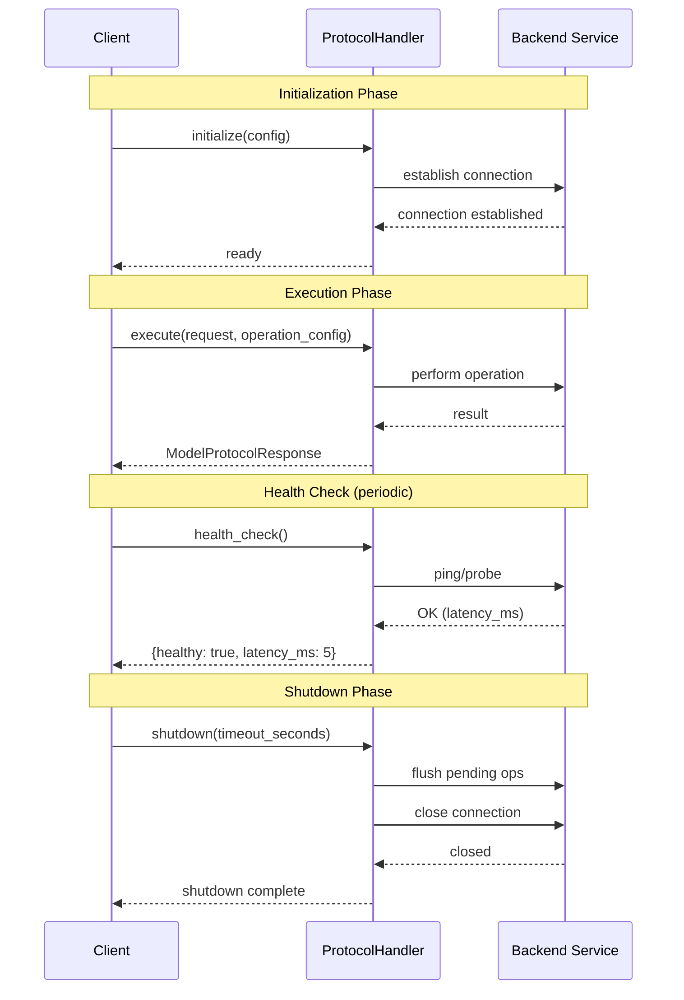
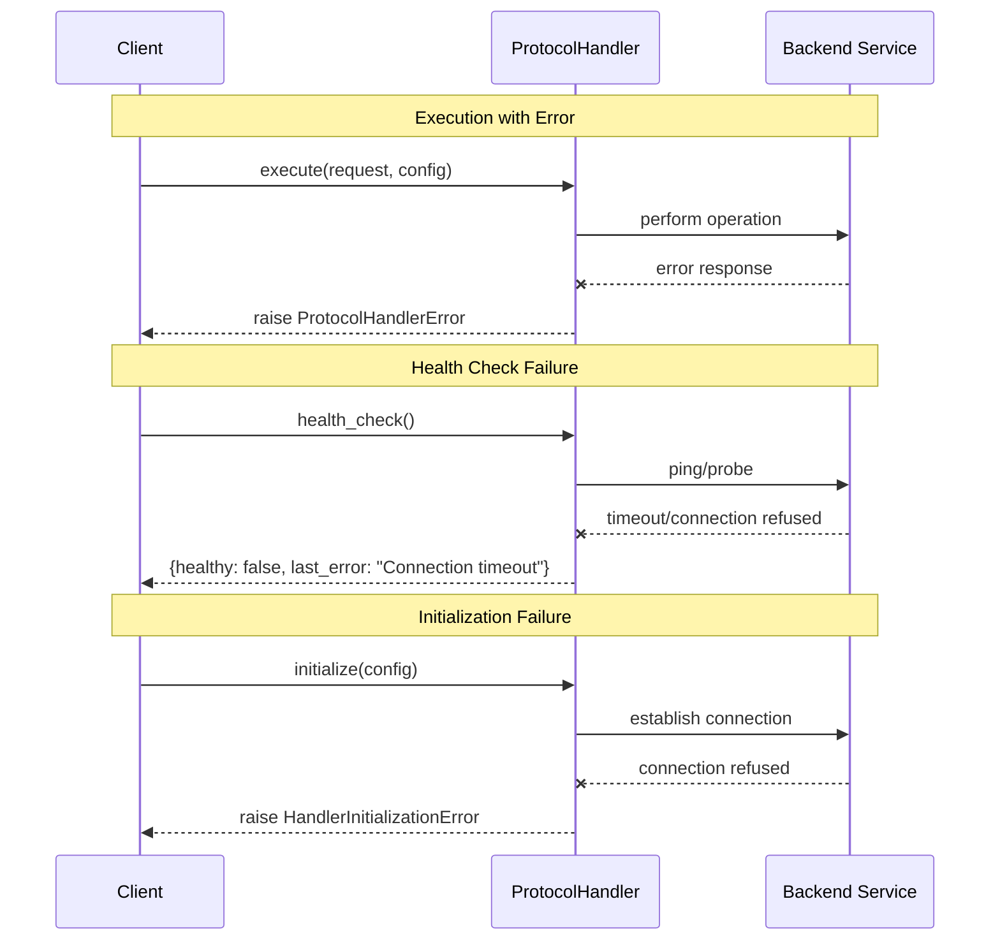
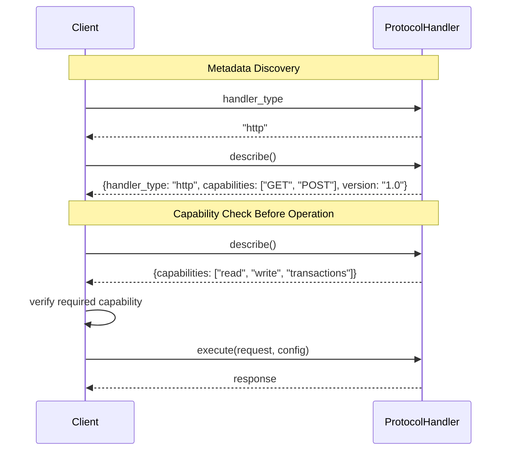
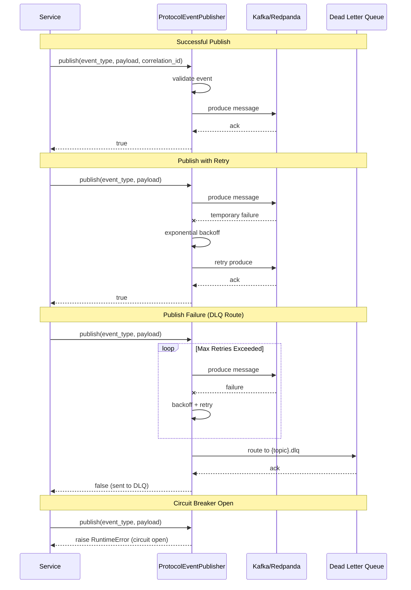
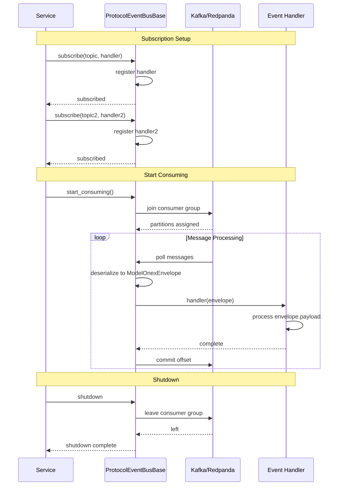
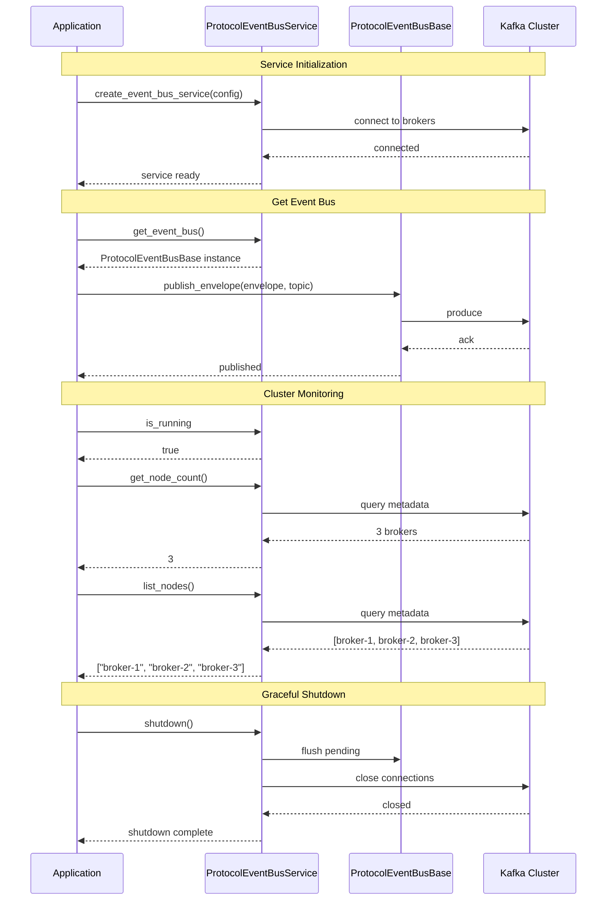
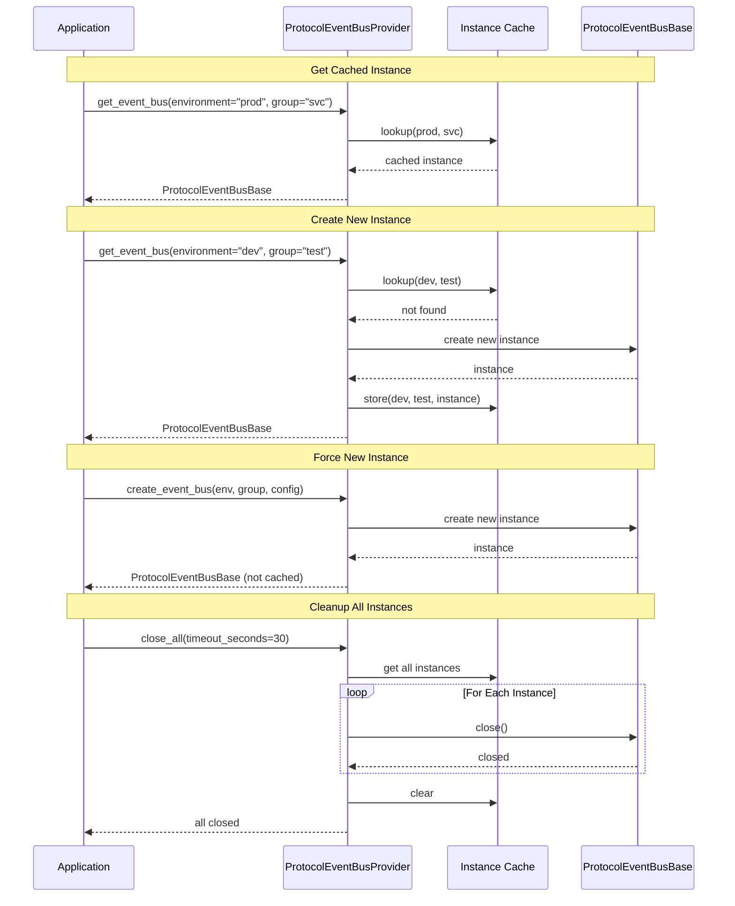
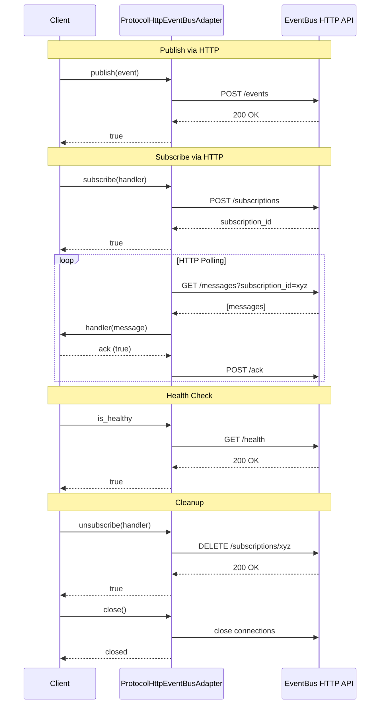

# Protocol Interaction Patterns

This document provides sequence diagrams showing the interaction patterns for key ONEX SPI protocols. These diagrams help developers understand the expected lifecycle and communication flows when implementing or using these protocols.

## Handler Protocol Patterns

The `ProtocolHandler` interface defines the contract for protocol-specific handlers (HTTP, Kafka, PostgreSQL, etc.) used in effect nodes for request-response I/O operations.

### Handler Lifecycle Flow

### Handler Error Handling Flow

### Handler Introspection Flow

## EventBus Protocol Patterns

The EventBus protocols define contracts for distributed messaging with envelope-based communication, supporting both publishing and consuming patterns.

### Publisher Flow

### Consumer Flow (Envelope-Based)

### EventBus Service Lifecycle

### EventBus Provider Pattern

### HTTP EventBus Adapter Flow

## Key Protocol Differences

| Aspect | ProtocolHandler | ProtocolEventBus |
|--------|-----------------|------------------|
| **Pattern** | Request-Response | Publish-Subscribe |
| **Communication** | Synchronous (awaited) | Asynchronous (fire-and-forget) |
| **Use Case** | Direct I/O operations | Inter-service messaging |
| **Coupling** | Tight (direct response) | Loose (topic-based) |
| **Error Handling** | Exceptions | DLQ routing |
| **State** | Per-request | Consumer groups |

## See Also

- [Developer Guide](developer-guide/README.md) - Protocol implementation guidance
- [EventBus API Reference](api-reference/EVENT-BUS.md) - EventBus protocol details
- [Protocol Selection Guide](patterns/PROTOCOL-SELECTION-GUIDE.md) - Choosing the right protocol
- [Protocol Composition Patterns](patterns/PROTOCOL-COMPOSITION-PATTERNS.md) - Composing protocols
- [Implementation Examples](examples/IMPLEMENTATION-EXAMPLES.md) - Working code examples
