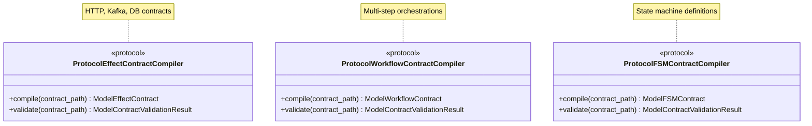

# Contract Compiler Protocols API Reference

  

> **SPI Version**: 0.3.0 | **Status**: Stable | **Since**: v0.2.0

---

## Table of Contents

- [Overview](#overview)
- [Architecture](#architecture)
- [Contract Types](#contract-types)
- [ProtocolEffectContractCompiler](#protocoleffectcontractcompiler)
  - [Methods](#methods)
  - [Protocol Definition](#protocol-definition)
  - [Usage Example](#usage-example)
  - [Effect Contract YAML Example](#effect-contract-yaml-example)
- [ProtocolWorkflowContractCompiler](#protocolworkflowcontractcompiler)
  - [Methods](#methods-1)
  - [Protocol Definition](#protocol-definition-1)
  - [Usage Example](#usage-example-1)
  - [Workflow Contract YAML Example](#workflow-contract-yaml-example)
- [ProtocolFSMContractCompiler](#protocolfsmcontractcompiler)
  - [Methods](#methods-2)
  - [Protocol Definition](#protocol-definition-2)
  - [Usage Example](#usage-example-2)
  - [FSM Contract YAML Example](#fsm-contract-yaml-example)
- [Common Patterns](#common-patterns)
- [Exception Handling](#exception-handling)
- [Contract Validation Errors](#contract-validation-errors)
- [Version Information](#version-information)

---

## Overview

The contract compiler protocols define interfaces for compiling and validating ONEX contracts from YAML files. Contracts are declarative specifications that define behaviors, state machines, and workflows in the ONEX platform.

## Architecture

Contract compilers are **build-time tools** used by the ONEX CLI to:

1. **Compile** YAML contract files into runtime contract models
2. **Validate** contract structure and semantic correctness
3. **Generate** optimized runtime representations


### Compiler Protocol Relationships



**Note**: Contract compilers are not runtime nodes. Methods are async to maintain consistency with SPI patterns and allow for future flexibility in I/O operations (e.g., remote schema validation).

---

## Contract Types

| Contract Type | Compiler Protocol | Purpose |
|---------------|-------------------|---------|
| Effect | `ProtocolEffectContractCompiler` | Side-effecting operations (API calls, DB queries) |
| Workflow | `ProtocolWorkflowContractCompiler` | Multi-step orchestration flows |
| FSM | `ProtocolFSMContractCompiler` | Finite state machine configurations |

---

## ProtocolEffectContractCompiler

```python
from omnibase_spi.protocols.contracts import ProtocolEffectContractCompiler
```

### Description

Compile and validate effect contracts from YAML. Effect contracts define side-effecting operations such as API calls, database queries, and message publishing.

**Use Cases**:
- HTTP endpoint definitions
- Database query specifications
- Message queue publishing contracts
- External service integration contracts

### Methods

#### `compile`

```python
async def compile(
    self,
    contract_path: Path,
) -> ModelEffectContract:
    ...
```

Compile effect contract from YAML file.

**Args**:
- `contract_path` (`Path`): Path to YAML contract file

**Returns**:
- `ModelEffectContract`: Compiled effect contract model from `omnibase_core`

**Raises**:
- `ContractCompilerError`: If compilation fails (syntax error, invalid schema, semantic error)
- `FileNotFoundError`: If contract file not found

**Semantic Contract**:
- MUST validate YAML syntax
- MUST validate contract schema
- MUST validate semantic correctness (e.g., referenced handlers exist)
- SHOULD provide detailed error messages with line numbers

#### `validate`

```python
async def validate(
    self,
    contract_path: Path,
) -> ModelContractValidationResult:
    ...
```

Validate contract without compiling.

**Args**:
- `contract_path` (`Path`): Path to contract file

**Returns**:
- `ModelContractValidationResult`: Validation result containing:
  - `is_valid` (`bool`): Whether the contract passed all validation checks
  - `errors` (`list[ModelValidationError]`): List of validation errors (empty if valid)
  - `warnings` (`list[ModelValidationWarning]`): List of non-fatal warnings

**Semantic Contract**:
- MUST NOT raise exceptions for invalid contracts (return errors in result)
- SHOULD validate all errors, not just the first one
- SHOULD provide actionable error messages with line numbers

> **Design Note**: Unlike `compile()` which raises `ContractCompilerError` for invalid contracts, `validate()` returns a result object with `is_valid=False`. This validation-first pattern enables:
> - **Batch error collection**: Gather all validation errors in one pass, not just the first
> - **Better developer experience**: Display all issues at once for faster iteration
> - **Programmatic error handling**: Inspect errors without try/except blocks

### Protocol Definition

```python
from pathlib import Path
from typing import Protocol, runtime_checkable

@runtime_checkable
class ProtocolEffectContractCompiler(Protocol):
    """
    Compile and validate effect contracts from YAML.

    Effect contracts define side-effecting operations such as
    API calls, database queries, and message publishing.

    Note:
        This is a build-time tool for CLI usage, not a runtime node.
    """

    async def compile(
        self,
        contract_path: Path,
    ) -> ModelEffectContract:
        """Compile effect contract from YAML file."""
        ...

    async def validate(
        self,
        contract_path: Path,
    ) -> ModelContractValidationResult:
        """Validate contract without compiling."""
        ...
```

### Usage Example

```python
from pathlib import Path
from omnibase_spi.protocols.contracts import ProtocolEffectContractCompiler

async def compile_effect_contract(
    compiler: ProtocolEffectContractCompiler,
    contract_path: Path,
) -> None:
    """Compile and validate an effect contract."""

    # First validate without compiling
    validation_result = await compiler.validate(contract_path)

    if not validation_result.is_valid:
        for error in validation_result.errors:
            print(f"Error at line {error.line}: {error.message}")
        return

    # Compile the validated contract
    try:
        contract = await compiler.compile(contract_path)
        print(f"Compiled contract: {contract.contract_id}")
        print(f"Protocol type: {contract.protocol_type}")
        print(f"Operations: {len(contract.operations)}")
    except ContractCompilerError as e:
        print(f"Compilation failed: {e}")
        if e.context:
            print(f"Context: {e.context}")
```

### Effect Contract YAML Example

```yaml
# contracts/http_api.effect.yaml
contract_id: user_api.v1
version: "1.0.0"
protocol_type: http_rest

connection:
  base_url: https://api.example.com
  timeout_seconds: 30
  retry_policy:
    max_retries: 3
    backoff_multiplier: 2.0

operations:
  - name: get_user
    method: GET
    path: /users/{user_id}
    response_schema:
      type: object
      properties:
        id: { type: string }
        name: { type: string }
        email: { type: string }

  - name: create_user
    method: POST
    path: /users
    request_schema:
      type: object
      required: [name, email]
      properties:
        name: { type: string }
        email: { type: string }
```

---

## ProtocolWorkflowContractCompiler

```python
from omnibase_spi.protocols.contracts import ProtocolWorkflowContractCompiler
```

### Description

Compile and validate workflow contracts from YAML. Workflow contracts define multi-step orchestration flows with dependencies, error handling, and compensation.

**Use Cases**:
- Multi-step business processes
- Saga pattern implementations
- Pipeline orchestrations
- Complex data processing workflows

### Methods

#### `compile`

```python
async def compile(
    self,
    contract_path: Path,
) -> ModelWorkflowContract:
    ...
```

Compile workflow contract from YAML file.

**Args**:
- `contract_path` (`Path`): Path to YAML contract file

**Returns**:
- `ModelWorkflowContract`: Compiled workflow contract model from `omnibase_core`

**Raises**:
- `ContractCompilerError`: If compilation fails
- `FileNotFoundError`: If contract file not found

**Semantic Contract**:
- MUST validate step dependencies form a DAG (no cycles)
- MUST validate referenced nodes exist
- MUST validate compensation steps are valid
- SHOULD validate timeout configurations are reasonable

#### `validate`

```python
async def validate(
    self,
    contract_path: Path,
) -> ModelContractValidationResult:
    ...
```

Validate contract without compiling.

**Args**:
- `contract_path` (`Path`): Path to contract file

**Returns**:
- `ModelContractValidationResult`: Validation result containing:
  - `is_valid` (`bool`): Whether the contract passed all validation checks
  - `errors` (`list[ModelValidationError]`): List of validation errors (empty if valid)
  - `warnings` (`list[ModelValidationWarning]`): List of non-fatal warnings

**Semantic Contract**:
- MUST NOT raise exceptions for invalid contracts (return errors in result)
- SHOULD validate all errors, not just the first one
- SHOULD provide actionable error messages with line numbers
- SHOULD detect DAG violations (circular dependencies)

> **Design Note**: Unlike `compile()` which raises `ContractCompilerError` for invalid contracts, `validate()` returns a result object with `is_valid=False`. This validation-first pattern enables:
> - **Batch error collection**: Gather all validation errors in one pass, not just the first
> - **Better developer experience**: Display all issues at once for faster iteration
> - **Programmatic error handling**: Inspect errors without try/except blocks

### Protocol Definition

```python
from pathlib import Path
from typing import Protocol, runtime_checkable

@runtime_checkable
class ProtocolWorkflowContractCompiler(Protocol):
    """
    Compile and validate workflow contracts from YAML.

    Workflow contracts define multi-step orchestration flows
    with dependencies, error handling, and compensation.

    Note:
        This is a build-time tool for CLI usage, not a runtime node.
    """

    async def compile(
        self,
        contract_path: Path,
    ) -> ModelWorkflowContract:
        """Compile workflow contract from YAML file."""
        ...

    async def validate(
        self,
        contract_path: Path,
    ) -> ModelContractValidationResult:
        """Validate contract without compiling."""
        ...
```

### Usage Example

```python
from pathlib import Path
from omnibase_spi.protocols.contracts import ProtocolWorkflowContractCompiler

async def compile_workflow(
    compiler: ProtocolWorkflowContractCompiler,
    contract_path: Path,
) -> None:
    """Compile a workflow contract with validation-first pattern."""

    # First validate without compiling to collect all errors
    validation_result = await compiler.validate(contract_path)

    if not validation_result.is_valid:
        # Handle validation errors (no exception raised)
        for error in validation_result.errors:
            print(f"Error at line {error.line}: {error.message}")

        # Also check warnings for non-fatal issues
        for warning in validation_result.warnings:
            print(f"Warning: {warning.message}")
        return

    # Compile the validated contract
    try:
        contract = await compiler.compile(contract_path)

        print(f"Workflow: {contract.contract_id}")
        print(f"Steps: {len(contract.steps)}")

        # Print execution order based on dependencies
        for step in contract.execution_order:
            print(f"  - {step.name} (depends on: {step.depends_on})")

        # Check for compensation steps
        if contract.compensation_steps:
            print("Compensation steps defined for rollback")

    except ContractCompilerError as e:
        # compile() may still raise for unexpected errors
        print(f"Compilation failed: {e}")
```

### Workflow Contract YAML Example

```yaml
# contracts/order_processing.workflow.yaml
contract_id: order_processing.v1
version: "1.0.0"

steps:
  - name: validate_order
    node_id: order_validator.v1
    timeout_seconds: 10

  - name: check_inventory
    node_id: inventory_checker.v1
    depends_on: [validate_order]
    timeout_seconds: 30

  - name: process_payment
    node_id: payment_processor.v1
    depends_on: [validate_order, check_inventory]
    timeout_seconds: 60
    compensation: refund_payment

  - name: ship_order
    node_id: shipping_service.v1
    depends_on: [process_payment]
    timeout_seconds: 120

compensation_steps:
  - name: refund_payment
    node_id: payment_refunder.v1
    timeout_seconds: 60

error_handling:
  default_strategy: compensate
  retry_policy:
    max_retries: 3
    backoff_multiplier: 2.0
```

---

## ProtocolFSMContractCompiler

```python
from omnibase_spi.protocols.contracts import ProtocolFSMContractCompiler
```

### Description

Compile and validate FSM (Finite State Machine) contracts from YAML. FSM contracts define state machine configurations with states, transitions, guards, and actions.

**Use Cases**:
- Order state management (created -> confirmed -> shipped -> delivered)
- User lifecycle (registered -> active -> suspended -> deleted)
- Document workflows (draft -> review -> approved -> published)
- Protocol state management

### Methods

#### `compile`

```python
async def compile(
    self,
    contract_path: Path,
) -> ModelFSMContract:
    ...
```

Compile FSM contract from YAML file.

**Args**:
- `contract_path` (`Path`): Path to YAML contract file

**Returns**:
- `ModelFSMContract`: Compiled FSM contract model from `omnibase_core`

**Raises**:
- `ContractCompilerError`: If compilation fails
- `FileNotFoundError`: If contract file not found

**Semantic Contract**:
- MUST validate all transitions reference valid states
- MUST validate initial state exists
- MUST validate final states exist (if specified)
- MUST validate guards are syntactically correct
- SHOULD detect unreachable states

#### `validate`

```python
async def validate(
    self,
    contract_path: Path,
) -> ModelContractValidationResult:
    ...
```

Validate contract without compiling.

**Args**:
- `contract_path` (`Path`): Path to contract file

**Returns**:
- `ModelContractValidationResult`: Validation result containing:
  - `is_valid` (`bool`): Whether the contract passed all validation checks
  - `errors` (`list[ModelValidationError]`): List of validation errors (empty if valid)
  - `warnings` (`list[ModelValidationWarning]`): List of non-fatal warnings

**Semantic Contract**:
- MUST NOT raise exceptions for invalid contracts (return errors in result)
- SHOULD validate all errors, not just the first one
- SHOULD provide actionable error messages with line numbers
- SHOULD detect unreachable states and invalid transitions

> **Design Note**: Unlike `compile()` which raises `ContractCompilerError` for invalid contracts, `validate()` returns a result object with `is_valid=False`. This validation-first pattern enables:
> - **Batch error collection**: Gather all validation errors in one pass, not just the first
> - **Better developer experience**: Display all issues at once for faster iteration
> - **Programmatic error handling**: Inspect errors without try/except blocks

### Protocol Definition

```python
from pathlib import Path
from typing import Protocol, runtime_checkable

@runtime_checkable
class ProtocolFSMContractCompiler(Protocol):
    """
    Compile and validate FSM contracts from YAML.

    FSM contracts define finite state machine configurations
    with states, transitions, guards, and actions.

    Note:
        This is a build-time tool for CLI usage, not a runtime node.
    """

    async def compile(
        self,
        contract_path: Path,
    ) -> ModelFSMContract:
        """Compile FSM contract from YAML file."""
        ...

    async def validate(
        self,
        contract_path: Path,
    ) -> ModelContractValidationResult:
        """Validate contract without compiling."""
        ...
```

### Usage Example

```python
from pathlib import Path
from omnibase_spi.protocols.contracts import ProtocolFSMContractCompiler

async def compile_fsm(
    compiler: ProtocolFSMContractCompiler,
    contract_path: Path,
) -> None:
    """Compile and analyze an FSM contract with validation-first pattern."""

    # First validate without compiling to collect all errors
    validation_result = await compiler.validate(contract_path)

    if not validation_result.is_valid:
        # Handle validation errors (no exception raised)
        for error in validation_result.errors:
            print(f"Error at line {error.line}: {error.message}")

        # Check warnings for issues like unreachable states
        for warning in validation_result.warnings:
            print(f"Warning: {warning.message}")
        return

    # Compile the validated contract
    try:
        contract = await compiler.compile(contract_path)

        print(f"FSM: {contract.contract_id}")
        print(f"Initial state: {contract.initial_state}")
        print(f"States: {', '.join(contract.states)}")
        print(f"Final states: {', '.join(contract.final_states)}")

        print("\nTransitions:")
        for transition in contract.transitions:
            guard_str = f" [if {transition.guard}]" if transition.guard else ""
            action_str = f" / {transition.action}" if transition.action else ""
            print(f"  {transition.from_state} --{transition.event}--> "
                  f"{transition.to_state}{guard_str}{action_str}")

        # Check for unreachable states
        reachable = contract.get_reachable_states()
        unreachable = set(contract.states) - reachable
        if unreachable:
            print(f"\nWarning: Unreachable states: {unreachable}")

    except ContractCompilerError as e:
        # compile() may still raise for unexpected errors
        print(f"Compilation failed: {e}")
```

### FSM Contract YAML Example

```yaml
# contracts/order_state.fsm.yaml
contract_id: order_state.v1
version: "1.0.0"

initial_state: created
final_states: [delivered, cancelled]

states:
  - created
  - confirmed
  - processing
  - shipped
  - delivered
  - cancelled

transitions:
  - from: created
    to: confirmed
    event: confirm
    action: send_confirmation_email

  - from: created
    to: cancelled
    event: cancel
    action: log_cancellation

  - from: confirmed
    to: processing
    event: start_processing
    guard: inventory_available

  - from: confirmed
    to: cancelled
    event: cancel
    action: release_inventory

  - from: processing
    to: shipped
    event: ship
    action: notify_shipping

  - from: shipped
    to: delivered
    event: deliver
    action: send_delivery_notification

guards:
  inventory_available:
    type: expression
    expression: "context.inventory_count > 0"
```

---

## Common Patterns

### Validation Before Compilation

Always validate before compiling to get all errors at once:

```python
async def safe_compile(
    compiler: ProtocolEffectContractCompiler,
    contract_path: Path,
) -> ModelEffectContract | None:
    """Compile with full validation."""

    # Validate first to collect all errors
    result = await compiler.validate(contract_path)

    if not result.is_valid:
        for error in result.errors:
            logger.error(
                f"Contract validation error",
                path=str(contract_path),
                line=error.line,
                message=error.message,
            )
        return None

    # Compile validated contract
    return await compiler.compile(contract_path)
```

### Batch Compilation

Compile multiple contracts with error collection:

```python
async def compile_all_contracts(
    compiler: ProtocolEffectContractCompiler,
    contract_dir: Path,
) -> tuple[list[ModelEffectContract], list[str]]:
    """Compile all contracts in a directory."""

    contracts = []
    errors = []

    for contract_path in contract_dir.glob("*.effect.yaml"):
        try:
            contract = await compiler.compile(contract_path)
            contracts.append(contract)
        except ContractCompilerError as e:
            errors.append(f"{contract_path}: {e}")

    return contracts, errors
```

### Contract Registry Integration

Register compiled contracts for runtime lookup:

```python
async def load_contracts(
    compiler: ProtocolEffectContractCompiler,
    registry: ProtocolContractRegistry,
    contract_dir: Path,
) -> None:
    """Load and register all effect contracts."""

    for contract_path in contract_dir.glob("*.effect.yaml"):
        contract = await compiler.compile(contract_path)
        registry.register(contract.contract_id, contract)
```

---

## Exception Handling

### compile() vs validate() Semantics

The `compile()` and `validate()` methods have fundamentally different error-handling semantics:

| Method | Invalid Contract | File Not Found | Unexpected Error |
|--------|------------------|----------------|------------------|
| `compile()` | **Raises** `ContractCompilerError` | Raises `FileNotFoundError` | Raises exception |
| `validate()` | **Returns** `ModelContractValidationResult` with `is_valid=False` | Raises `FileNotFoundError` | Raises exception |

**Key Distinction**:

> **`validate()` does NOT raise exceptions for invalid contracts.**
>
> Instead, it returns a `ModelContractValidationResult` with `is_valid=False` and populates the `errors` list.
> This is intentional: validation is designed to collect ALL errors in a single pass.

> **`compile()` RAISES exceptions for invalid contracts.**
>
> It raises `ContractCompilerError` at the first fatal error encountered.
> Use this when you expect the contract to be valid and want fail-fast behavior.

**When to use each method**:
- **`validate()`**: Use for validation-first workflows, IDE integration, linting tools, or any scenario where you want to collect and display all errors at once
- **`compile()`**: Use for production pipelines after validation, or when you need the compiled contract and expect it to be valid

### ModelContractValidationResult Structure

```python
class ModelContractValidationResult:
    """Result of contract validation."""

    is_valid: bool  # True if no errors (warnings are allowed)
    errors: list[ModelValidationError]  # Fatal validation errors
    warnings: list[ModelValidationWarning]  # Non-fatal warnings

class ModelValidationError:
    """A single validation error."""

    message: str  # Human-readable error message
    line: int | None  # Line number in YAML (if applicable)
    column: int | None  # Column number (if applicable)
    code: str  # Error code (e.g., "MISSING_FIELD", "INVALID_REF")

class ModelValidationWarning:
    """A non-fatal validation warning."""

    message: str  # Human-readable warning message
    line: int | None  # Line number (if applicable)
    code: str  # Warning code (e.g., "UNREACHABLE_STATE")
```

### Recommended Pattern: Validation-First

```python
async def safe_compile(compiler, contract_path: Path):
    """
    Recommended pattern: validate before compile.

    This pattern demonstrates the key semantic difference:
    - validate() returns a result object (no exception for invalid contracts)
    - compile() raises ContractCompilerError for invalid contracts
    """

    # Step 1: Validate to collect ALL errors (no exception raised)
    # validate() returns ModelContractValidationResult, NOT an exception
    result = await compiler.validate(contract_path)

    if not result.is_valid:
        # Errors are in result.errors, not caught via try/except
        # This allows displaying ALL errors to the user at once
        for error in result.errors:
            logger.error(f"Line {error.line}: {error.message}")
        return None

    # Step 2: Compile the validated contract
    # After successful validation, compile() should succeed
    # However, compile() CAN still raise for unexpected errors (I/O, etc.)
    try:
        return await compiler.compile(contract_path)
    except ContractCompilerError as e:
        # This should be rare after successful validation
        # May indicate a race condition or implementation bug
        logger.error(f"Unexpected compile error: {e}")
        return None
```

See [EXCEPTIONS.md](EXCEPTIONS.md) for complete exception hierarchy.

---

## Contract Validation Errors

Common validation errors and their meanings:

| Error | Meaning | Solution |
|-------|---------|----------|
| `Missing required field` | Contract missing mandatory field | Add the required field |
| `Invalid protocol type` | Unknown protocol type specified | Use valid type: http, kafka, etc. |
| `Circular dependency` | Workflow steps have circular deps | Restructure step dependencies |
| `Unknown state` | Transition references undefined state | Define the state or fix typo |
| `Invalid guard expression` | Guard syntax error | Fix expression syntax |
| `Unreachable state` | State cannot be reached from initial | Add transition or remove state |

---

## Version Information

- **API Version**: 0.3.0
- **Python Compatibility**: 3.12+
- **Type Checking**: mypy strict mode compatible
- **Runtime Checking**: All protocols are `@runtime_checkable`

---

## See Also

- **[NODES.md](./NODES.md)** - Node protocols that use compiled contracts at runtime
- **[HANDLERS.md](./HANDLERS.md)** - Handler protocols referenced in effect contracts
- **[WORKFLOW-ORCHESTRATION.md](./WORKFLOW-ORCHESTRATION.md)** - Workflow orchestration that uses workflow contracts
- **[VALIDATION.md](./VALIDATION.md)** - Validation protocols for contract validation
- **[EXCEPTIONS.md](./EXCEPTIONS.md)** - Exception hierarchy including `ContractCompilerError`
- **[README.md](./README.md)** - Complete API reference index

---

*This API reference is part of the omnibase_spi documentation.*
