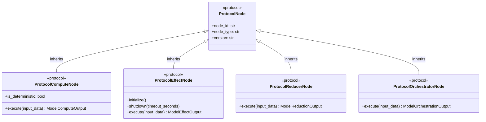
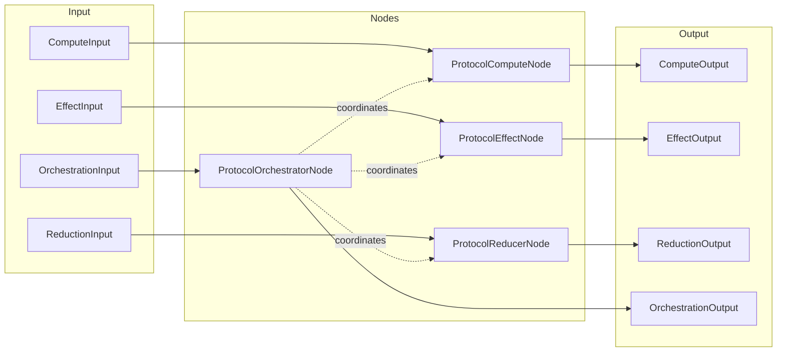

# Node Protocols API Reference

  

> **SPI Version**: 0.3.0 | **Status**: Stable | **Since**: v0.1.0

---

## Table of Contents

- [Overview](#overview)
- [Architecture](#architecture)
- [Protocol Hierarchy](#protocol-hierarchy)
- [ProtocolNode](#protocolnode)
  - [Properties](#properties)
  - [Protocol Definition](#protocol-definition)
  - [Usage Example](#usage-example)
- [ProtocolComputeNode](#protocolcomputenode)
  - [Properties](#properties-1)
  - [Methods](#methods)
  - [Protocol Definition](#protocol-definition-1)
  - [Usage Example](#usage-example-1)
- [ProtocolEffectNode](#protocoleffectnode)
  - [Properties](#properties-2)
  - [Methods](#methods-1)
  - [Protocol Definition](#protocol-definition-2)
  - [Usage Example](#usage-example-2)
- [ProtocolReducerNode](#protocolreducernode)
  - [Properties](#properties-3)
  - [Methods](#methods-2)
  - [Protocol Definition](#protocol-definition-3)
  - [Usage Example](#usage-example-3)
- [ProtocolOrchestratorNode](#protocolorchestratornode)
  - [Properties](#properties-4)
  - [Methods](#methods-3)
  - [Protocol Definition](#protocol-definition-4)
  - [Usage Example](#usage-example-4)
- [Node Type Comparison](#node-type-comparison)
- [Exception Handling](#exception-handling)
- [Version Information](#version-information)

---

## Overview

The ONEX node protocols define the four fundamental node types in the ONEX architecture. Each node type serves a specific purpose in the system, from pure computations to side-effecting I/O operations to workflow orchestration.

## Architecture

The ONEX platform follows a **4-node architecture** where each node type has distinct responsibilities:

| Node Type | Purpose | Side Effects | Deterministic |
|-----------|---------|--------------|---------------|
| `ProtocolComputeNode` | Pure transformations | No | Yes |
| `ProtocolEffectNode` | I/O operations | Yes | No |
| `ProtocolReducerNode` | State aggregation | Controlled | Varies |
| `ProtocolOrchestratorNode` | Workflow coordination | Delegates | N/A |

All node protocols inherit from `ProtocolNode`, which provides common identity and metadata properties.

## Protocol Hierarchy



### Node Execution Flow

The following diagram shows how data flows through each node type and how the orchestrator coordinates the other nodes:



---

## ProtocolNode

```python
from omnibase_spi.protocols.nodes import ProtocolNode
```

### Description

Base protocol for all ONEX nodes. Provides identity and type metadata that all specialized node types inherit.

**Stability**: Stable - No breaking changes expected within minor versions.

**Version**: Added in v0.3.0

### Properties

| Property | Type | Description |
|----------|------|-------------|
| `node_id` | `str` | Globally unique node identifier (e.g., `'vectorization.v1'`) |
| `node_type` | `str` | Node type classification: `'compute'`, `'effect'`, `'reducer'`, `'orchestrator'` |
| `version` | `str` | Semantic version of the node implementation |

### Protocol Definition

```python
from typing import Protocol, runtime_checkable

@runtime_checkable
class ProtocolNode(Protocol):
    """
    Base protocol for all nodes.

    Provides identity and type metadata; execution behavior is
    defined in specialized sub-interfaces (compute, effect, etc.).
    """

    @property
    def node_id(self) -> str:
        """Globally unique node identifier (e.g., 'vectorization.v1')."""
        ...

    @property
    def node_type(self) -> str:
        """
        Node type classification.

        Recommended values: 'compute', 'effect', 'reducer', 'orchestrator'.
        """
        ...

    @property
    def version(self) -> str:
        """Semantic version of this node implementation."""
        ...
```

### Usage Example

```python
from omnibase_spi.protocols.nodes import ProtocolNode

def get_node_info(node: ProtocolNode) -> dict[str, str]:
    """Extract metadata from any node type."""
    return {
        "id": node.node_id,
        "type": node.node_type,
        "version": node.version,
    }

# Runtime type checking
def validate_node(obj: object) -> bool:
    """Check if an object implements ProtocolNode."""
    return isinstance(obj, ProtocolNode)
```

---

## ProtocolComputeNode

```python
from omnibase_spi.protocols.nodes import ProtocolComputeNode
```

### Description

Protocol for pure compute nodes that perform deterministic, side-effect-free transformations. The same input should always produce the same output.

**Key Characteristics**:
- No side effects (no I/O, no state mutation)
- Deterministic output for given input
- Suitable for data transformation, validation, and calculations

**Example Implementations**:
- Data transformation nodes
- Validation nodes
- Algorithm execution nodes
- Stateless business logic nodes

### Properties

| Property | Type | Description |
|----------|------|-------------|
| `node_id` | `str` | Inherited from `ProtocolNode` |
| `node_type` | `str` | Inherited from `ProtocolNode` (should be `'compute'`) |
| `version` | `str` | Inherited from `ProtocolNode` |
| `is_deterministic` | `bool` | Whether the node produces deterministic output |

### Methods

#### `execute`

```python
async def execute(
    self,
    input_data: ModelComputeInput,
) -> ModelComputeOutput:
    ...
```

Execute pure computation.

**Args**:
- `input_data` (`ModelComputeInput`): Compute input model from `omnibase_core`

**Returns**:
- `ModelComputeOutput`: Compute output model from `omnibase_core`

**Raises**:
- `SPIError`: If computation fails

**Semantic Contract**:
- MUST NOT perform any I/O operations
- MUST NOT modify external state
- SHOULD produce identical output for identical input
- SHOULD be safe to retry without side effects

### Protocol Definition

```python
from typing import Protocol, runtime_checkable
from omnibase_spi.protocols.nodes.base import ProtocolNode

@runtime_checkable
class ProtocolComputeNode(ProtocolNode, Protocol):
    """
    Protocol for pure compute nodes.

    Compute nodes perform deterministic, side-effect-free transformations.
    The same input should always produce the same output.
    """

    async def execute(
        self,
        input_data: ModelComputeInput,
    ) -> ModelComputeOutput:
        """Execute pure computation."""
        ...

    @property
    def is_deterministic(self) -> bool:
        """
        Whether the node is expected to be deterministic.

        True means same input_data always yields same output.
        Compute nodes should typically return True.
        """
        ...
```

### Usage Example

```python
from omnibase_spi.protocols.nodes import ProtocolComputeNode
from omnibase_core.models.compute import ModelComputeInput, ModelComputeOutput

class VectorizationNode:
    """Example compute node for text vectorization."""

    @property
    def node_id(self) -> str:
        return "vectorization.v1"

    @property
    def node_type(self) -> str:
        return "compute"

    @property
    def version(self) -> str:
        return "1.0.0"

    @property
    def is_deterministic(self) -> bool:
        return True

    def _vectorize(self, text: str) -> list[float]:
        """Convert text to vector embedding (placeholder implementation)."""
        # In production, this would call an embedding model (e.g., OpenAI, HuggingFace)
        return [float(ord(c)) for c in text[:10]]  # Simplified for example

    async def execute(
        self,
        input_data: ModelComputeInput,
    ) -> ModelComputeOutput:
        """Transform text input into vector representation."""
        text = input_data.payload.get("text", "")
        vector = self._vectorize(text)  # Pure computation
        return ModelComputeOutput(
            node_id=self.node_id,
            payload={"vector": vector},
        )

# Type checking at runtime
node = VectorizationNode()
assert isinstance(node, ProtocolComputeNode)
```

---

## ProtocolEffectNode

```python
from omnibase_spi.protocols.nodes import ProtocolEffectNode
```

### Description

Protocol for effect nodes that perform side-effecting operations such as external API calls, database operations, and message queue interactions.

**Key Characteristics**:
- Has side effects (I/O operations)
- May not be deterministic
- Requires lifecycle management (initialize/shutdown)
- Often delegates to [ProtocolHandler](./HANDLERS.md#protocolhandler) implementations for actual I/O

**Example Implementations**:
- HTTP API client nodes
- Database query nodes
- Message publishing nodes
- File processing nodes

### Properties

| Property | Type | Description |
|----------|------|-------------|
| `node_id` | `str` | Inherited from `ProtocolNode` |
| `node_type` | `str` | Inherited from `ProtocolNode` (should be `'effect'`) |
| `version` | `str` | Inherited from `ProtocolNode` |

### Methods

#### `initialize`

```python
async def initialize(self) -> None:
    ...
```

Initialize node-specific resources if needed.

Called before the first `execute()` to set up connections, load contracts, initialize handlers, etc.

**Raises**:
- `HandlerInitializationError`: If initialization fails

**Semantic Contract**:
- MUST be called before any `execute()` calls
- SHOULD be idempotent (safe to call multiple times)
- MUST complete successfully before the node is considered ready

#### `shutdown`

```python
async def shutdown(self, timeout_seconds: float = 30.0) -> None:
    ...
```

Release node-specific resources if needed.

Called during graceful shutdown to close connections, flush pending operations, and release resources.

**Args**:
- `timeout_seconds` (`float`): Maximum time to wait for shutdown to complete. Defaults to 30.0 seconds.

**Raises**:
- `TimeoutError`: If shutdown does not complete within the specified timeout

**Semantic Contract**:
- MUST release all held resources
- SHOULD flush any pending operations
- MUST NOT raise exceptions other than `TimeoutError`

#### `execute`

```python
async def execute(
    self,
    input_data: ModelEffectInput,
) -> ModelEffectOutput:
    ...
```

Execute effect operation.

**Args**:
- `input_data` (`ModelEffectInput`): Effect input model from `omnibase_core`

**Returns**:
- `ModelEffectOutput`: Effect output model from `omnibase_core`

**Raises**:
- `ProtocolHandlerError`: If effect execution fails
- `SPIError`: For other SPI-related errors
- `InvalidProtocolStateError`: If called before `initialize()`

**Semantic Contract**:
- MUST be called after `initialize()`
- MAY perform I/O operations
- SHOULD handle transient failures with appropriate retry logic
- MUST propagate errors appropriately

### Protocol Definition

```python
from typing import Protocol, runtime_checkable
from omnibase_spi.protocols.nodes.base import ProtocolNode

@runtime_checkable
class ProtocolEffectNode(ProtocolNode, Protocol):
    """
    Protocol for effect nodes.

    Effect nodes perform side-effecting operations such as:
        - External API calls (HTTP, gRPC)
        - Database operations (read/write)
        - Message queue interactions (Kafka, RabbitMQ)
        - File system operations
    """

    async def initialize(self) -> None:
        """Initialize node-specific resources if needed."""
        ...

    async def shutdown(self, timeout_seconds: float = 30.0) -> None:
        """Release node-specific resources if needed."""
        ...

    async def execute(
        self,
        input_data: ModelEffectInput,
    ) -> ModelEffectOutput:
        """Execute effect operation."""
        ...
```

### Usage Example

```python
from omnibase_spi.protocols.nodes import ProtocolEffectNode
from omnibase_spi.protocols.handlers import ProtocolHandler
from omnibase_spi.exceptions import InvalidProtocolStateError
from omnibase_core.models.effect import ModelEffectInput, ModelEffectOutput


class HttpApiNode:
    """Example effect node for HTTP API calls."""

    def __init__(self, handler: ProtocolHandler):
        self._handler = handler
        self._initialized = False
        # Configuration would typically come from environment or dependency injection
        self._config = {"base_url": "https://api.example.com", "timeout": 30}

    @property
    def node_id(self) -> str:
        return "http_api.v1"

    @property
    def node_type(self) -> str:
        return "effect"

    @property
    def version(self) -> str:
        return "1.0.0"

    async def initialize(self) -> None:
        """Initialize HTTP connection pool."""
        await self._handler.initialize(self._config)
        self._initialized = True

    async def shutdown(self, timeout_seconds: float = 30.0) -> None:
        """Close HTTP connections."""
        await self._handler.shutdown(timeout_seconds)
        self._initialized = False

    async def execute(
        self,
        input_data: ModelEffectInput,
    ) -> ModelEffectOutput:
        """Make HTTP request via handler."""
        if not self._initialized:
            raise InvalidProtocolStateError(
                "Cannot call execute() before initialize()"
            )
        # Build request from input_data payload
        request = input_data.payload.get("request", {})
        operation_config = {"method": "POST", "endpoint": "/data"}
        response = await self._handler.execute(request, operation_config)
        return ModelEffectOutput(
            node_id=self.node_id,
            payload=response.data,
        )


# --- Example usage demonstrating lifecycle management ---

async def example_usage():
    # In production, handler would be obtained via dependency injection (DI) or service registry.
    # Example: handler = container.get(ProtocolHandler)
    # The ProtocolHandler implementation lives in omnibase_infra (e.g., HttpHandler).
    handler: ProtocolHandler = ...  # type: ignore  # Placeholder (see HANDLERS.md)

    node = HttpApiNode(handler)
    await node.initialize()
    try:
        # Create input data for the effect operation
        input_data = ModelEffectInput(
            node_id="http_api.v1",
            payload={"request": {"url": "/users", "body": {"name": "test"}}},
        )
        result = await node.execute(input_data)
    finally:
        await node.shutdown()
```

---

## ProtocolReducerNode

```python
from omnibase_spi.protocols.nodes import ProtocolReducerNode
```

### Description

Protocol for reducer nodes that aggregate state from a stream of inputs. They maintain accumulated state and produce outputs based on reduction logic.

**Key Characteristics**:
- State aggregation from multiple inputs
- Maintains accumulated state across invocations
- Produces reduced/aggregated outputs

**Example Implementations**:
- Event aggregation nodes
- State accumulation nodes
- Metrics collection nodes
- Log aggregation nodes

### Properties

| Property | Type | Description |
|----------|------|-------------|
| `node_id` | `str` | Inherited from `ProtocolNode` |
| `node_type` | `str` | Inherited from `ProtocolNode` (should be `'reducer'`) |
| `version` | `str` | Inherited from `ProtocolNode` |

### Methods

#### `execute`

```python
async def execute(
    self,
    input_data: ModelReductionInput,
) -> ModelReductionOutput:
    ...
```

Execute state reduction.

**Args**:
- `input_data` (`ModelReductionInput`): Reduction input model from `omnibase_core`

**Returns**:
- `ModelReductionOutput`: Reduction output model from `omnibase_core`

**Raises**:
- `SPIError`: If reduction fails

**Semantic Contract**:
- MUST aggregate input data with current state
- SHOULD maintain consistent state across invocations
- MAY persist state to external storage

### Protocol Definition

```python
from typing import Protocol, runtime_checkable
from omnibase_spi.protocols.nodes.base import ProtocolNode

@runtime_checkable
class ProtocolReducerNode(ProtocolNode, Protocol):
    """
    Protocol for reducer nodes.

    Reducer nodes aggregate state from a stream of inputs.
    They maintain accumulated state and produce outputs
    based on reduction logic.
    """

    async def execute(
        self,
        input_data: ModelReductionInput,
    ) -> ModelReductionOutput:
        """Execute state reduction."""
        ...
```

### Usage Example

```python
from omnibase_spi.protocols.nodes import ProtocolReducerNode
from omnibase_core.models.reducer import ModelReductionInput, ModelReductionOutput


class MetricsAggregatorNode:
    """Example reducer node for metrics aggregation."""

    def __init__(self):
        self._accumulated_metrics: dict[str, float] = {}
        self._count: int = 0

    @property
    def node_id(self) -> str:
        return "metrics_aggregator.v1"

    @property
    def node_type(self) -> str:
        return "reducer"

    @property
    def version(self) -> str:
        return "1.0.0"

    async def execute(
        self,
        input_data: ModelReductionInput,
    ) -> ModelReductionOutput:
        """Aggregate metrics from input data."""
        metrics = input_data.payload.get("metrics", {})

        # Accumulate metrics
        for key, value in metrics.items():
            if key in self._accumulated_metrics:
                self._accumulated_metrics[key] += value
            else:
                self._accumulated_metrics[key] = value

        self._count += 1

        return ModelReductionOutput(
            node_id=self.node_id,
            payload={
                "aggregated_metrics": self._accumulated_metrics,
                "sample_count": self._count,
            },
        )


# --- Example usage demonstrating stateful reduction ---

async def example_usage():
    # Create sample inputs - each represents a batch of metrics to aggregate
    input1 = ModelReductionInput(
        node_id="metrics_aggregator.v1",
        payload={"metrics": {"requests": 100, "errors": 5}},
    )
    input2 = ModelReductionInput(
        node_id="metrics_aggregator.v1",
        payload={"metrics": {"requests": 150, "errors": 3}},
    )
    input3 = ModelReductionInput(
        node_id="metrics_aggregator.v1",
        payload={"metrics": {"requests": 200, "errors": 2}},
    )

    # Reducer maintains state across invocations
    reducer = MetricsAggregatorNode()
    await reducer.execute(input1)  # Accumulates: requests=100, errors=5
    await reducer.execute(input2)  # Accumulates: requests=250, errors=8
    result = await reducer.execute(input3)  # Returns: requests=450, errors=10
    # result.payload == {"aggregated_metrics": {"requests": 450, "errors": 10}, "sample_count": 3}
```

---

## ProtocolOrchestratorNode

```python
from omnibase_spi.protocols.nodes import ProtocolOrchestratorNode
```

### Description

Protocol for orchestrator nodes that coordinate the execution of other nodes or workflows. They manage complex multi-step processes.

**Key Characteristics**:
- Coordinates multiple node executions
- Manages workflow state and dependencies
- Handles error recovery and compensation
- Routes work to appropriate nodes

**Example Implementations**:
- Workflow engine nodes
- Pipeline orchestration nodes
- Saga coordination nodes
- Process manager nodes

### Properties

| Property | Type | Description |
|----------|------|-------------|
| `node_id` | `str` | Inherited from `ProtocolNode` |
| `node_type` | `str` | Inherited from `ProtocolNode` (should be `'orchestrator'`) |
| `version` | `str` | Inherited from `ProtocolNode` |

### Methods

#### `execute`

```python
async def execute(
    self,
    input_data: ModelOrchestrationInput,
) -> ModelOrchestrationOutput:
    ...
```

Execute orchestration.

**Args**:
- `input_data` (`ModelOrchestrationInput`): Orchestration input model from `omnibase_core`

**Returns**:
- `ModelOrchestrationOutput`: Orchestration output model from `omnibase_core`

**Raises**:
- `SPIError`: If orchestration fails

**Semantic Contract**:
- MUST coordinate child node executions
- SHOULD manage workflow state transitions
- MUST handle partial failures appropriately
- MAY implement compensation logic for rollback

### Protocol Definition

```python
from typing import Protocol, runtime_checkable
from omnibase_spi.protocols.nodes.base import ProtocolNode

@runtime_checkable
class ProtocolOrchestratorNode(ProtocolNode, Protocol):
    """
    Protocol for orchestrator nodes.

    Orchestrator nodes coordinate the execution of other nodes
    or workflows. They manage complex multi-step processes.
    """

    async def execute(
        self,
        input_data: ModelOrchestrationInput,
    ) -> ModelOrchestrationOutput:
        """Execute orchestration."""
        ...
```

### Usage Example

```python
from omnibase_spi.protocols.nodes import (
    ProtocolOrchestratorNode,
    ProtocolComputeNode,
    ProtocolEffectNode,
)
from omnibase_spi.protocols.handlers import ProtocolHandler
from omnibase_core.models.orchestrator import (
    ModelOrchestrationInput,
    ModelOrchestrationOutput,
)
from omnibase_core.models.compute import ModelComputeInput
from omnibase_core.models.effect import ModelEffectInput


class PipelineOrchestratorNode:
    """Example orchestrator for a data processing pipeline."""

    def __init__(
        self,
        transform_node: ProtocolComputeNode,
        persist_node: ProtocolEffectNode,
    ):
        self._transform_node = transform_node
        self._persist_node = persist_node

    @property
    def node_id(self) -> str:
        return "pipeline_orchestrator.v1"

    @property
    def node_type(self) -> str:
        return "orchestrator"

    @property
    def version(self) -> str:
        return "1.0.0"

    async def execute(
        self,
        input_data: ModelOrchestrationInput,
    ) -> ModelOrchestrationOutput:
        """Orchestrate transform -> persist pipeline."""
        # Step 1: Transform data (compute node)
        transform_result = await self._transform_node.execute(
            ModelComputeInput(node_id=self._transform_node.node_id, payload=input_data.payload)
        )

        # Step 2: Persist result (effect node)
        persist_result = await self._persist_node.execute(
            ModelEffectInput(node_id=self._persist_node.node_id, payload=transform_result.payload)
        )

        return ModelOrchestrationOutput(
            node_id=self.node_id,
            payload={
                "transform_result": transform_result.payload,
                "persist_result": persist_result.payload,
                "status": "completed",
            },
        )


# --- Example usage demonstrating workflow composition ---

async def example_usage():
    # Assume: VectorizationNode is a ProtocolComputeNode implementation
    # (see ProtocolComputeNode example above for full implementation)
    from omnibase_core.models.compute import ModelComputeOutput

    class VectorizationNode:
        """Placeholder compute node (see full implementation in ProtocolComputeNode section)."""
        node_id = "vectorization.v1"
        node_type = "compute"
        version = "1.0.0"
        is_deterministic = True

        async def execute(self, input_data: ModelComputeInput) -> ModelComputeOutput:
            return ModelComputeOutput(node_id=self.node_id, payload={"vector": [0.1, 0.2]})

    # Assume: DatabasePersistNode is a ProtocolEffectNode implementation
    # In production, this would be provided by omnibase_infra
    from omnibase_core.models.effect import ModelEffectOutput

    class DatabasePersistNode:
        """Placeholder effect node for database persistence."""
        node_id = "db_persist.v1"
        node_type = "effect"
        version = "1.0.0"

        def __init__(self, handler: ProtocolHandler):
            self._handler = handler

        async def initialize(self) -> None:
            pass  # Would initialize DB connection

        async def shutdown(self, timeout_seconds: float = 30.0) -> None:
            pass  # Would close DB connection

        async def execute(self, input_data: ModelEffectInput) -> ModelEffectOutput:
            # Would persist to database via handler
            return ModelEffectOutput(node_id=self.node_id, payload={"persisted": True})

    # In production, handler would be obtained via dependency injection (DI) or service registry.
    # Example: handler = container.get(ProtocolHandler)
    # The ProtocolHandler implementation lives in omnibase_infra (e.g., DatabaseHandler).
    handler: ProtocolHandler = ...  # type: ignore  # Placeholder (see HANDLERS.md)

    # Compose nodes into orchestrated workflow
    orchestrator = PipelineOrchestratorNode(
        transform_node=VectorizationNode(),
        persist_node=DatabasePersistNode(handler),
    )

    # Create orchestration input
    input_data = ModelOrchestrationInput(
        node_id="pipeline_orchestrator.v1",
        payload={"text": "Hello, world!"},
    )

    result = await orchestrator.execute(input_data)
    # result.payload == {"transform_result": {...}, "persist_result": {...}, "status": "completed"}
```

---

## Node Type Comparison

| Aspect | Compute | Effect | Reducer | Orchestrator |
|--------|---------|--------|---------|--------------|
| **Purpose** | Pure transformation | I/O operations | State aggregation | Workflow coordination |
| **Side Effects** | None | Yes | Controlled | Delegates |
| **Deterministic** | Yes | No | Varies | N/A |
| **State** | Stateless | Connection state | Accumulated state | Workflow state |
| **Lifecycle** | None | initialize/shutdown | None | Depends |
| **Input Model** | `ModelComputeInput` | `ModelEffectInput` | `ModelReductionInput` | `ModelOrchestrationInput` |
| **Output Model** | `ModelComputeOutput` | `ModelEffectOutput` | `ModelReductionOutput` | `ModelOrchestrationOutput` |

## Exception Handling

All node `execute()` methods may raise:

| Exception | When |
|-----------|------|
| `SPIError` | Base SPI error for all failures |
| `ProtocolHandlerError` | Effect node handler failures |
| `HandlerInitializationError` | Effect node initialization failures |
| `InvalidProtocolStateError` | Lifecycle violations (e.g., execute before initialize) |

See [EXCEPTIONS.md](EXCEPTIONS.md) for complete exception hierarchy.

---

## Version Information

- **API Version**: 0.3.0
- **Python Compatibility**: 3.12+
- **Type Checking**: mypy strict mode compatible
- **Runtime Checking**: All protocols are `@runtime_checkable`

---

## See Also

- **[HANDLERS.md](./HANDLERS.md)** - Handler protocols that effect nodes delegate I/O operations to
- **[CONTRACTS.md](./CONTRACTS.md)** - Contract compilers that generate runtime contracts for nodes
- **[REGISTRY.md](./REGISTRY.md)** - Handler registry for dependency injection into nodes
- **[EXCEPTIONS.md](./EXCEPTIONS.md)** - Exception hierarchy for node error handling
- **[WORKFLOW-ORCHESTRATION.md](./WORKFLOW-ORCHESTRATION.md)** - Workflow orchestration using ONEX nodes
- **[README.md](./README.md)** - Complete API reference index

---

*This API reference is part of the omnibase_spi documentation.*
