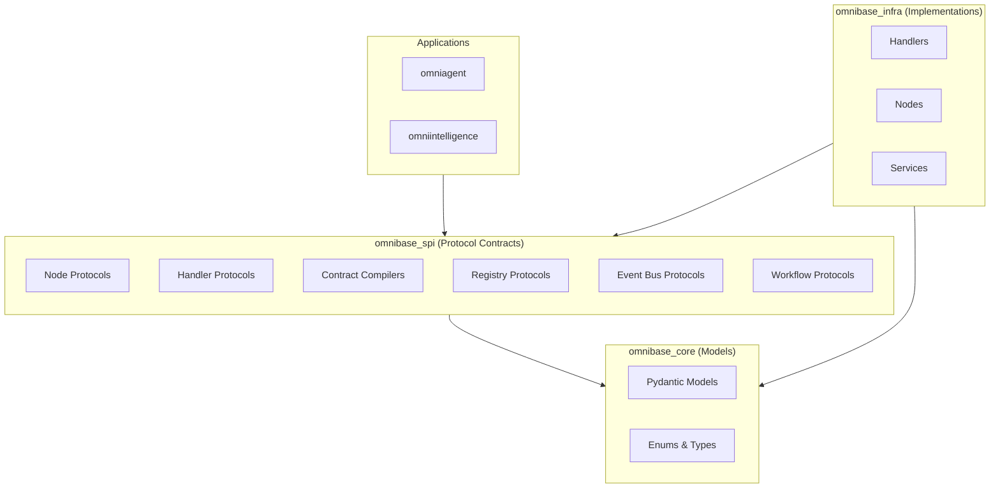
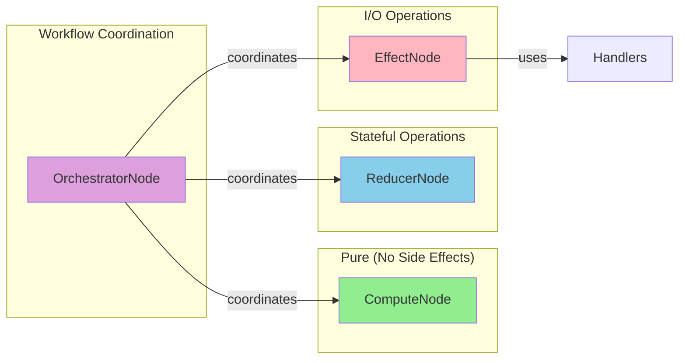

# ONEX SPI API Reference

## Overview

Complete API reference documentation for all **176 protocols** across **22 specialized domains** in the omnibase-spi package. This reference provides detailed documentation for every public interface in the Service Provider Interface layer.

## Protocol Architecture

The ONEX SPI follows a **protocol-first design** with enterprise-grade features:

- **Zero Implementation Dependencies**: Pure protocol contracts only
- **Runtime Type Safety**: Full `@runtime_checkable` protocol support
- **Dependency Injection**: Sophisticated service lifecycle management
- **Event-Driven Architecture**: Event sourcing and workflow orchestration
- **Multi-Subsystem Coordination**: MCP integration and distributed tooling

### SPI Layer Diagram



### ONEX 4-Node Architecture



## Domain Organization

The API reference is organized by domain, matching the package structure:

### Core System Protocols
- **[Core Protocols](./CORE.md)** - System-level contracts and fundamentals (13 protocols)
- **[Container Protocols](./CONTAINER.md)** - Dependency injection and service management (14 protocols)
- **[Node Protocols](./NODES.md)** - ONEX 4-node architecture (5 protocols) **NEW in v0.3.0**
- **[Handler Protocols](./HANDLERS.md)** - Protocol-specific I/O handlers (1 protocol) **NEW in v0.3.0**
- **[Contract Compilers](./CONTRACTS.md)** - Contract compilation protocols (3 protocols) **NEW in v0.3.0**
- **[Registry Protocols](./REGISTRY.md)** - Handler registry management (1 protocol) **NEW in v0.3.0**
- **[Exceptions](./EXCEPTIONS.md)** - SPI exception hierarchy (6 exceptions) **NEW in v0.3.0**

### Workflow and Event Processing
- **[Workflow Orchestration](./WORKFLOW-ORCHESTRATION.md)** - Event-driven FSM orchestration (12 protocols)
- **[Event Bus](./EVENT-BUS.md)** - Distributed messaging infrastructure (14 protocols)
- **[Memory Management](./MEMORY.md)** - Memory operations and workflow management (14 protocols)

### Integration and Communication
- **[MCP Integration](./MCP.md)** - Model Context Protocol coordination (14 protocols)
- **[Networking](./NETWORKING.md)** - HTTP, Kafka, and communication protocols (6 protocols)
- **[File Handling](./FILE-HANDLING.md)** - File processing and type handling (8 protocols)

### Validation and Quality
- **[Validation](./VALIDATION.md)** - Input validation and compliance (10 protocols)

### Type System
- **Type definitions are integrated within each protocol domain**
- **All types follow consistent naming conventions**
- **Comprehensive type coverage across all 176 protocols**
- **Type Protocols (14)**: ProtocolContract, ProtocolOnexError, and domain-specific type definitions
- **ONEX Node Types (4)**: ProtocolEffectNode, ProtocolComputeNode, ProtocolReducerNode, ProtocolOrchestratorNode

## Protocol Documentation Standards

### Protocol Documentation Format

Each protocol is documented with:

```python
@runtime_checkable
class ProtocolExample(Protocol):
    """
    Brief description of the protocol's purpose.

    Detailed description covering:
    - Primary use cases and scenarios
    - Key features and capabilities
    - Integration patterns and usage
    - Implementation requirements

    Key Features:
        - **Feature 1**: Description of key feature
        - **Feature 2**: Description of another feature

    Example::

        # Usage example
        async def example_usage(service: ProtocolExample):
            result = await service.method_name(param="value")
            return result

    """

    # Properties are documented with type annotations
    property_name: str
    """Description of the property."""

    async def method_name(
        self,
        param: str,
        optional_param: Optional[int] = None,
    ) -> str:
        """
        Method description with clear purpose.

        Args:
            param: Description of required parameter
            optional_param: Description of optional parameter

        Returns:
            Description of return value

        Raises:
            ValueError: When parameter validation fails
            TimeoutError: When operation times out
        """
        ...
```

### Type Documentation Format

Type aliases and protocol classes are documented with:

```python
WorkflowState = Literal[
    "pending", "running", "completed", "failed"
]
"""
Workflow execution states.

Values:
    pending: Workflow is waiting to start
    running: Workflow is currently executing
    completed: Workflow finished successfully
    failed: Workflow encountered an error
"""
```

## Quick Reference

### Core System Interfaces
| Protocol | Purpose | Usage |
|----------|---------|-------|
| `ProtocolLogger` | Structured logging | System-wide logging |
| `ProtocolHealthMonitor` | Health monitoring | Service health tracking |
| `ProtocolServiceRegistry` | Dependency injection | Service lifecycle management |
| `ProtocolCacheService` | Caching abstraction | Performance optimization |

### Workflow Orchestration
| Protocol | Purpose | Usage |
|----------|---------|-------|
| `ProtocolWorkflowEventBus` | Event-driven orchestration | Workflow coordination |
| `ProtocolWorkflowOrchestrator` | Workflow management | Distributed execution |
| `ProtocolWorkQueue` | Task scheduling | Work distribution |
| `ProtocolWorkflowPersistence` | State management | Workflow state storage |

### MCP Integration
| Protocol | Purpose | Usage |
|----------|---------|-------|
| `ProtocolMCPRegistry` | Tool coordination | Multi-subsystem management |
| `ProtocolMCPToolProxy` | Tool execution | Distributed tool calls |
| `ProtocolMCPMonitor` | Health monitoring | System health tracking |
| `ProtocolMCPSubsystemClient` | Subsystem communication | Tool routing |

### Event Processing
| Protocol | Purpose | Usage |
|----------|---------|-------|
| `ProtocolEventBus` | Event messaging | Distributed communication |
| `ProtocolKafkaAdapter` | Kafka integration | Event streaming |
| `ProtocolEventOrchestrator` | Event coordination | Event routing |
| `ProtocolEventPublisher` | Event publishing | Message distribution |
| `ProtocolEventBusProvider` | Event bus provider | Component-level integration |

### Container Management
| Protocol | Purpose | Usage |
|----------|---------|-------|
| `ProtocolServiceRegistry` | Service registration | Dependency injection |
| `ProtocolServiceFactory` | Service creation | Instance management |
| `ProtocolDependencyGraph` | Dependency analysis | Circular dependency detection |
| `ProtocolInjectionContext` | Injection tracking | Context management |
| `ProtocolServiceResolver` | Service resolution | Type/name-based lookup |
| `ProtocolContainer` | Generic value containers | Metadata-aware value wrapping |

### ONEX Node Types
| Protocol | Purpose | Usage |
|----------|---------|-------|
| `ProtocolEffectNode` | Side-effecting operations | I/O, API calls, database operations |
| `ProtocolComputeNode` | Pure transformations | Business logic, data transformation |
| `ProtocolReducerNode` | Data aggregation | Result synthesis, state persistence |
| `ProtocolOrchestratorNode` | Workflow coordination | Task distribution, state management |

## Implementation Notes

### Protocol Compliance

All protocols in the API reference are designed to be:

- **Runtime Checkable**: Use `isinstance(obj, Protocol)` for validation
- **Type Safe**: Full mypy compatibility with strict checking
- **Framework Agnostic**: No dependencies on specific implementations
- **Forward Compatible**: Extensible design for future enhancements

### SPI Purity

The API reference documents pure protocol definitions that:

- Contain no concrete implementations
- Use only abstract method signatures with `...`
- Employ type hints for all parameters and return values
- Follow namespace isolation rules
- Maintain zero runtime dependencies

### Usage Patterns

Common patterns documented throughout:

- **Dependency Injection**: Using protocols as service contracts
- **Event Sourcing**: Building event-driven architectures
- **Distributed Coordination**: Multi-node service coordination
- **Type Safety**: Leveraging strong typing for reliability

## Protocol Statistics

- **Total Protocols**: 176+ protocol files
- **Domain Coverage**: 22+ specialized domains
- **Type Definitions**: 14 comprehensive type modules
- **Enterprise Features**: Health monitoring, metrics, circuit breakers
- **Architecture Patterns**: Event sourcing, dependency injection, distributed coordination
- **Latest Additions (v0.3.0)**:
  - **Node Protocols**: ProtocolNode, ProtocolComputeNode, ProtocolEffectNode, ProtocolReducerNode, ProtocolOrchestratorNode
  - **Handler Protocols**: ProtocolHandler with full lifecycle management
  - **Contract Compilers**: ProtocolEffectContractCompiler, ProtocolWorkflowContractCompiler, ProtocolFSMContractCompiler
  - **Registry**: ProtocolHandlerRegistry for handler dependency injection
  - **Exceptions**: Complete SPIError hierarchy with context support

## Navigation

Use the sidebar or table of contents to navigate between different protocol domains. Each page includes:

- **Overview** - Domain purpose and key concepts
- **Types** - Type definitions and aliases
- **Protocols** - Protocol interface definitions
- **Usage Examples** - Practical usage patterns
- **Integration Notes** - Implementation guidance

## Version Information

- **API Version**: 0.3.0
- **Python Compatibility**: 3.12+
- **Type Checking**: mypy strict mode compatible
- **Runtime Checking**: All protocols are `@runtime_checkable`

---

*This API reference is automatically generated from protocol definitions and maintained alongside the codebase.*
