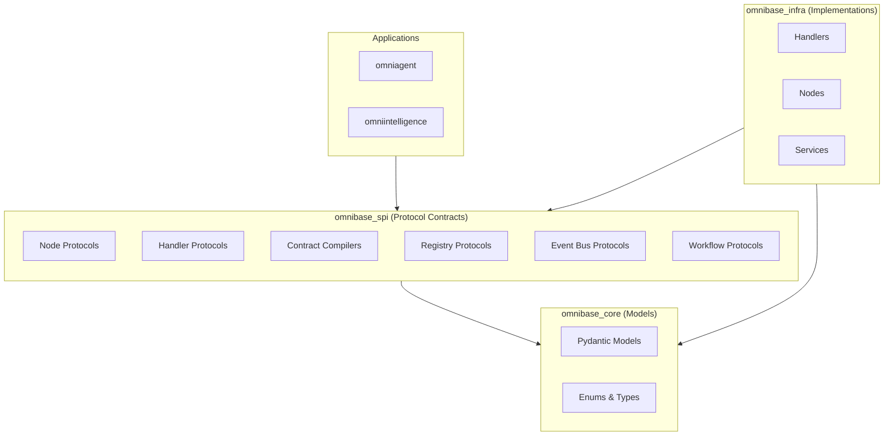
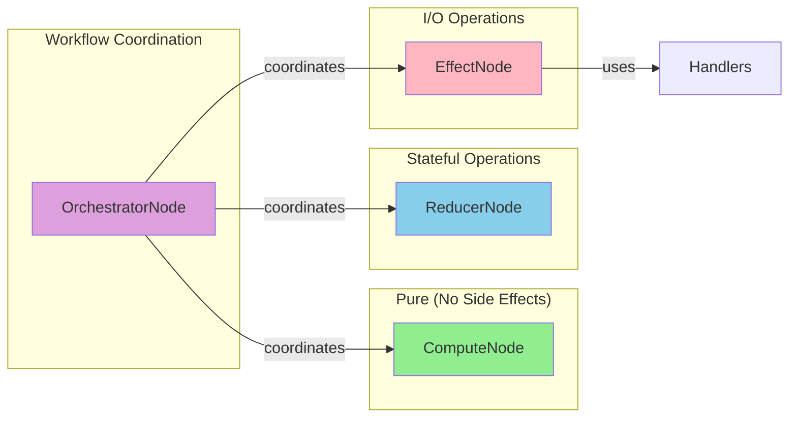

# ONEX SPI API Reference

## Overview

Complete API reference documentation for all **176 protocols** across **22 specialized domains** in the omnibase-spi package. This reference provides detailed documentation for every public interface in the Service Provider Interface layer.

## Protocol Architecture

The ONEX SPI follows a **protocol-first design** with enterprise-grade features:

- **Zero Implementation Dependencies**: Pure protocol contracts only
- **Runtime Type Safety**: Full `@runtime_checkable` protocol support
- **Dependency Injection**: Sophisticated service lifecycle management
- **Event-Driven Architecture**: Event sourcing and workflow orchestration
- **Multi-Subsystem Coordination**: MCP integration and distributed tooling

### SPI Layer Diagram



### ONEX 4-Node Architecture



## Domain Organization

The API reference is organized by domain, matching the package structure:

### Core System Protocols
- **[Core Protocols](./CORE.md)** - System-level contracts and fundamentals (13 protocols)
- **[Container Protocols](./CONTAINER.md)** - Dependency injection and service management (14 protocols)
- **[Node Protocols](./NODES.md)** - ONEX 4-node architecture (5 protocols) **NEW in v0.3.0**
- **[Handler Protocols](./HANDLERS.md)** - Protocol-specific I/O handlers (1 protocol) **NEW in v0.3.0**
- **[Contract Compilers](./CONTRACTS.md)** - Contract compilation protocols (3 protocols) **NEW in v0.3.0**
- **[Registry Protocols](./REGISTRY.md)** - Handler registry management (1 protocol) **NEW in v0.3.0**
- **[Exceptions](./EXCEPTIONS.md)** - SPI exception hierarchy (6 exceptions) **NEW in v0.3.0**

### Workflow and Event Processing
- **[Workflow Orchestration](./WORKFLOW-ORCHESTRATION.md)** - Event-driven FSM orchestration (12 protocols)
- **[Event Bus](./EVENT-BUS.md)** - Distributed messaging infrastructure (14 protocols)
- **[Memory Management](./MEMORY.md)** - Memory operations and workflow management (14 protocols)

### Integration and Communication
- **[MCP Integration](./MCP.md)** - Model Context Protocol coordination (14 protocols)
- **[Networking](./NETWORKING.md)** - HTTP, Kafka, and communication protocols (6 protocols)
- **[File Handling](./FILE-HANDLING.md)** - File processing and type handling (8 protocols)

### Validation and Quality
- **[Validation](./VALIDATION.md)** - Input validation and compliance (10 protocols)

### Type System
- **Type definitions are integrated within each protocol domain**
- **All types follow consistent naming conventions**
- **Comprehensive type coverage across all 176 protocols**
- **Type Protocols (14)**: ProtocolContract, ProtocolOnexError, and domain-specific type definitions
- **ONEX Node Types (4)**: ProtocolEffectNode, ProtocolComputeNode, ProtocolReducerNode, ProtocolOrchestratorNode

## Protocol Documentation Standards

### Protocol Documentation Format

Each protocol is documented with:

```python
@runtime_checkable
class ProtocolExample(Protocol):
    """
    Brief description of the protocol's purpose.

    Detailed description covering:
    - Primary use cases and scenarios
    - Key features and capabilities
    - Integration patterns and usage
    - Implementation requirements

    Key Features:
        - **Feature 1**: Description of key feature
        - **Feature 2**: Description of another feature

    Example::

        # Usage example
        async def example_usage(service: ProtocolExample):
            result = await service.method_name(param="value")
            return result

    """

    # Properties are documented with type annotations
    property_name: str
    """Description of the property."""

    async def method_name(
        self,
        param: str,
        optional_param: Optional[int] = None,
    ) -> str:
        """
        Method description with clear purpose.

        Args:
            param: Description of required parameter
            optional_param: Description of optional parameter

        Returns:
            Description of return value

        Raises:
            ValueError: When parameter validation fails
            TimeoutError: When operation times out
        """
        ...
```

### Type Documentation Format

Type aliases and protocol classes are documented with:

```python
WorkflowState = Literal[
    "pending", "running", "completed", "failed"
]
"""
Workflow execution states.

Values:
    pending: Workflow is waiting to start
    running: Workflow is currently executing
    completed: Workflow finished successfully
    failed: Workflow encountered an error
"""
```

## Quick Reference

### Core System Interfaces
| Protocol | Purpose | Usage |
|----------|---------|-------|
| `ProtocolLogger` | Structured logging | System-wide logging |
| `ProtocolHealthMonitor` | Health monitoring | Service health tracking |
| `ProtocolServiceRegistry` | Dependency injection | Service lifecycle management |
| `ProtocolCacheService` | Caching abstraction | Performance optimization |

### Workflow Orchestration
| Protocol | Purpose | Usage |
|----------|---------|-------|
| `ProtocolWorkflowEventBus` | Event-driven orchestration | Workflow coordination |
| `ProtocolWorkflowOrchestrator` | Workflow management | Distributed execution |
| `ProtocolWorkQueue` | Task scheduling | Work distribution |
| `ProtocolWorkflowPersistence` | State management | Workflow state storage |

### MCP Integration
| Protocol | Purpose | Usage |
|----------|---------|-------|
| `ProtocolMCPRegistry` | Tool coordination | Multi-subsystem management |
| `ProtocolMCPToolProxy` | Tool execution | Distributed tool calls |
| `ProtocolMCPMonitor` | Health monitoring | System health tracking |
| `ProtocolMCPSubsystemClient` | Subsystem communication | Tool routing |

### Event Processing
| Protocol | Purpose | Usage |
|----------|---------|-------|
| `ProtocolEventBus` | Event messaging | Distributed communication |
| `ProtocolKafkaAdapter` | Kafka integration | Event streaming |
| `ProtocolEventOrchestrator` | Event coordination | Event routing |
| `ProtocolEventPublisher` | Event publishing | Message distribution |
| `ProtocolEventBusProvider` | Event bus provider | Component-level integration |

### Container Management
| Protocol | Purpose | Usage |
|----------|---------|-------|
| `ProtocolServiceRegistry` | Service registration | Dependency injection |
| `ProtocolServiceFactory` | Service creation | Instance management |
| `ProtocolDependencyGraph` | Dependency analysis | Circular dependency detection |
| `ProtocolInjectionContext` | Injection tracking | Context management |
| `ProtocolServiceResolver` | Service resolution | Type/name-based lookup |
| `ProtocolContainer` | Generic value containers | Metadata-aware value wrapping |

### ONEX Node Types
| Protocol | Purpose | Usage |
|----------|---------|-------|
| `ProtocolEffectNode` | Side-effecting operations | I/O, API calls, database operations |
| `ProtocolComputeNode` | Pure transformations | Business logic, data transformation |
| `ProtocolReducerNode` | Data aggregation | Result synthesis, state persistence |
| `ProtocolOrchestratorNode` | Workflow coordination | Task distribution, state management |

## Implementation Notes

### Protocol Compliance

All protocols in the API reference are designed to be:

- **Runtime Checkable**: Use `isinstance(obj, Protocol)` for validation
- **Type Safe**: Full mypy compatibility with strict checking
- **Framework Agnostic**: No dependencies on specific implementations
- **Forward Compatible**: Extensible design for future enhancements

### SPI Purity

The API reference documents pure protocol definitions that:

- Contain no concrete implementations
- Use only abstract method signatures with `...`
- Employ type hints for all parameters and return values
- Follow namespace isolation rules
- Maintain zero runtime dependencies

### Usage Patterns

Common patterns documented throughout:

- **Dependency Injection**: Using protocols as service contracts
- **Event Sourcing**: Building event-driven architectures
- **Distributed Coordination**: Multi-node service coordination
- **Type Safety**: Leveraging strong typing for reliability

## Protocol Statistics

- **Total Protocols**: 176+ protocol files
- **Domain Coverage**: 22+ specialized domains
- **Type Definitions**: 14 comprehensive type modules
- **Enterprise Features**: Health monitoring, metrics, circuit breakers
- **Architecture Patterns**: Event sourcing, dependency injection, distributed coordination
- **Latest Additions (v0.3.0)**:
  - **Node Protocols**: ProtocolNode, ProtocolComputeNode, ProtocolEffectNode, ProtocolReducerNode, ProtocolOrchestratorNode
  - **Handler Protocols**: ProtocolHandler with full lifecycle management
  - **Contract Compilers**: ProtocolEffectContractCompiler, ProtocolWorkflowContractCompiler, ProtocolFSMContractCompiler
  - **Registry**: ProtocolHandlerRegistry for handler dependency injection
  - **Exceptions**: Complete SPIError hierarchy with context support

## Navigation

Use the sidebar or table of contents to navigate between different protocol domains. Each page includes:

- **Overview** - Domain purpose and key concepts
- **Types** - Type definitions and aliases
- **Protocols** - Protocol interface definitions
- **Usage Examples** - Practical usage patterns
- **Integration Notes** - Implementation guidance

## Common Patterns

This section demonstrates common multi-protocol usage patterns showing how protocols work together in real-world scenarios.

### Pattern 1: Handler Lifecycle with Registry

**Use Case**: Register protocol handlers and manage their lifecycle through dependency injection.

**Protocols Involved**:
- `ProtocolHandler` - Protocol-specific I/O handler interface
- `ProtocolHandlerRegistry` - Handler registration and lookup
- `ProtocolServiceRegistry` - Service lifecycle management

```python
from omnibase_spi.protocols import (
    ProtocolHandler,
    ProtocolHandlerRegistry,
    ProtocolServiceRegistry,
)
from omnibase_spi.exceptions import RegistryError


async def setup_handlers(
    registry: ProtocolHandlerRegistry,
    service_registry: ProtocolServiceRegistry,
) -> None:
    """
    Register handlers and configure lifecycle management.

    This pattern enables dynamic handler discovery and injection
    into effect nodes at runtime.
    """
    # Register handler classes by protocol type
    registry.register("http", HttpHandler)
    registry.register("postgresql", PostgresHandler)
    registry.register("kafka", KafkaHandler)

    # List available protocols for introspection
    available = registry.list_protocols()
    print(f"Registered protocols: {available}")

    # Resolve handler for effect node injection
    if registry.is_registered("postgresql"):
        handler_cls = registry.get("postgresql")

        # Register as singleton in service registry
        await service_registry.register_service(
            interface=ProtocolHandler,
            implementation=handler_cls,
            lifecycle="singleton",
            scope="global",
            configuration={"pool_size": 10},
        )


async def use_handler(registry: ProtocolHandlerRegistry) -> None:
    """Resolve and use a handler with proper lifecycle."""
    try:
        handler_cls = registry.get("http")
        handler = handler_cls()

        # Initialize with connection config
        await handler.initialize(connection_config)

        try:
            # Execute protocol-specific operation
            response = await handler.execute(request, operation_config)

            # Health check for monitoring
            health = await handler.health_check()
            if not health["healthy"]:
                # Handle degraded state
                pass
        finally:
            # Always clean up resources
            await handler.shutdown(timeout_seconds=10.0)

    except RegistryError as e:
        print(f"Protocol not registered: {e.context}")
```

**Related Documentation**: [HANDLERS.md](./HANDLERS.md), [REGISTRY.md](./REGISTRY.md), [CONTAINER.md](./CONTAINER.md)

---

### Pattern 2: Effect Node with Handler Injection

**Use Case**: Create effect nodes that receive handlers via dependency injection, enabling testability and protocol flexibility.

**Protocols Involved**:
- `ProtocolOnexEffectNode` - Effect node interface for side-effecting operations
- `ProtocolHandler` - Injected handler for I/O operations
- `ProtocolServiceRegistry` - Dependency resolution

```python
from typing import Any

from omnibase_spi.protocols import (
    ProtocolHandler,
    ProtocolOnexEffectNode,
    ProtocolServiceRegistry,
)
from omnibase_spi.exceptions import (
    InvalidProtocolStateError,
    ProtocolHandlerError,
    SPIError,
)


class ApiEffectNode:
    """
    Effect node that uses injected handlers for external API calls.

    This pattern separates I/O concerns from business logic,
    enabling easy testing with mock handlers.
    """

    def __init__(
        self,
        handler: ProtocolHandler,
        node_id: str = "effect-api-call",
    ) -> None:
        self._handler = handler
        self._node_id = node_id
        self._initialized = False

    @property
    def node_id(self) -> str:
        return self._node_id

    @property
    def node_type(self) -> str:
        return "effect"

    async def initialize(self, config: Any) -> None:
        """Initialize the effect node and its handler."""
        await self._handler.initialize(config)
        self._initialized = True

    async def execute_effect(self, contract: Any) -> Any:
        """
        Execute the effect using the injected handler.

        Raises:
            InvalidProtocolStateError: If called before initialize().
            ProtocolHandlerError: If handler execution fails.
        """
        if not self._initialized:
            raise InvalidProtocolStateError(
                "Cannot call execute_effect() before initialize()",
                context={
                    "node_id": self._node_id,
                    "current_state": "uninitialized",
                    "required_state": "initialized",
                },
            )

        try:
            # Build request from contract
            request = self._build_request(contract)
            operation_config = self._build_operation_config(contract)

            # Delegate to handler
            response = await self._handler.execute(request, operation_config)

            return self._transform_response(response)

        except ProtocolHandlerError:
            # Re-raise handler errors with context
            raise
        except Exception as e:
            raise ProtocolHandlerError(
                f"Effect execution failed: {e}",
                context={"node_id": self._node_id, "contract": str(contract)},
            ) from e


# Factory function using service registry
async def create_api_effect_node(
    service_registry: ProtocolServiceRegistry,
    protocol_type: str = "http",
) -> ApiEffectNode:
    """
    Create effect node with handler resolved from service registry.

    This pattern enables runtime handler selection and testing.
    """
    # Resolve handler from registry
    handler = await service_registry.resolve_service(
        interface=ProtocolHandler,
        context={"protocol_type": protocol_type},
    )

    # Validate handler type at runtime
    assert isinstance(handler, ProtocolHandler)

    return ApiEffectNode(handler=handler)
```

**Related Documentation**: [NODES.md](./NODES.md), [HANDLERS.md](./HANDLERS.md), [EXCEPTIONS.md](./EXCEPTIONS.md)

---

### Pattern 3: Contract Compilation Pipeline

**Use Case**: Compile YAML contracts into runtime models for node configuration and validation.

**Protocols Involved**:
- `ProtocolEffectContractCompiler` - Effect contract compilation
- `ProtocolWorkflowContractCompiler` - Workflow contract compilation
- `ProtocolFSMContractCompiler` - FSM state machine compilation

```python
from pathlib import Path

from omnibase_spi.protocols import (
    ProtocolEffectContractCompiler,
    ProtocolWorkflowContractCompiler,
)
from omnibase_spi.exceptions import ContractCompilerError


async def compile_effect_contract(
    compiler: ProtocolEffectContractCompiler,
    contract_path: Path,
) -> None:
    """
    Compile and validate an effect contract.

    Effect contracts define side-effecting operations such as
    API calls, database queries, and message publishing.
    """
    # First validate without compiling
    validation_result = await compiler.validate(contract_path)

    if not validation_result.is_valid:
        for error in validation_result.errors:
            print(f"Validation error: {error}")
        return

    # Compile to runtime model
    try:
        contract = await compiler.compile(contract_path)

        # Use compiled contract to configure effect node
        print(f"Compiled effect contract: {contract.name}")
        print(f"Protocol type: {contract.protocol_type}")
        print(f"Retry policy: {contract.retry_policy}")

    except ContractCompilerError as e:
        print(f"Compilation failed: {e}")
        print(f"Context: {e.context}")


async def compile_workflow_pipeline(
    effect_compiler: ProtocolEffectContractCompiler,
    workflow_compiler: ProtocolWorkflowContractCompiler,
    contracts_dir: Path,
) -> dict:
    """
    Compile a complete workflow with its effect dependencies.

    This pattern shows how contract compilers work together
    to build a complete workflow configuration.
    """
    compiled = {"effects": [], "workflow": None}

    # Compile all effect contracts first
    effects_dir = contracts_dir / "effects"
    for effect_path in effects_dir.glob("*.yaml"):
        try:
            effect_contract = await effect_compiler.compile(effect_path)
            compiled["effects"].append(effect_contract)
        except ContractCompilerError as e:
            raise ContractCompilerError(
                f"Failed to compile effect: {effect_path.name}",
                context={
                    "path": str(effect_path),
                    "original_error": str(e),
                    **e.context,
                },
            ) from e

    # Compile workflow contract
    workflow_path = contracts_dir / "workflow.yaml"
    try:
        workflow_contract = await workflow_compiler.compile(workflow_path)
        compiled["workflow"] = workflow_contract

        # Validate that workflow references valid effects
        for step in workflow_contract.steps:
            effect_names = [e.name for e in compiled["effects"]]
            if step.effect_ref not in effect_names:
                raise ContractCompilerError(
                    f"Workflow references unknown effect: {step.effect_ref}",
                    context={
                        "workflow": workflow_contract.name,
                        "step": step.name,
                        "available_effects": effect_names,
                    },
                )

    except FileNotFoundError:
        raise ContractCompilerError(
            "Workflow contract not found",
            context={"path": str(workflow_path)},
        )

    return compiled
```

**Related Documentation**: [CONTRACTS.md](./CONTRACTS.md), [NODES.md](./NODES.md)

---

### Pattern 4: Error Handling Chain

**Use Case**: Properly handle and propagate errors through the SPI exception hierarchy with rich context.

**Protocols Involved**:
- `SPIError` - Base exception for all SPI errors
- `ProtocolHandlerError` - Handler execution failures
- `HandlerInitializationError` - Handler setup failures
- `InvalidProtocolStateError` - Lifecycle violations

```python
from omnibase_spi.exceptions import (
    ContractCompilerError,
    HandlerInitializationError,
    InvalidProtocolStateError,
    ProtocolHandlerError,
    ProtocolNotImplementedError,
    RegistryError,
    SPIError,
)


async def execute_with_error_handling(
    handler: ProtocolHandler,
    request: Any,
) -> Any:
    """
    Demonstrate proper error handling with SPI exceptions.

    All SPI exceptions include a context dict for debugging.
    """
    try:
        # Attempt handler execution
        return await handler.execute(request, operation_config)

    except HandlerInitializationError as e:
        # Handler failed to initialize (connection issues, auth, etc.)
        log.error(
            "Handler initialization failed",
            handler_type=e.context.get("handler_type"),
            connection=e.context.get("connection_string"),
            retry_count=e.context.get("retry_count"),
        )
        raise  # Re-raise to caller

    except InvalidProtocolStateError as e:
        # Called method in wrong lifecycle state
        log.error(
            "Invalid protocol state",
            node_id=e.context.get("node_id"),
            current_state=e.context.get("current_state"),
            required_state=e.context.get("required_state"),
        )
        raise

    except ProtocolHandlerError as e:
        # Handler execution failed
        log.error(
            "Handler execution failed",
            status_code=e.context.get("status_code"),
            url=e.context.get("url"),
            method=e.context.get("method"),
        )
        # Optionally wrap with more context
        raise ProtocolHandlerError(
            f"Request failed: {e}",
            context={
                **e.context,
                "request_id": request.id,
                "timestamp": datetime.utcnow().isoformat(),
            },
        ) from e


def resolve_with_fallback(
    registry: ProtocolHandlerRegistry,
    protocol_type: str,
    fallback_type: str = "http",
) -> type[ProtocolHandler]:
    """
    Resolve handler with fallback using exception handling.
    """
    try:
        return registry.get(protocol_type)
    except RegistryError as e:
        log.warning(
            "Protocol not registered, using fallback",
            requested=protocol_type,
            fallback=fallback_type,
            available=e.context.get("available_types", []),
        )
        return registry.get(fallback_type)


async def safe_workflow_execution(
    orchestrator: ProtocolOnexOrchestratorNode,
    contract: Any,
) -> Any:
    """
    Execute workflow with comprehensive error handling.

    Demonstrates catching base SPIError for broad exception handling.
    """
    try:
        return await orchestrator.execute_orchestration(contract)

    except ContractCompilerError as e:
        # Contract configuration issue
        log.error("Contract error", path=e.context.get("path"))
        raise

    except ProtocolNotImplementedError as e:
        # Missing implementation in DI container
        log.error(
            "Missing implementation",
            protocol=e.context.get("protocol_name"),
            required_by=e.context.get("required_by"),
        )
        raise

    except SPIError as e:
        # Catch-all for any SPI error
        log.error(
            "SPI error during workflow execution",
            error_type=type(e).__name__,
            message=str(e),
            context=e.context,
        )
        # Add workflow context and re-raise
        e.context["workflow_id"] = contract.workflow_id
        raise
```

**Related Documentation**: [EXCEPTIONS.md](./EXCEPTIONS.md)

---

### Pattern 5: Workflow Orchestration

**Use Case**: Coordinate multiple node types through an orchestrator to execute complex multi-step workflows.

**Protocols Involved**:
- `ProtocolOnexOrchestratorNode` - Workflow coordination
- `ProtocolOnexComputeNode` - Pure transformations
- `ProtocolOnexEffectNode` - Side-effecting operations
- `ProtocolOnexReducerNode` - Result aggregation
- `ProtocolServiceRegistry` - Node resolution

```python
from typing import Any

from omnibase_spi.protocols import (
    ProtocolOnexComputeNode,
    ProtocolOnexEffectNode,
    ProtocolOnexOrchestratorNode,
    ProtocolOnexReducerNode,
    ProtocolServiceRegistry,
)
from omnibase_spi.exceptions import SPIError


class DataProcessingOrchestrator:
    """
    Orchestrator that coordinates compute, effect, and reducer nodes.

    This pattern demonstrates the ONEX 4-node architecture:
    - Compute: Pure data transformations
    - Effect: External I/O operations
    - Reducer: Result aggregation
    - Orchestrator: Workflow coordination
    """

    def __init__(
        self,
        compute_node: ProtocolOnexComputeNode,
        effect_node: ProtocolOnexEffectNode,
        reducer_node: ProtocolOnexReducerNode,
    ) -> None:
        self._compute = compute_node
        self._effect = effect_node
        self._reducer = reducer_node
        self._node_id = "orchestrator-data-processing"

    @property
    def node_id(self) -> str:
        return self._node_id

    @property
    def node_type(self) -> str:
        return "orchestrator"

    async def execute_orchestration(self, contract: Any) -> Any:
        """
        Execute a multi-step data processing workflow.

        Workflow steps:
        1. Compute: Transform and validate input data
        2. Effect: Fetch enrichment data from external API
        3. Compute: Merge and transform combined data
        4. Reducer: Aggregate results and generate summary
        """
        results = []

        try:
            # Step 1: Initial data transformation (pure compute)
            compute_contract = self._build_compute_contract(
                contract.input_data,
                operation="validate_and_transform",
            )
            transformed = await self._compute.execute_compute(compute_contract)
            results.append({"step": "transform", "output": transformed})

            # Step 2: Fetch external data (effect)
            effect_contract = self._build_effect_contract(
                transformed,
                operation="fetch_enrichment",
            )
            enrichment = await self._effect.execute_effect(effect_contract)
            results.append({"step": "enrich", "output": enrichment})

            # Step 3: Merge data (pure compute)
            merge_contract = self._build_compute_contract(
                {"original": transformed, "enrichment": enrichment},
                operation="merge",
            )
            merged = await self._compute.execute_compute(merge_contract)
            results.append({"step": "merge", "output": merged})

            # Step 4: Aggregate results (reducer)
            reducer_contract = self._build_reducer_contract(
                merged,
                aggregation_type="summary",
            )
            final_result = await self._reducer.execute_reduction(reducer_contract)
            results.append({"step": "aggregate", "output": final_result})

            return {
                "status": "completed",
                "workflow_id": contract.workflow_id,
                "steps": results,
                "result": final_result,
            }

        except SPIError as e:
            # Add orchestration context to error
            e.context["orchestrator_id"] = self._node_id
            e.context["completed_steps"] = [r["step"] for r in results]
            raise


async def create_orchestrator(
    service_registry: ProtocolServiceRegistry,
) -> DataProcessingOrchestrator:
    """
    Create orchestrator with nodes resolved from service registry.

    This pattern enables flexible node composition and testing.
    """
    # Resolve nodes from service registry
    compute_node = await service_registry.resolve_service(
        interface=ProtocolOnexComputeNode,
        context={"node_type": "compute:transform"},
    )

    effect_node = await service_registry.resolve_service(
        interface=ProtocolOnexEffectNode,
        context={"node_type": "effect:http"},
    )

    reducer_node = await service_registry.resolve_service(
        interface=ProtocolOnexReducerNode,
        context={"node_type": "reducer:aggregation"},
    )

    return DataProcessingOrchestrator(
        compute_node=compute_node,
        effect_node=effect_node,
        reducer_node=reducer_node,
    )


# Runtime protocol validation
def validate_node_types(
    compute: object,
    effect: object,
    reducer: object,
    orchestrator: object,
) -> bool:
    """Validate that objects implement required protocols."""
    return all([
        isinstance(compute, ProtocolOnexComputeNode),
        isinstance(effect, ProtocolOnexEffectNode),
        isinstance(reducer, ProtocolOnexReducerNode),
        isinstance(orchestrator, ProtocolOnexOrchestratorNode),
    ])
```

**Related Documentation**: [NODES.md](./NODES.md), [WORKFLOW-ORCHESTRATION.md](./WORKFLOW-ORCHESTRATION.md), [CONTAINER.md](./CONTAINER.md)

---

## Version Information

- **API Version**: 0.3.0
- **Python Compatibility**: 3.12+
- **Type Checking**: mypy strict mode compatible
- **Runtime Checking**: All protocols are `@runtime_checkable`

## See Also

- **[Glossary](../GLOSSARY.md)** - Definitions of terms used in this reference (Protocol, Handler, Node, Contract, etc.)
- **[Quick Start Guide](../QUICK-START.md)** - Get up and running quickly
- **[Developer Guide](../developer-guide/README.md)** - Complete development workflow
- **[Architecture Overview](../architecture/README.md)** - Design principles and patterns
- **[Contributing Guide](../CONTRIBUTING.md)** - How to contribute to the project
- **[Main README](../../README.md)** - Repository overview

For term definitions, see the [Glossary](../GLOSSARY.md).

---

*This API reference is automatically generated from protocol definitions and maintained alongside the codebase.*
