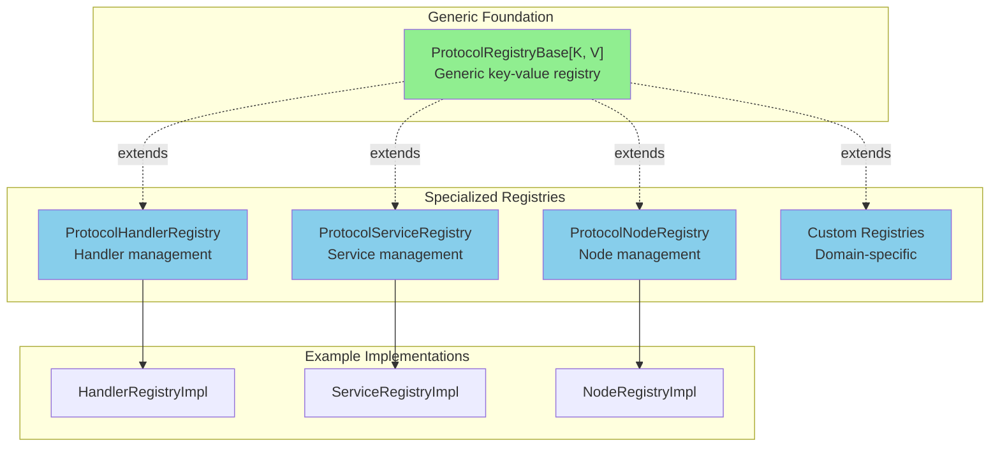
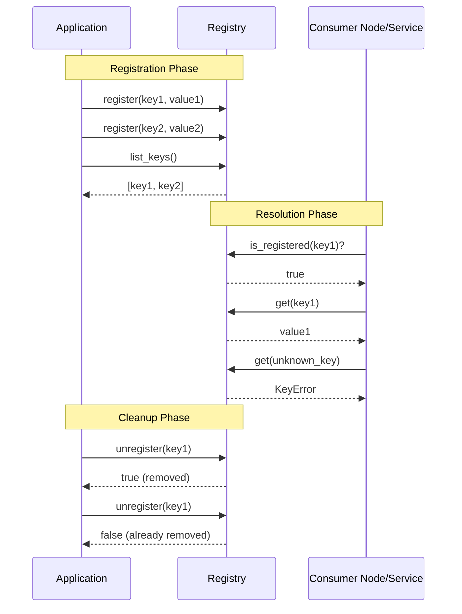

# Registry Protocols API Reference

  

---

## Table of Contents

- [Overview](#overview)
- [Architecture](#architecture)
- [ProtocolRegistryBase[K, V]](#protocolregistrybasek-v) **NEW**
  - [Description](#description)
  - [Type Parameters](#type-parameters)
  - [Methods](#methods)
  - [Protocol Definition](#protocol-definition)
  - [Thread Safety](#thread-safety)
  - [Error Handling](#error-handling)
  - [Invariants](#invariants)
- [Usage Patterns](#usage-patterns)
  - [Pattern 1: Simple Type Alias](#pattern-1-simple-type-alias)
  - [Pattern 2: Extended Protocol](#pattern-2-extended-protocol)
  - [Pattern 3: Custom Implementation](#pattern-3-custom-implementation)
- [ProtocolHandlerRegistry](#protocolhandlerregistry)
  - [Description](#description-1)
  - [Methods](#methods-1)
  - [Protocol Definition](#protocol-definition-1)
  - [Usage Example](#usage-example)
  - [Factory Pattern Integration](#factory-pattern-integration)
  - [Effect Node Integration](#effect-node-integration)
  - [Testing with Mock Registry](#testing-with-mock-registry)
- [Migration Guide](#migration-guide)
  - [Migrating from ProtocolHandlerRegistry](#migrating-from-protocolhandlerregistry)
  - [Migrating from ProtocolServiceRegistry](#migrating-from-protocolserviceregistry)
- [Best Practices](#best-practices)
- [Handler Validation Notes](#handler-validation-notes)
- [Exception Handling](#exception-handling)
- [Thread Safety](#thread-safety)
- [Version Information](#version-information)

---

## Overview

The registry protocols define interfaces for managing key-value registrations in the ONEX platform. Starting with v0.3.0, the registry system is built on a **generic, type-safe foundation** (`ProtocolRegistryBase[K, V]`) that enables specialized registries for different domains while maintaining consistent behavior.

**Key Features**:
- **Generic Type Safety**: Full type parameter support for keys and values
- **Consistent Interface**: All registries share the same core CRUD operations
- **Extensible**: Easy to create domain-specific registries
- **Thread-Safe Contract**: All implementations must support concurrent access
- **Runtime Checkable**: Protocol-based for duck typing and dependency injection

---

## Architecture

The registry architecture consists of a **generic base protocol** and **specialized registries** for specific domains:



### Registry Operations Sequence



---

## ProtocolRegistryBase[K, V]

```python
from omnibase_spi.protocols.registry import ProtocolRegistryBase
```

### Description

**Generic protocol for key-value registry implementations.** This is the foundational interface that all specialized registries extend or implement. It provides type-safe CRUD operations with strong thread safety and error handling guarantees.

**Use Cases**:
- Building new registry implementations with custom key/value types
- Type-safe registry operations without domain-specific logic
- Foundation for specialized registries (handlers, services, nodes, etc.)
- Testing with mock registries

**When to Use**:
- ✅ You need a generic registry without domain-specific validation
- ✅ Type safety for registry operations is critical
- ✅ Building a new specialized registry protocol
- ✅ Writing tests that need registry mocks

**When NOT to Use**:
- ❌ Domain-specific validation is required → use specialized protocols
- ❌ Additional methods beyond CRUD are needed → extend the protocol
- ❌ Integration with existing domain models is required → create specialized registry

### Type Parameters

| Parameter | Description | Constraints | Examples |
|-----------|-------------|-------------|----------|
| `K` | Key type | Must be hashable in implementations | `str`, `int`, `Enum`, `type` |
| `V` | Value type | Can be any type | `type[Handler]`, `ServiceInstance`, `ConfigDict` |

**Important**: While the protocol does not enforce hashability at the type level, implementations MUST use hashable key types (required by Python dict).

### Methods

#### `register`

```python
def register(self, key: K, value: V) -> None:
    ...
```

Register a key-value pair in the registry.

**Args**:
- `key` (`K`): Registration key (must be hashable in implementations)
- `value` (`V`): Value to associate with the key

**Raises**:
- `ValueError`: If duplicate key and implementation forbids overwrites (implementation-specific)
- `RegistryError`: If registration fails due to internal error

**Behavior**:
- Adds or updates a key-value mapping
- Duplicate key handling is implementation-specific (may overwrite or raise)
- Must be thread-safe for concurrent registrations

**Example**:
```python
registry.register("service_a", ServiceAImpl)
registry.register("service_b", ServiceBImpl)
```

#### `get`

```python
def get(self, key: K) -> V:
    ...
```

Retrieve the value associated with a key.

**Args**:
- `key` (`K`): Registration key to lookup

**Returns**:
- `V`: Value associated with the key

**Raises**:
- `KeyError`: If key is not registered (REQUIRED)
- `RegistryError`: If retrieval fails due to internal error

**Contract**:
- MUST return the exact value registered (not a copy unless value is immutable)
- MUST raise `KeyError` for unknown keys (never return `None`)
- Must be thread-safe with concurrent `register()`/`unregister()`

**Example**:
```python
try:
    service_cls = registry.get("service_a")
    service = service_cls()
except KeyError:
    print("Service not registered")
```

#### `list_keys`

```python
def list_keys(self) -> list[K]:
    ...
```

List all registered keys.

**Returns**:
- `list[K]`: List of all registered keys. Empty list if no keys registered.
  Order is implementation-specific (may be insertion order, sorted, etc.)

**Thread Safety**:
- MUST return a consistent snapshot
- Concurrent modifications during list construction must not cause corruption
- Returned list may become stale if concurrent modifications occur

**Example**:
```python
keys = registry.list_keys()
for key in keys:
    value = registry.get(key)
    print(f"{key} -> {value}")
```

#### `is_registered`

```python
def is_registered(self, key: K) -> bool:
    ...
```

Check if a key is registered.

**Args**:
- `key` (`K`): Key to check

**Returns**:
- `bool`: `True` if key is registered, `False` otherwise

**Contract**:
- MUST NOT raise exceptions
- Result is a point-in-time snapshot (key may be registered/unregistered immediately after)

**Example**:
```python
if registry.is_registered("service_a"):
    service = registry.get("service_a")
else:
    print("Service not available")
```

#### `unregister`

```python
def unregister(self, key: K) -> bool:
    ...
```

Remove a key-value pair from the registry.

**Args**:
- `key` (`K`): Key to remove

**Returns**:
- `bool`: `True` if key was registered and removed, `False` if key was not registered

**Contract**:
- Idempotent operation (safe to call multiple times with same key)
- MUST NOT raise exceptions for non-existent keys
- Must be thread-safe (if multiple threads unregister same key, only one returns `True`)

**Example**:
```python
if registry.unregister("service_a"):
    print("Service unregistered")
else:
    print("Service was not registered")
```

### Protocol Definition

```python
from typing import Generic, Protocol, TypeVar, runtime_checkable

K = TypeVar("K")  # Key type (must be hashable in implementations)
V = TypeVar("V")  # Value type


@runtime_checkable
class ProtocolRegistryBase(Protocol, Generic[K, V]):
    """
    Generic protocol for key-value registry implementations.

    Type Parameters:
        K: Key type (must be hashable in concrete implementations)
        V: Value type (can be any type)
    """

    def register(self, key: K, value: V) -> None:
        """Register a key-value pair."""
        ...

    def get(self, key: K) -> V:
        """Retrieve value by key."""
        ...

    def list_keys(self) -> list[K]:
        """List all registered keys."""
        ...

    def is_registered(self, key: K) -> bool:
        """Check if key is registered."""
        ...

    def unregister(self, key: K) -> bool:
        """Remove key-value pair."""
        ...
```

### Thread Safety

**Contract**: Implementations MUST be thread-safe for concurrent read/write operations.

**Implementation Guidance**:

```python
import threading

class ThreadSafeRegistry:
    """Example thread-safe registry implementation."""

    def __init__(self):
        self._registry: dict[str, type] = {}
        self._lock = threading.RLock()

    def register(self, key: str, value: type) -> None:
        with self._lock:
            self._registry[key] = value

    def get(self, key: str) -> type:
        with self._lock:
            if key not in self._registry:
                raise KeyError(f"Key not registered: {key}")
            return self._registry[key]

    def list_keys(self) -> list[str]:
        with self._lock:
            return list(self._registry.keys())

    def is_registered(self, key: str) -> bool:
        with self._lock:
            return key in self._registry

    def unregister(self, key: str) -> bool:
        with self._lock:
            if key in self._registry:
                del self._registry[key]
                return True
            return False
```

**Note**: Callers should not assume thread safety - always check implementation documentation.

### Error Handling

**Required Error Behavior**:

| Method | Error Condition | Required Behavior |
|--------|----------------|-------------------|
| `register()` | Duplicate key (optional enforcement) | MAY raise `ValueError` |
| `register()` | Internal error | MUST raise `RegistryError` |
| `get()` | Key not found | MUST raise `KeyError` |
| `get()` | Internal error | MUST raise `RegistryError` |
| `list_keys()` | Any condition | MUST NOT raise exceptions |
| `is_registered()` | Any condition | MUST NOT raise exceptions |
| `unregister()` | Key not found | MUST return `False` (not raise) |

### Invariants

The protocol defines the following invariants that all implementations must maintain:

1. **Registration Invariant**: After `register(k, v)`, `is_registered(k)` returns `True`
2. **Unregistration Invariant**: After `unregister(k)`, `is_registered(k)` returns `False`
3. **Get Invariant**: `get(k)` succeeds if and only if `is_registered(k)` is `True`
4. **List Invariant**: `list_keys()` contains exactly the keys for which `is_registered()` is `True`
5. **Idempotency Invariant**: `unregister(k)` can be called multiple times without error

---

## Usage Patterns

The generic `ProtocolRegistryBase[K, V]` supports three primary usage patterns for creating specialized registries.

### Pattern 1: Simple Type Alias

**When to Use**: You need a registry with specific key/value types but no additional methods.

**Example**: Handler registry

```python
from typing import TYPE_CHECKING, runtime_checkable
from omnibase_spi.protocols.registry import ProtocolRegistryBase

if TYPE_CHECKING:
    from omnibase_spi.protocols.handlers import ProtocolHandler

# Simple type alias - inherits all ProtocolRegistryBase methods
@runtime_checkable
class ProtocolHandlerRegistry(ProtocolRegistryBase[str, type["ProtocolHandler"]]):
    """Registry mapping protocol type strings to handler classes."""
    pass


# Usage
handler_registry: ProtocolHandlerRegistry = ...
handler_registry.register("http", HttpRestHandler)
handler_cls = handler_registry.get("http")
```

**Benefits**:
- ✅ Minimal boilerplate
- ✅ Full type safety
- ✅ Clear intent through naming

**Limitations**:
- ❌ Cannot add domain-specific methods
- ❌ Cannot add domain-specific validation

### Pattern 2: Extended Protocol

**When to Use**: You need domain-specific methods in addition to core CRUD operations.

**Example**: Service registry with lifecycle methods

```python
from typing import Callable, Protocol, runtime_checkable

from omnibase_spi.protocols.registry import ProtocolRegistryBase


@runtime_checkable
class ProtocolServiceRegistry(ProtocolRegistryBase[str, object], Protocol):
    """Registry for service instances with lifecycle management."""

    # Inherits: register(), get(), list_keys(), is_registered(), unregister()

    def get_or_create(self, key: str, factory: Callable[[], object]) -> object:
        """Get service or create using factory if not registered."""
        ...

    def shutdown_all(self) -> None:
        """Shutdown all registered services."""
        ...

    def health_check(self) -> dict[str, bool]:
        """Check health of all registered services."""
        ...


# Implementation
class ServiceRegistryImpl:
    def __init__(self):
        self._services: dict[str, object] = {}

    # Implement all ProtocolRegistryBase methods
    def register(self, key: str, value: object) -> None:
        self._services[key] = value

    def get(self, key: str) -> object:
        if key not in self._services:
            raise KeyError(f"Service not registered: {key}")
        return self._services[key]

    def list_keys(self) -> list[str]:
        return list(self._services.keys())

    def is_registered(self, key: str) -> bool:
        return key in self._services

    def unregister(self, key: str) -> bool:
        if key in self._services:
            del self._services[key]
            return True
        return False

    # Implement extended methods
    def get_or_create(self, key: str, factory: Callable) -> object:
        if not self.is_registered(key):
            service = factory()
            self.register(key, service)
        return self.get(key)

    def shutdown_all(self) -> None:
        for service in self._services.values():
            if hasattr(service, "shutdown"):
                service.shutdown()
        self._services.clear()

    def health_check(self) -> dict[str, bool]:
        return {
            key: service.is_healthy() if hasattr(service, "is_healthy") else True
            for key, service in self._services.items()
        }
```

**Benefits**:
- ✅ Domain-specific functionality
- ✅ Extended protocol still compatible with base protocol
- ✅ Clear separation between generic and domain logic

**Use Cases**:
- Service registries with lifecycle management
- Node registries with graph operations
- Handler registries with protocol validation

### Pattern 3: Custom Implementation

**When to Use**: You need specialized internal behavior while maintaining the registry interface.

**Example**: Registry with metrics and caching

```python
from typing import TypeVar, Generic
import time

K = TypeVar("K")
V = TypeVar("V")


class MetricsRegistry(Generic[K, V]):
    """Registry with built-in metrics tracking."""

    def __init__(self):
        self._registry: dict[K, V] = {}
        self._metrics = {
            "register_count": 0,
            "get_count": 0,
            "cache_hits": 0,
            "cache_misses": 0,
        }
        self._last_access: dict[K, float] = {}

    def register(self, key: K, value: V) -> None:
        self._registry[key] = value
        self._metrics["register_count"] += 1
        self._last_access[key] = time.time()

    def get(self, key: K) -> V:
        self._metrics["get_count"] += 1
        if key in self._registry:
            self._metrics["cache_hits"] += 1
            self._last_access[key] = time.time()
            return self._registry[key]
        else:
            self._metrics["cache_misses"] += 1
            raise KeyError(f"Key not found: {key}")

    def list_keys(self) -> list[K]:
        return list(self._registry.keys())

    def is_registered(self, key: K) -> bool:
        return key in self._registry

    def unregister(self, key: K) -> bool:
        if key in self._registry:
            del self._registry[key]
            self._last_access.pop(key, None)
            return True
        return False

    def get_metrics(self) -> dict:
        """Custom method: Get registry metrics."""
        return self._metrics.copy()

    def get_least_recently_used(self, n: int = 5) -> list[K]:
        """Custom method: Get least recently used keys."""
        sorted_keys = sorted(
            self._last_access.items(),
            key=lambda x: x[1]
        )
        return [k for k, _ in sorted_keys[:n]]
```

**Benefits**:
- ✅ Complete control over internal implementation
- ✅ Can add non-protocol methods for specific use cases
- ✅ Can optimize for specific access patterns

**Trade-offs**:
- ⚠️ More code to maintain
- ⚠️ Non-protocol methods not available through protocol interface

---

## ProtocolHandlerRegistry

```python
from omnibase_spi.protocols.registry import ProtocolHandlerRegistry
```

### Description

**Specialized registry for managing ProtocolHandler implementations.** This is a domain-specific registry that maps protocol type identifiers (http, kafka, postgresql, etc.) to their handler implementations for dependency injection.

This protocol is a **specialization** of `ProtocolRegistryBase[str, type[ProtocolHandler]]`.

**Use Cases**:
- Application bootstrap (register all handlers)
- Effect node initialization (resolve handler by type)
- Handler discovery (list available protocols)
- Dynamic handler selection

### Methods

`ProtocolHandlerRegistry` inherits all methods from `ProtocolRegistryBase` with specialized signatures:

#### `register`

```python
def register(
    self,
    protocol_type: str,
    handler_cls: type[ProtocolHandler],
) -> None:
    ...
```

Register a protocol handler.

**Args**:
- `protocol_type` (`str`): Protocol type identifier (e.g., `'http_rest'`, `'bolt'`, `'kafka'`)
- `handler_cls` (`type[ProtocolHandler]`): Handler class implementing `ProtocolHandler`

**Raises**:
- `RegistryError`: If registration fails (e.g., duplicate registration without override)

**Semantic Contract**:
- SHOULD validate handler_cls implements `ProtocolHandler` (see [Validation Notes](#handler-validation-notes))
- SHOULD allow re-registration (override) of existing types
- MUST be thread-safe for concurrent registrations

#### `get`

```python
def get(
    self,
    protocol_type: str,
) -> type[ProtocolHandler]:
    ...
```

Get handler class for protocol type.

**Args**:
- `protocol_type` (`str`): Protocol type identifier

**Returns**:
- `type[ProtocolHandler]`: Handler class for the protocol type

**Raises**:
- `KeyError`: If protocol type not registered

**Semantic Contract**:
- MUST return the exact class registered (not an instance)
- MUST raise `KeyError` for unknown types (not return None)

#### `list_keys`

Lists all registered protocol types:

```python
def list_keys(self) -> list[str]:
    """List registered protocol types."""
    ...
```

**Returns**:
- `list[str]`: List of registered protocol type identifiers

#### `is_registered`

```python
def is_registered(self, protocol_type: str) -> bool:
    ...
```

Check if protocol type is registered.

**Args**:
- `protocol_type` (`str`): Protocol type identifier

**Returns**:
- `bool`: True if protocol type is registered

### Protocol Definition

```python
from typing import Protocol, runtime_checkable, TYPE_CHECKING

if TYPE_CHECKING:
    from omnibase_spi.protocols.handlers import ProtocolHandler


@runtime_checkable
class ProtocolHandlerRegistry(Protocol):
    """
    Protocol for registering and resolving ProtocolHandler implementations.

    Specialization of ProtocolRegistryBase[str, type[ProtocolHandler]].
    """

    def register(
        self,
        protocol_type: str,
        handler_cls: type[ProtocolHandler],
    ) -> None:
        """Register a protocol handler."""
        ...

    def get(
        self,
        protocol_type: str,
    ) -> type[ProtocolHandler]:
        """Get handler class for protocol type."""
        ...

    def list_keys(self) -> list[str]:
        """List registered protocol types."""
        ...

    def is_registered(self, protocol_type: str) -> bool:
        """Check if protocol type is registered."""
        ...

    def unregister(self, protocol_type: str) -> bool:
        """Remove a protocol handler from the registry."""
        ...
```

### Usage Example

```python
from omnibase_spi.protocols.registry import ProtocolHandlerRegistry
from omnibase_spi.protocols.handlers import ProtocolHandler
from omnibase_spi.exceptions import RegistryError


class HandlerRegistryImpl:
    """Example implementation of ProtocolHandlerRegistry."""

    def __init__(self):
        self._handlers: dict[str, type[ProtocolHandler]] = {}

    def register(
        self,
        protocol_type: str,
        handler_cls: type[ProtocolHandler],
    ) -> None:
        """Register a protocol handler."""
        if not isinstance(handler_cls, type):
            raise RegistryError(
                f"handler_cls must be a class, got {type(handler_cls)}",
                context={"protocol_type": protocol_type}
            )

        # See "Handler Validation Notes" section for validation options
        self._handlers[protocol_type] = handler_cls

    def get(
        self,
        protocol_type: str,
    ) -> type[ProtocolHandler]:
        """Get handler class for protocol type."""
        if protocol_type not in self._handlers:
            raise KeyError(
                f"Protocol type '{protocol_type}' is not registered. "
                f"Available: {list(self._handlers.keys())}"
            )
        return self._handlers[protocol_type]

    def list_keys(self) -> list[str]:
        """List registered protocol types."""
        return sorted(self._handlers.keys())

    def unregister(self, protocol_type: str) -> bool:
        """Remove a protocol handler from the registry."""
        if protocol_type in self._handlers:
            del self._handlers[protocol_type]
            return True
        return False

    def is_registered(self, protocol_type: str) -> bool:
        """Check if protocol type is registered."""
        return protocol_type in self._handlers


# Application bootstrap
registry = HandlerRegistryImpl()
registry.register("http", HttpRestHandler)
registry.register("kafka", KafkaHandler)
registry.register("postgresql", PostgresHandler)
registry.register("neo4j", BoltHandler)

# List available protocols
print(f"Available protocols: {registry.list_keys()}")
# Output: Available protocols: ['http', 'kafka', 'neo4j', 'postgresql']

# Check before using
if registry.is_registered("http"):
    handler_cls = registry.get("http")
    handler = handler_cls()
    await handler.initialize(config)
```

### Factory Pattern Integration

Combine registry with factory for full DI:

```python
class HandlerFactory:
    """Factory that uses registry for handler creation."""

    def __init__(self, registry: ProtocolHandlerRegistry):
        self._registry = registry
        self._instances: dict[str, ProtocolHandler] = {}

    async def get_handler(
        self,
        protocol_type: str,
        config: ModelConnectionConfig,
    ) -> ProtocolHandler:
        """Get or create initialized handler instance."""

        # Check cache first
        cache_key = f"{protocol_type}:{config.cache_key}"
        if cache_key in self._instances:
            return self._instances[cache_key]

        # Create new instance
        handler_cls = self._registry.get(protocol_type)
        handler = handler_cls()
        await handler.initialize(config)

        # Cache and return
        self._instances[cache_key] = handler
        return handler

    async def shutdown_all(self) -> None:
        """Shutdown all cached handlers."""
        for handler in self._instances.values():
            await handler.shutdown()
        self._instances.clear()


# Usage
factory = HandlerFactory(registry)
http_handler = await factory.get_handler("http", http_config)
kafka_handler = await factory.get_handler("kafka", kafka_config)
```

### Effect Node Integration

Effect nodes use the registry to resolve handlers:

```python
class DatabaseEffectNode:
    """Effect node that uses registry for handler resolution."""

    def __init__(
        self,
        registry: ProtocolHandlerRegistry,
        protocol_type: str = "postgresql",
    ):
        self._registry = registry
        self._protocol_type = protocol_type
        self._handler: ProtocolHandler | None = None

    @property
    def node_id(self) -> str:
        return f"database_effect.{self._protocol_type}.v1"

    @property
    def node_type(self) -> str:
        return "effect"

    @property
    def version(self) -> str:
        return "1.0.0"

    async def initialize(self) -> None:
        """Initialize handler from registry."""
        handler_cls = self._registry.get(self._protocol_type)
        self._handler = handler_cls()
        await self._handler.initialize(self._config)

    async def execute(
        self,
        input_data: ModelEffectInput,
    ) -> ModelEffectOutput:
        """Execute database operation via handler."""
        if not self._handler:
            raise InvalidProtocolStateError(
                "Cannot call execute() before initialize()"
            )
        response = await self._handler.execute(request, operation_config)
        return ModelEffectOutput(payload=response.data)

    async def shutdown(self, timeout_seconds: float = 30.0) -> None:
        """Shutdown handler."""
        if self._handler:
            await self._handler.shutdown(timeout_seconds)
            self._handler = None
```

### Testing with Mock Registry

```python
import pytest
from unittest.mock import AsyncMock, MagicMock


class MockHandler:
    """Mock handler for testing."""

    def __init__(self):
        self.initialize = AsyncMock()
        self.shutdown = AsyncMock()
        self.execute = AsyncMock(return_value=MockResponse())
        self.describe = MagicMock(return_value={"handler_type": "mock"})
        self.health_check = AsyncMock(return_value={"healthy": True})

    @property
    def handler_type(self) -> str:
        return "mock"


@pytest.fixture
def mock_registry():
    """Create registry with mock handler."""
    registry = HandlerRegistryImpl()
    registry.register("mock", MockHandler)
    return registry


async def test_effect_node_with_mock_registry(mock_registry):
    """Test effect node with mocked handler."""
    node = DatabaseEffectNode(mock_registry, protocol_type="mock")
    await node.initialize()

    result = await node.execute(input_data)

    assert result is not None
    await node.shutdown()
```

---

## Migration Guide

### Migrating from ProtocolHandlerRegistry

If you have existing code using `ProtocolHandlerRegistry`, no changes are required - the protocol is now built on `ProtocolRegistryBase` but maintains full backward compatibility.

**Before** (v0.2.x):
```python
from omnibase_spi.protocols.registry import ProtocolHandlerRegistry

registry: ProtocolHandlerRegistry = HandlerRegistryImpl()
registry.register("http", HttpHandler)
handler_cls = registry.get("http")
```

**After** (v0.3.0+):
```python
from omnibase_spi.protocols.registry import ProtocolHandlerRegistry

# Same code - fully compatible
registry: ProtocolHandlerRegistry = HandlerRegistryImpl()
registry.register("http", HttpHandler)
handler_cls = registry.get("http")
```

**New Capability** - You can now use `ProtocolRegistryBase` directly for type-generic code:

```python
from omnibase_spi.protocols.registry import ProtocolRegistryBase

def log_registry_state(registry: ProtocolRegistryBase[str, type]) -> None:
    """Generic function that works with any registry."""
    keys = registry.list_keys()
    print(f"Registry has {len(keys)} entries: {keys}")

# Works with ProtocolHandlerRegistry
log_registry_state(handler_registry)

# Works with any registry using str keys and type values
log_registry_state(service_registry)
log_registry_state(node_registry)
```

### Migrating from ProtocolServiceRegistry

If you have a custom service registry, you can now extend `ProtocolRegistryBase` for better type safety:

**Before** (custom implementation):
```python
class ServiceRegistry:
    def __init__(self):
        self._services: dict[str, object] = {}

    def register(self, name: str, service: object) -> None:
        self._services[name] = service

    def get(self, name: str) -> object:
        return self._services[name]

    # ... other methods
```

**After** (using ProtocolRegistryBase):
```python
from typing import runtime_checkable, Protocol
from omnibase_spi.protocols.registry import ProtocolRegistryBase


@runtime_checkable
class ProtocolServiceRegistry(ProtocolRegistryBase[str, object], Protocol):
    """Service registry with lifecycle management."""
    pass


class ServiceRegistryImpl:
    """Implements ProtocolServiceRegistry (and thus ProtocolRegistryBase)."""

    def __init__(self):
        self._services: dict[str, object] = {}

    def register(self, key: str, value: object) -> None:
        self._services[key] = value

    def get(self, key: str) -> object:
        if key not in self._services:
            raise KeyError(f"Service not registered: {key}")
        return self._services[key]

    def list_keys(self) -> list[str]:
        return list(self._services.keys())

    def is_registered(self, key: str) -> bool:
        return key in self._services

    def unregister(self, key: str) -> bool:
        if key in self._services:
            del self._services[key]
            return True
        return False
```

**Benefits**:
- ✅ Standard interface across all registries
- ✅ Type safety with `ProtocolRegistryBase[str, object]`
- ✅ Works with generic registry utilities
- ✅ Better IDE autocomplete and type checking

---

## Best Practices

### 1. Use Type Aliases for Simple Registries

When you don't need additional methods, use a simple type alias:

```python
from typing import Callable

from omnibase_spi.protocols.registry import ProtocolRegistryBase

# Clean and type-safe
ProtocolConfigRegistry = ProtocolRegistryBase[str, dict]
ProtocolFactoryRegistry = ProtocolRegistryBase[str, Callable]
```

### 2. Register at Startup, Resolve at Runtime

```python
def bootstrap_handlers(registry: ProtocolHandlerRegistry) -> None:
    """Register all handlers during application startup."""
    registry.register("http", HttpRestHandler)
    registry.register("grpc", GrpcHandler)
    registry.register("kafka", KafkaHandler)
    registry.register("postgresql", PostgresHandler)
    registry.register("neo4j", BoltHandler)
    registry.register("redis", RedisHandler)
```

### 3. Use Constants for Registry Keys

```python
class ProtocolTypes:
    """Constants for protocol type identifiers."""
    HTTP = "http"
    GRPC = "grpc"
    KAFKA = "kafka"
    POSTGRESQL = "postgresql"
    NEO4J = "neo4j"
    REDIS = "redis"


# Usage
registry.register(ProtocolTypes.HTTP, HttpRestHandler)
handler_cls = registry.get(ProtocolTypes.HTTP)
```

### 4. Check Registration Before Get

```python
def safe_get_handler(
    registry: ProtocolHandlerRegistry,
    protocol_type: str,
) -> type[ProtocolHandler] | None:
    """Safely get handler, returning None if not registered."""
    if registry.is_registered(protocol_type):
        return registry.get(protocol_type)
    return None
```

### 5. Log Registry State for Debugging

```python
def log_registry_state(
    registry: ProtocolRegistryBase[str, type],
    logger: Logger,
) -> None:
    """Log all registered items for debugging."""
    keys = registry.list_keys()
    logger.info(
        f"Registry initialized with {len(keys)} entries",
        keys=keys,
    )
```

### 6. Use Generic Functions for Registry Operations

```python
from typing import TypeVar

K = TypeVar("K")
V = TypeVar("V")


def bulk_register(
    registry: ProtocolRegistryBase[K, V],
    items: dict[K, V],
) -> None:
    """Register multiple items at once."""
    for key, value in items.items():
        registry.register(key, value)


def bulk_unregister(
    registry: ProtocolRegistryBase[K, V],
    keys: list[K],
) -> int:
    """Unregister multiple keys, return count of removed items."""
    removed = 0
    for key in keys:
        if registry.unregister(key):
            removed += 1
    return removed
```

### 7. Implement Thread-Safe Registries

Always use locks for mutable state:

```python
import threading

class ThreadSafeRegistry:
    def __init__(self):
        self._registry: dict[str, type] = {}
        self._lock = threading.RLock()

    def register(self, key: str, value: type) -> None:
        with self._lock:
            self._registry[key] = value

    # ... implement other methods with lock
```

---

## Handler Validation Notes

### The Structural Typing Challenge

`ProtocolHandler` is a `@runtime_checkable` protocol, which enables Python's structural subtyping (duck typing). However, this creates a validation challenge for class-level checks:

| Check Type | Works With | Does NOT Work With |
|------------|------------|-------------------|
| `isinstance(instance, ProtocolHandler)` | Instances of any class with matching methods | Classes (type objects) |
| `issubclass(cls, ProtocolHandler)` | Classes that explicitly inherit from Protocol | Structurally-conforming classes (duck-typed) |

**Key Insight**: `issubclass()` only works for classes that explicitly inherit from the protocol. It does NOT detect structural conformance (duck typing). This means a class that implements all `ProtocolHandler` methods but does not inherit from it will fail `issubclass()` checks.

### Validation Approaches

#### Option 1: Explicit Protocol Inheritance (Recommended)

Require handler implementations to explicitly inherit from `ProtocolHandler`:

```python
from omnibase_spi.protocols.handlers import ProtocolHandler


class HttpRestHandler(ProtocolHandler):
    """Handler that explicitly inherits from ProtocolHandler."""

    @property
    def handler_type(self) -> str:
        return "http"

    # ... implement other methods
```

With explicit inheritance, `issubclass()` works correctly:

```python
def register(self, protocol_type: str, handler_cls: type[ProtocolHandler]) -> None:
    if not issubclass(handler_cls, ProtocolHandler):
        raise RegistryError(f"{handler_cls.__name__} must inherit from ProtocolHandler")
    self._handlers[protocol_type] = handler_cls
```

#### Option 2: Instance-Based Validation (Deferred)

Validate by creating a temporary instance (more expensive but works with structural typing):

```python
def register(self, protocol_type: str, handler_cls: type[ProtocolHandler]) -> None:
    # Create instance to check structural conformance
    try:
        instance = handler_cls.__new__(handler_cls)
        if not isinstance(instance, ProtocolHandler):
            raise RegistryError(f"{handler_cls.__name__} does not implement ProtocolHandler")
    except Exception as e:
        raise RegistryError(f"Cannot validate {handler_cls.__name__}: {e}")
    self._handlers[protocol_type] = handler_cls
```

#### Option 3: Duck-Type at First Use (Lazy Validation)

Skip class-level validation and rely on runtime errors when methods are called:

```python
def register(self, protocol_type: str, handler_cls: type[ProtocolHandler]) -> None:
    # Trust the type hint - validation happens at first use
    if not isinstance(handler_cls, type):
        raise RegistryError(f"handler_cls must be a class, got {type(handler_cls)}")
    self._handlers[protocol_type] = handler_cls
```

This approach relies on:
- Type hints for static analysis (`type[ProtocolHandler]`)
- Runtime errors when invalid handlers fail to respond to method calls

#### Option 4: Attribute-Based Validation

Check for required attributes/methods without inheritance:

```python
REQUIRED_HANDLER_METHODS = ["initialize", "shutdown", "execute", "describe", "health_check"]
REQUIRED_HANDLER_PROPERTIES = ["handler_type"]


def register(self, protocol_type: str, handler_cls: type[ProtocolHandler]) -> None:
    # Check for required methods
    for method in REQUIRED_HANDLER_METHODS:
        if not callable(getattr(handler_cls, method, None)):
            raise RegistryError(f"{handler_cls.__name__} missing method: {method}")

    # Check for required properties
    for prop in REQUIRED_HANDLER_PROPERTIES:
        if not hasattr(handler_cls, prop):
            raise RegistryError(f"{handler_cls.__name__} missing property: {prop}")

    self._handlers[protocol_type] = handler_cls
```

### Recommendation

For ONEX platform implementations, we recommend **Option 1 (Explicit Inheritance)** because:

1. **Clear contract**: Inheritance explicitly declares intent to implement the protocol
2. **Static type checking**: mypy can verify method signatures at development time
3. **Simple validation**: `issubclass()` works reliably
4. **Documentation**: Inheritance chain is visible in class hierarchy

If supporting third-party handlers that may not inherit from `ProtocolHandler`, consider **Option 4 (Attribute-Based Validation)** as a fallback.

---

## Exception Handling

Registry methods may raise:

| Exception | Method | When |
|-----------|--------|------|
| `ValueError` | `register()` | Duplicate key (implementation-specific) |
| `RegistryError` | `register()` | Registration fails due to internal error |
| `KeyError` | `get()` | Key not registered (REQUIRED) |
| `RegistryError` | `get()` | Retrieval fails due to internal error |

The `list_keys()`, `is_registered()`, and `unregister()` methods MUST NOT raise exceptions.

See [EXCEPTIONS.md](EXCEPTIONS.md) for complete exception hierarchy.

---

## Thread Safety

All registry implementations MUST be thread-safe for concurrent access. Here's a reference implementation:

```python
import threading


class ThreadSafeRegistry:
    """Thread-safe registry implementation."""

    def __init__(self):
        self._handlers: dict[str, type[ProtocolHandler]] = {}
        self._lock = threading.RLock()

    def register(
        self,
        protocol_type: str,
        handler_cls: type[ProtocolHandler],
    ) -> None:
        with self._lock:
            self._handlers[protocol_type] = handler_cls

    def get(
        self,
        protocol_type: str,
    ) -> type[ProtocolHandler]:
        with self._lock:
            if protocol_type not in self._handlers:
                raise KeyError(f"Not registered: {protocol_type}")
            return self._handlers[protocol_type]

    def list_keys(self) -> list[str]:
        with self._lock:
            return list(self._handlers.keys())

    def is_registered(self, protocol_type: str) -> bool:
        with self._lock:
            return protocol_type in self._handlers

    def unregister(self, protocol_type: str) -> bool:
        with self._lock:
            if protocol_type in self._handlers:
                del self._handlers[protocol_type]
                return True
            return False
```

**Note**: The example uses `threading.RLock()` (reentrant lock) to allow the same thread to acquire the lock multiple times. For simple cases, `threading.Lock()` is sufficient.

---

## Version Information

- **API Version**: 0.3.0
- **Python Compatibility**: 3.12+
- **Type Checking**: mypy strict mode compatible
- **Runtime Checking**: All protocols are `@runtime_checkable`

**New in v0.3.0**:
- `ProtocolRegistryBase[K, V]` - Generic registry protocol
- Type-safe registry patterns
- Comprehensive thread safety guarantees
- Enhanced error handling contracts

---

## See Also

- **[HANDLERS.md](./HANDLERS.md)** - Handler protocols that are registered in the registry
- **[NODES.md](./NODES.md)** - Node protocols, especially [ProtocolEffectNode](./NODES.md#protocoleffectnode) which uses the registry for handler resolution
- **[CONTAINER.md](./CONTAINER.md)** - Dependency injection container that may use the registry
- **[EXCEPTIONS.md](./EXCEPTIONS.md)** - Exception hierarchy including `RegistryError`
- **[README.md](./README.md)** - Complete API reference index

---

*This API reference is part of the omnibase_spi documentation.*
