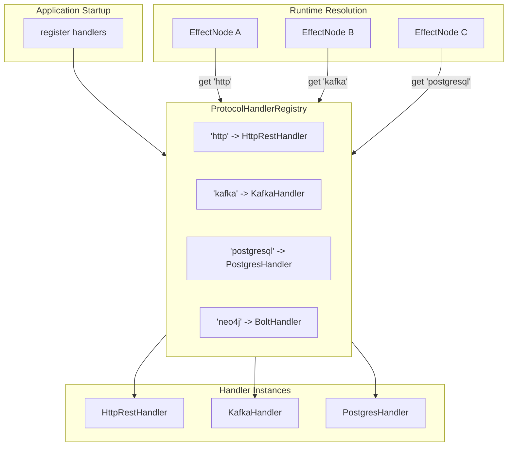
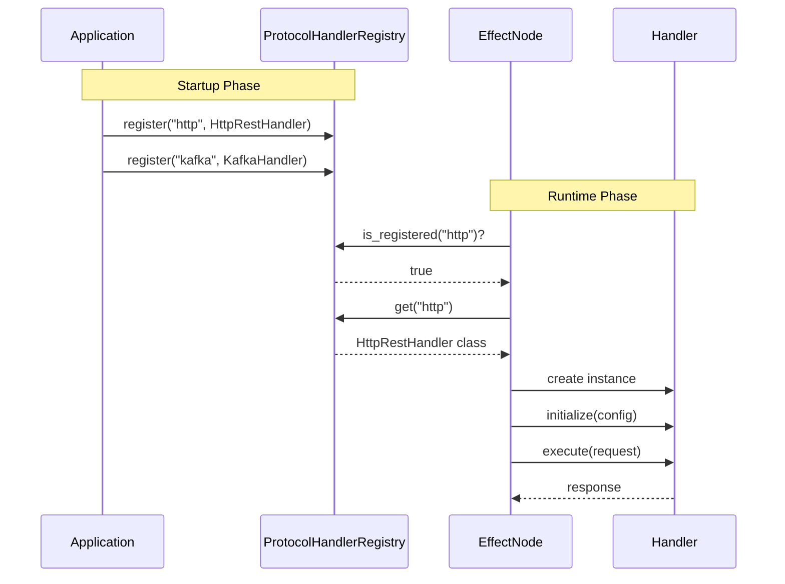

# Registry Protocols API Reference

  

> **SPI Version**: 0.3.0 | **Status**: Stable | **Since**: v0.1.0

---

## Table of Contents

- [Overview](#overview)
- [Architecture](#architecture)
- [ProtocolHandlerRegistry](#protocolhandlerregistry)
  - [Description](#description)
  - [Methods](#methods)
    - [register](#register)
    - [get](#get)
    - [list_protocols](#list_protocols)
    - [is_registered](#is_registered)
  - [Protocol Definition](#protocol-definition)
  - [Usage Example](#usage-example)
  - [Factory Pattern Integration](#factory-pattern-integration)
  - [Effect Node Integration](#effect-node-integration)
  - [Testing with Mock Registry](#testing-with-mock-registry)
- [Best Practices](#best-practices)
- [Handler Validation Notes](#handler-validation-notes)
  - [The Structural Typing Challenge](#the-structural-typing-challenge)
  - [Validation Approaches](#validation-approaches)
  - [Recommendation](#recommendation)
- [Exception Handling](#exception-handling)
- [Thread Safety](#thread-safety)
- [Version Information](#version-information)

---

## Overview

The registry protocols define interfaces for managing handler registrations in the ONEX platform. The registry pattern enables dependency injection by mapping protocol type identifiers to their handler implementations.

## Architecture

The handler registry acts as a **service locator** for protocol handlers, enabling:

- **Decoupled configuration**: Register handlers at startup, resolve at runtime
- **Dynamic dispatch**: Select handlers based on protocol type
- **Testability**: Register mock handlers for testing
- **Extensibility**: Add new protocol types without code changes



### Registry Operations Sequence



---

## ProtocolHandlerRegistry

```python
from omnibase_spi.protocols.registry import ProtocolHandlerRegistry
```

### Description

Protocol for registering and resolving [ProtocolHandler](./HANDLERS.md#protocolhandler) implementations. Manages the mapping between protocol types (http_rest, bolt, postgres, kafka) and their handler implementations for dependency injection.

**Use Cases**:
- Application bootstrap (register all handlers)
- Effect node initialization (resolve handler by type)
- Handler discovery (list available protocols)
- Dynamic handler selection

### Methods

#### `register`

```python
def register(
    self,
    protocol_type: str,
    handler_cls: type[ProtocolHandler],
) -> None:
    ...
```

Register a protocol handler.

**Args**:
- `protocol_type` (`str`): Protocol type identifier (e.g., `'http_rest'`, `'bolt'`, `'kafka'`)
- `handler_cls` (`type[ProtocolHandler]`): Handler class implementing `ProtocolHandler`

**Raises**:
- `RegistryError`: If registration fails (e.g., duplicate registration without override)

**Semantic Contract**:
- SHOULD validate handler_cls implements `ProtocolHandler` (see [Validation Notes](#handler-validation-notes) below)
- SHOULD allow re-registration (override) of existing types
- MUST be thread-safe for concurrent registrations

#### `get`

```python
def get(
    self,
    protocol_type: str,
) -> type[ProtocolHandler]:
    ...
```

Get handler class for protocol type.

**Args**:
- `protocol_type` (`str`): Protocol type identifier

**Returns**:
- `type[ProtocolHandler]`: Handler class for the protocol type

**Raises**:
- `RegistryError`: If protocol type not registered

**Semantic Contract**:
- MUST return the exact class registered (not an instance)
- MUST raise `RegistryError` for unknown types (not return None)

#### `list_protocols`

```python
def list_protocols(self) -> list[str]:
    ...
```

List registered protocol types.

**Returns**:
- `list[str]`: List of registered protocol type identifiers

**Semantic Contract**:
- MUST return all registered protocol types
- SHOULD return types in registration order or sorted alphabetically

#### `is_registered`

```python
def is_registered(self, protocol_type: str) -> bool:
    ...
```

Check if protocol type is registered.

**Args**:
- `protocol_type` (`str`): Protocol type identifier

**Returns**:
- `bool`: True if protocol type is registered

**Semantic Contract**:
- MUST NOT raise exceptions
- SHOULD be a fast O(1) operation

### Protocol Definition

```python
from typing import Protocol, runtime_checkable
from omnibase_spi.protocols.handlers import ProtocolHandler

@runtime_checkable
class ProtocolHandlerRegistry(Protocol):
    """
    Protocol for registering and resolving ProtocolHandler implementations.

    Manages the mapping between protocol types (http_rest, bolt, postgres, kafka)
    and their handler implementations for dependency injection.
    """

    def register(
        self,
        protocol_type: str,
        handler_cls: type[ProtocolHandler],
    ) -> None:
        """Register a protocol handler."""
        ...

    def get(
        self,
        protocol_type: str,
    ) -> type[ProtocolHandler]:
        """Get handler class for protocol type."""
        ...

    def list_protocols(self) -> list[str]:
        """List registered protocol types."""
        ...

    def is_registered(self, protocol_type: str) -> bool:
        """Check if protocol type is registered."""
        ...
```

### Usage Example

```python
from omnibase_spi.protocols.registry import ProtocolHandlerRegistry
from omnibase_spi.protocols.handlers import ProtocolHandler
from omnibase_spi.exceptions import RegistryError

class HandlerRegistryImpl:
    """Example implementation of ProtocolHandlerRegistry."""

    def __init__(self):
        self._handlers: dict[str, type[ProtocolHandler]] = {}

    def register(
        self,
        protocol_type: str,
        handler_cls: type[ProtocolHandler],
    ) -> None:
        """Register a protocol handler."""
        if not isinstance(handler_cls, type):
            raise RegistryError(
                f"handler_cls must be a class, got {type(handler_cls)}",
                context={"protocol_type": protocol_type}
            )

        # See "Handler Validation Notes" section for validation options
        self._handlers[protocol_type] = handler_cls

    def get(
        self,
        protocol_type: str,
    ) -> type[ProtocolHandler]:
        """Get handler class for protocol type."""
        if protocol_type not in self._handlers:
            raise RegistryError(
                f"Protocol type '{protocol_type}' is not registered",
                context={
                    "protocol_type": protocol_type,
                    "available_types": list(self._handlers.keys()),
                }
            )
        return self._handlers[protocol_type]

    def list_protocols(self) -> list[str]:
        """List registered protocol types."""
        return sorted(self._handlers.keys())

    def is_registered(self, protocol_type: str) -> bool:
        """Check if protocol type is registered."""
        return protocol_type in self._handlers


# Application bootstrap
registry = HandlerRegistryImpl()
registry.register("http", HttpRestHandler)
registry.register("kafka", KafkaHandler)
registry.register("postgresql", PostgresHandler)
registry.register("neo4j", BoltHandler)

# List available protocols
print(f"Available protocols: {registry.list_protocols()}")
# Output: Available protocols: ['http', 'kafka', 'neo4j', 'postgresql']

# Check before using
if registry.is_registered("http"):
    handler_cls = registry.get("http")
    handler = handler_cls()
    await handler.initialize(config)
```

### Factory Pattern Integration

Combine registry with factory for full DI:

```python
class HandlerFactory:
    """Factory that uses registry for handler creation."""

    def __init__(self, registry: ProtocolHandlerRegistry):
        self._registry = registry
        self._instances: dict[str, ProtocolHandler] = {}

    async def get_handler(
        self,
        protocol_type: str,
        config: ModelConnectionConfig,
    ) -> ProtocolHandler:
        """Get or create initialized handler instance."""

        # Check cache first
        cache_key = f"{protocol_type}:{config.cache_key}"
        if cache_key in self._instances:
            return self._instances[cache_key]

        # Create new instance
        handler_cls = self._registry.get(protocol_type)
        handler = handler_cls()
        await handler.initialize(config)

        # Cache and return
        self._instances[cache_key] = handler
        return handler

    async def shutdown_all(self) -> None:
        """Shutdown all cached handlers."""
        for handler in self._instances.values():
            await handler.shutdown()
        self._instances.clear()


# Usage
factory = HandlerFactory(registry)
http_handler = await factory.get_handler("http", http_config)
kafka_handler = await factory.get_handler("kafka", kafka_config)
```

### Effect Node Integration

Effect nodes use the registry to resolve handlers:

```python
class DatabaseEffectNode:
    """Effect node that uses registry for handler resolution."""

    def __init__(
        self,
        registry: ProtocolHandlerRegistry,
        protocol_type: str = "postgresql",
    ):
        self._registry = registry
        self._protocol_type = protocol_type
        self._handler: ProtocolHandler | None = None

    @property
    def node_id(self) -> str:
        return f"database_effect.{self._protocol_type}.v1"

    @property
    def node_type(self) -> str:
        return "effect"

    @property
    def version(self) -> str:
        return "1.0.0"

    async def initialize(self) -> None:
        """Initialize handler from registry."""
        handler_cls = self._registry.get(self._protocol_type)
        self._handler = handler_cls()
        await self._handler.initialize(self._config)

    async def execute(
        self,
        input_data: ModelEffectInput,
    ) -> ModelEffectOutput:
        """Execute database operation via handler."""
        if not self._handler:
            raise InvalidProtocolStateError(
                "Cannot call execute() before initialize()"
            )
        response = await self._handler.execute(request, operation_config)
        return ModelEffectOutput(payload=response.data)

    async def shutdown(self, timeout_seconds: float = 30.0) -> None:
        """Shutdown handler."""
        if self._handler:
            await self._handler.shutdown(timeout_seconds)
            self._handler = None
```

### Testing with Mock Registry

```python
import pytest
from unittest.mock import AsyncMock, MagicMock

class MockHandler:
    """Mock handler for testing."""

    def __init__(self):
        self.initialize = AsyncMock()
        self.shutdown = AsyncMock()
        self.execute = AsyncMock(return_value=MockResponse())
        self.describe = MagicMock(return_value={"handler_type": "mock"})
        self.health_check = AsyncMock(return_value={"healthy": True})

    @property
    def handler_type(self) -> str:
        return "mock"


@pytest.fixture
def mock_registry():
    """Create registry with mock handler."""
    registry = HandlerRegistryImpl()
    registry.register("mock", MockHandler)
    return registry


async def test_effect_node_with_mock_registry(mock_registry):
    """Test effect node with mocked handler."""
    node = DatabaseEffectNode(mock_registry, protocol_type="mock")
    await node.initialize()

    result = await node.execute(input_data)

    assert result is not None
    await node.shutdown()
```

---

## Best Practices

### 1. Register Handlers at Startup

```python
def bootstrap_handlers(registry: ProtocolHandlerRegistry) -> None:
    """Register all handlers during application startup."""
    registry.register("http", HttpRestHandler)
    registry.register("grpc", GrpcHandler)
    registry.register("kafka", KafkaHandler)
    registry.register("postgresql", PostgresHandler)
    registry.register("neo4j", BoltHandler)
    registry.register("redis", RedisHandler)
```

### 2. Use Protocol Type Constants

```python
class ProtocolTypes:
    """Constants for protocol type identifiers."""
    HTTP = "http"
    GRPC = "grpc"
    KAFKA = "kafka"
    POSTGRESQL = "postgresql"
    NEO4J = "neo4j"
    REDIS = "redis"

# Usage
registry.register(ProtocolTypes.HTTP, HttpRestHandler)
handler_cls = registry.get(ProtocolTypes.HTTP)
```

### 3. Check Registration Before Get

```python
def safe_get_handler(
    registry: ProtocolHandlerRegistry,
    protocol_type: str,
) -> type[ProtocolHandler] | None:
    """Safely get handler, returning None if not registered."""
    if registry.is_registered(protocol_type):
        return registry.get(protocol_type)
    return None
```

### 4. Log Registry State

```python
def log_registry_state(
    registry: ProtocolHandlerRegistry,
    logger: Logger,
) -> None:
    """Log all registered handlers for debugging."""
    protocols = registry.list_protocols()
    logger.info(
        f"Handler registry initialized with {len(protocols)} protocols",
        protocols=protocols,
    )
```

---

## Handler Validation Notes

### The Structural Typing Challenge

`ProtocolHandler` is a `@runtime_checkable` protocol, which enables Python's structural subtyping (duck typing). However, this creates a validation challenge for class-level checks:

| Check Type | Works With | Does NOT Work With |
|------------|------------|-------------------|
| `isinstance(instance, ProtocolHandler)` | Instances of any class with matching methods | Classes (type objects) |
| `issubclass(cls, ProtocolHandler)` | Classes that explicitly inherit from Protocol | Structurally-conforming classes (duck-typed) |

**Key Insight**: `issubclass()` only works for classes that explicitly inherit from the protocol. It does NOT detect structural conformance (duck typing). This means a class that implements all `ProtocolHandler` methods but does not inherit from it will fail `issubclass()` checks.

### Validation Approaches

#### Option 1: Explicit Protocol Inheritance (Recommended)

Require handler implementations to explicitly inherit from `ProtocolHandler`:

```python
from omnibase_spi.protocols.handlers import ProtocolHandler

class HttpRestHandler(ProtocolHandler):
    """Handler that explicitly inherits from ProtocolHandler."""

    @property
    def handler_type(self) -> str:
        return "http"

    # ... implement other methods
```

With explicit inheritance, `issubclass()` works correctly:

```python
def register(self, protocol_type: str, handler_cls: type[ProtocolHandler]) -> None:
    if not issubclass(handler_cls, ProtocolHandler):
        raise RegistryError(f"{handler_cls.__name__} must inherit from ProtocolHandler")
    self._handlers[protocol_type] = handler_cls
```

#### Option 2: Instance-Based Validation (Deferred)

Validate by creating a temporary instance (more expensive but works with structural typing):

```python
def register(self, protocol_type: str, handler_cls: type[ProtocolHandler]) -> None:
    # Create instance to check structural conformance
    try:
        instance = handler_cls.__new__(handler_cls)
        if not isinstance(instance, ProtocolHandler):
            raise RegistryError(f"{handler_cls.__name__} does not implement ProtocolHandler")
    except Exception as e:
        raise RegistryError(f"Cannot validate {handler_cls.__name__}: {e}")
    self._handlers[protocol_type] = handler_cls
```

#### Option 3: Duck-Type at First Use (Lazy Validation)

Skip class-level validation and rely on runtime errors when methods are called:

```python
def register(self, protocol_type: str, handler_cls: type[ProtocolHandler]) -> None:
    # Trust the type hint - validation happens at first use
    if not isinstance(handler_cls, type):
        raise RegistryError(f"handler_cls must be a class, got {type(handler_cls)}")
    self._handlers[protocol_type] = handler_cls
```

This approach relies on:
- Type hints for static analysis (`type[ProtocolHandler]`)
- Runtime errors when invalid handlers fail to respond to method calls

#### Option 4: Attribute-Based Validation

Check for required attributes/methods without inheritance:

```python
REQUIRED_HANDLER_METHODS = ["initialize", "shutdown", "execute", "describe", "health_check"]
REQUIRED_HANDLER_PROPERTIES = ["handler_type"]

def register(self, protocol_type: str, handler_cls: type[ProtocolHandler]) -> None:
    # Check for required methods
    for method in REQUIRED_HANDLER_METHODS:
        if not callable(getattr(handler_cls, method, None)):
            raise RegistryError(f"{handler_cls.__name__} missing method: {method}")

    # Check for required properties
    for prop in REQUIRED_HANDLER_PROPERTIES:
        if not hasattr(handler_cls, prop):
            raise RegistryError(f"{handler_cls.__name__} missing property: {prop}")

    self._handlers[protocol_type] = handler_cls
```

### Recommendation

For ONEX platform implementations, we recommend **Option 1 (Explicit Inheritance)** because:

1. **Clear contract**: Inheritance explicitly declares intent to implement the protocol
2. **Static type checking**: mypy can verify method signatures at development time
3. **Simple validation**: `issubclass()` works reliably
4. **Documentation**: Inheritance chain is visible in class hierarchy

If supporting third-party handlers that may not inherit from `ProtocolHandler`, consider **Option 4 (Attribute-Based Validation)** as a fallback.

---

## Exception Handling

Registry methods may raise:

| Exception | Method | When |
|-----------|--------|------|
| `RegistryError` | `register()` | Handler class invalid or registration fails |
| `RegistryError` | `get()` | Protocol type not registered |

The `list_protocols()` and `is_registered()` methods do NOT raise exceptions.

See [EXCEPTIONS.md](EXCEPTIONS.md) for complete exception hierarchy.

---

## Thread Safety

Registry implementations SHOULD be thread-safe:

```python
import threading

class ThreadSafeRegistry:
    """Thread-safe registry implementation."""

    def __init__(self):
        self._handlers: dict[str, type[ProtocolHandler]] = {}
        self._lock = threading.RLock()

    def register(
        self,
        protocol_type: str,
        handler_cls: type[ProtocolHandler],
    ) -> None:
        with self._lock:
            self._handlers[protocol_type] = handler_cls

    def get(
        self,
        protocol_type: str,
    ) -> type[ProtocolHandler]:
        with self._lock:
            if protocol_type not in self._handlers:
                raise RegistryError(f"Not registered: {protocol_type}")
            return self._handlers[protocol_type]

    def list_protocols(self) -> list[str]:
        with self._lock:
            return list(self._handlers.keys())

    def is_registered(self, protocol_type: str) -> bool:
        with self._lock:
            return protocol_type in self._handlers
```

---

## Version Information

- **API Version**: 0.3.0
- **Python Compatibility**: 3.12+
- **Type Checking**: mypy strict mode compatible
- **Runtime Checking**: All protocols are `@runtime_checkable`

---

## See Also

- **[HANDLERS.md](./HANDLERS.md)** - Handler protocols that are registered in the registry
- **[NODES.md](./NODES.md)** - Node protocols, especially [ProtocolEffectNode](./NODES.md#protocoleffectnode) which uses the registry for handler resolution
- **[CONTAINER.md](./CONTAINER.md)** - Dependency injection container that may use the registry
- **[EXCEPTIONS.md](./EXCEPTIONS.md)** - Exception hierarchy including `RegistryError`
- **[README.md](./README.md)** - Complete API reference index

---

*This API reference is part of the omnibase_spi documentation.*
