# ONEX SPI Architecture Overview

## Overview

Comprehensive architectural documentation for the omnibase-spi Service Provider Interface, covering design principles, patterns, and implementation strategies that enable distributed, type-safe service coordination across the ONEX ecosystem.

## Architectural Philosophy

### Core Principles

#### 1. Protocol-First Design
```python
# Define contracts before implementations
@runtime_checkable
class ProtocolUserService(Protocol):
    """Contract defines what, not how."""
    async def get_user(self, user_id: UUID) -> Optional[User]: ...

# Multiple implementations can satisfy the same contract
class DatabaseUserService(ProtocolUserService): ...
class CacheUserService(ProtocolUserService): ...
class RestApiUserService(ProtocolUserService): ...
```

**Benefits:**
- **Decoupling**: Clients depend on interfaces, not implementations
- **Testability**: Easy mocking and testing with protocol stubs
- **Flexibility**: Swap implementations without changing client code
- **Evolution**: Protocols can evolve while maintaining compatibility

#### 2. Namespace Isolation
```
src/omnibase/protocols/           # Pure protocol definitions
├── types/                        # Type definitions only
├── core/                         # System-level protocols
├── workflow_orchestration/       # Domain-specific protocols
├── mcp/                         # MCP integration protocols
└── event_bus/                   # Event messaging protocols

# Implementation packages (separate repositories)
omnibase-core/                   # Core implementations
omnibase-workflow/               # Workflow implementations
omnibase-mcp/                    # MCP implementations
```

**Benefits:**
- **Zero Dependencies**: Protocol definitions have no runtime dependencies
- **Clear Boundaries**: Strict separation between contracts and implementations
- **Reusability**: Protocols can be implemented by any package
- **Validation**: Automated validation ensures purity

#### 3. Type Safety First
```python
# Strong typing throughout
WorkflowState = Literal["pending", "running", "completed", "failed"]
ContextValue = str | int | float | bool | list[str] | dict[str, str]

class ProtocolWorkflowEvent(Protocol):
    event_type: WorkflowEventType  # Specific enum type
    data: dict[str, ContextValue]  # Constrained value types
    correlation_id: UUID           # Strong UUID type
```

**Benefits:**
- **Compile-time Safety**: Catch errors before runtime
- **IDE Support**: Rich autocomplete and refactoring
- **Documentation**: Types serve as documentation
- **Refactoring**: Safe large-scale changes

## Architectural Patterns

### 1. Event Sourcing Architecture

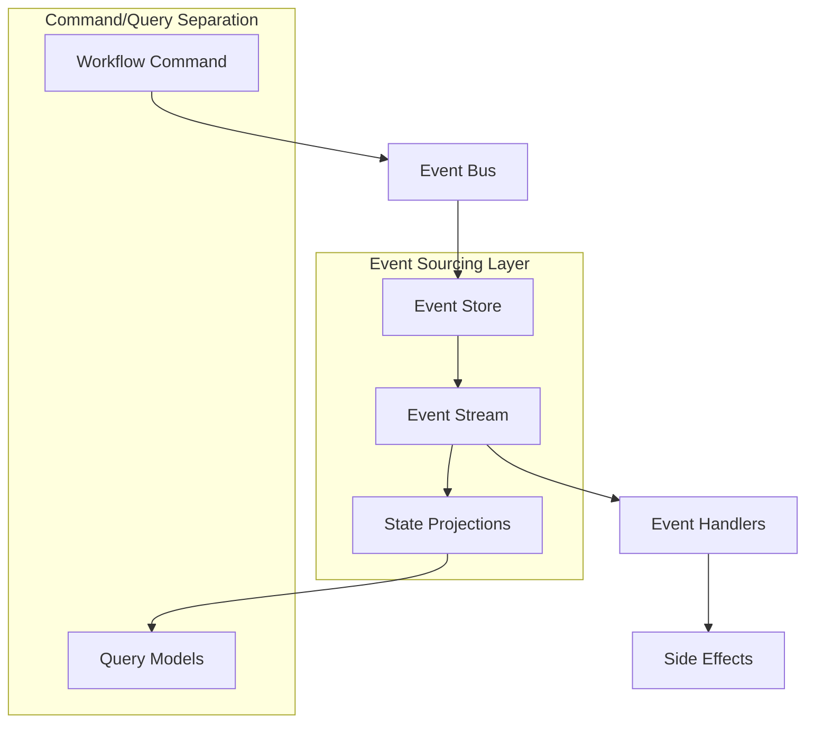

#### Event Sourcing Implementation
```python
# Event sourcing with complete audit trail
@runtime_checkable
class ProtocolWorkflowEventBus(Protocol):
    """Event sourcing for workflow orchestration."""

    async def publish_workflow_event(
        self, event: ProtocolWorkflowEvent
    ) -> None:
        """Publish event with sequence number and causation tracking."""
        ...

    async def replay_events(
        self,
        workflow_type: str,
        instance_id: UUID,
        from_sequence: int
    ) -> list[ProtocolWorkflowEvent]:
        """Replay events for state reconstruction."""
        ...

# Event with complete causation tracking
class ProtocolWorkflowEvent(Protocol):
    sequence_number: int           # Total ordering
    causation_id: Optional[UUID]   # What caused this event
    correlation_chain: list[UUID]  # Complete causation chain
    idempotency_key: str          # Duplicate prevention
```

**Key Features:**
- **Complete Audit Trail**: Every state change is recorded as an event
- **State Reconstruction**: Rebuild any state from events
- **Causation Tracking**: Full causation chains for debugging
- **Idempotency**: Duplicate event prevention

### 2. Workflow Isolation Pattern

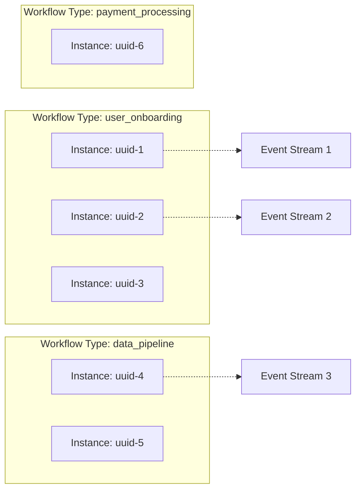

#### Isolation Implementation
```python
# {workflowType, instanceId} isolation pattern
class ProtocolWorkflowContext(Protocol):
    workflow_type: str     # Logical workflow type
    instance_id: UUID      # Unique instance within type
    isolation_level: IsolationLevel  # Transaction isolation

    # Instance-specific data and configuration
    data: dict[str, WorkflowData]
    secrets: dict[str, str]
    resource_limits: dict[str, int]

# Event routing based on isolation pattern
async def route_workflow_event(
    event: ProtocolWorkflowEvent,
    event_bus: ProtocolWorkflowEventBus
) -> None:
    """Route event to appropriate workflow instance."""
    topic = f"workflow.{event.workflow_type}"
    partition_key = str(event.instance_id)

    await event_bus.publish_workflow_event(
        event,
        target_topic=topic,
        partition_key=partition_key  # Ensures ordering per instance
    )
```

**Benefits:**
- **Instance Independence**: Instances don't interfere with each other
- **Resource Isolation**: Independent resource allocation
- **Scaling**: Scale workflow types independently
- **Failure Isolation**: Instance failures don't affect others

### 3. Multi-Subsystem Coordination (MCP)

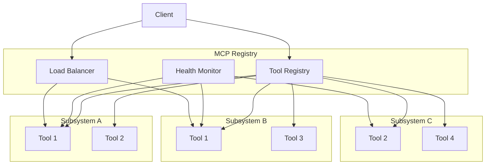

#### MCP Implementation
```python
# Multi-subsystem tool coordination
@runtime_checkable
class ProtocolMCPRegistry(Protocol):
    """Registry for multiple MCP subsystems."""

    async def register_subsystem(
        self,
        subsystem_metadata: ProtocolMCPSubsystemMetadata,
        tools: list[ProtocolMCPToolDefinition],
        api_key: str
    ) -> str:
        """Register subsystem with its tools."""
        ...

    async def execute_tool(
        self,
        tool_name: str,
        parameters: dict[str, ContextValue],
        preferred_subsystem: Optional[str] = None
    ) -> dict[str, Any]:
        """Execute tool with load balancing."""
        ...

# Tool definition with metadata
class ProtocolMCPToolDefinition(Protocol):
    name: str                    # Tool identifier
    tool_type: MCPToolType      # Classification
    subsystem_id: str           # Owning subsystem
    capabilities: list[str]     # Required capabilities
    parameters: list[ProtocolMCPToolParameter]  # Parameter schema
```

**Key Features:**
- **Multi-Subsystem Support**: Coordinate multiple tool providers
- **Dynamic Discovery**: Runtime tool discovery and routing
- **Load Balancing**: Distribute load across implementations
- **Health Monitoring**: Continuous subsystem health checking

### 4. Distributed Node Coordination

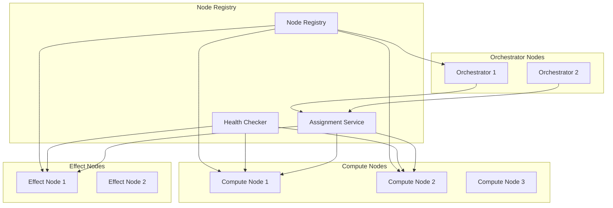

#### Node Coordination Implementation
```python
# Node types and capabilities
NodeType = Literal["COMPUTE", "EFFECT", "REDUCER", "ORCHESTRATOR"]

class ProtocolNodeCapability(Protocol):
    node_id: str
    node_type: NodeType
    capabilities: list[str]        # What this node can do
    capacity_limits: dict[str, int]  # Resource limits
    current_load: dict[str, int]     # Current utilization

# Distributed node registry
@runtime_checkable
class ProtocolWorkflowNodeRegistry(Protocol):
    """Registry for distributed workflow nodes."""

    async def register_workflow_node(
        self,
        node_metadata: ProtocolNodeCapability,
        capabilities: list[str],
        capacity_limits: dict[str, int]
    ) -> str:
        """Register node with capabilities."""
        ...

    async def find_capable_nodes(
        self,
        required_capabilities: list[str],
        resource_requirements: dict[str, int]
    ) -> list[ProtocolServiceDiscovery]:
        """Find nodes that can handle a task."""
        ...
```

**Benefits:**
- **Horizontal Scaling**: Add nodes dynamically
- **Capability Matching**: Route tasks to appropriate nodes
- **Load Distribution**: Balance load across available nodes
- **Fault Tolerance**: Handle node failures gracefully

## Domain Architecture

### Core System Layer

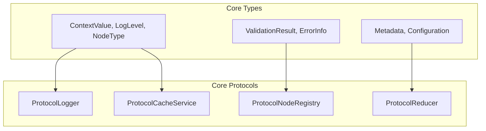

**Core System Responsibilities:**
- **Logging**: Structured logging with context
- **Caching**: Performance optimization layer
- **Node Management**: Distributed node coordination
- **State Reduction**: Immutable state updates
- **Validation**: Input validation and error handling

### Workflow Orchestration Layer

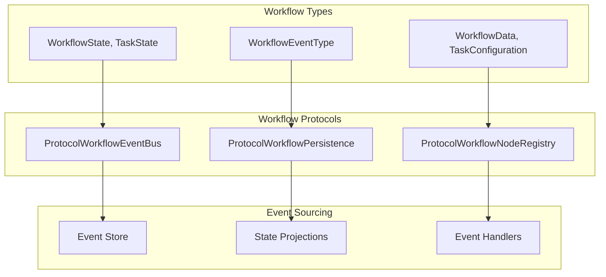

**Workflow Orchestration Responsibilities:**
- **Event-Driven FSM**: Finite state machine with event sourcing
- **Task Coordination**: Distributed task execution
- **State Management**: Immutable state with projections
- **Recovery**: Event replay for failure recovery

### MCP Integration Layer

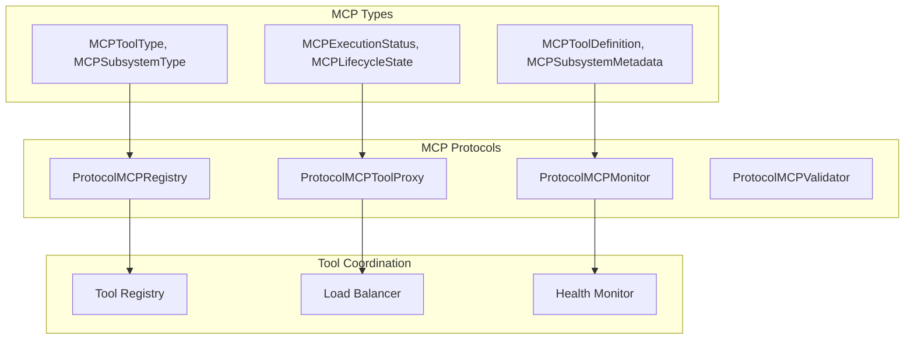

**MCP Integration Responsibilities:**
- **Tool Registry**: Multi-subsystem tool coordination
- **Execution Proxy**: Tool execution routing and marshaling
- **Health Monitoring**: Subsystem health and metrics
- **Validation**: Parameter and result validation

### Event Bus Layer

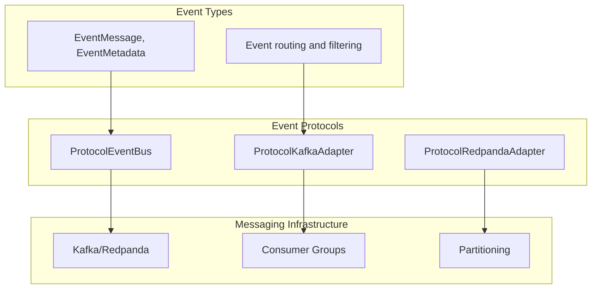

**Event Bus Responsibilities:**
- **Message Routing**: Topic-based message routing
- **Consumer Groups**: Scalable message processing
- **Partitioning**: Ordered message processing per partition
- **Persistence**: Durable message storage

## Quality Assurance Architecture

### SPI Purity Validation

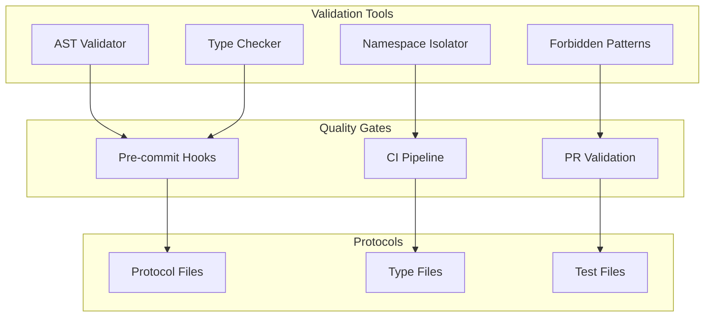

#### Validation Implementation
```python
# AST-based SPI validation
class SPIValidator(ast.NodeVisitor):
    """Validate SPI purity rules using AST parsing."""

    def visit_Import(self, node: ast.Import):
        """Check for forbidden imports."""
        forbidden_imports = ["os", "sys", "json", "asyncio", "logging"]
        for alias in node.names:
            if alias.name in forbidden_imports:
                self.violations.append(
                    SPIViolation("implementation_import", node.lineno)
                )

    def visit_ClassDef(self, node: ast.ClassDef):
        """Check for protocol vs implementation patterns."""
        # Check for dataclass usage (should use Protocol)
        for decorator in node.decorator_list:
            if isinstance(decorator, ast.Name) and decorator.id == "dataclass":
                self.violations.append(
                    SPIViolation("dataclass_usage", node.lineno)
                )

# Namespace isolation validation
def validate_namespace_isolation(file_path: Path) -> list[str]:
    """Validate that SPI files only import from protocols namespace."""
    violations = []
    with open(file_path) as f:
        for line_no, line in enumerate(f, 1):
            if "from omnibase_spi.core" in line or "from omnibase_spi.model" in line:
                violations.append(f"{file_path}:{line_no}: Namespace violation")
    return violations
```

### Type Safety Architecture

```python
# Type constraints throughout the system
ContextValue = str | int | float | bool | list[str] | dict[str, str]

# No Any types allowed in public interfaces
@runtime_checkable
class ProtocolUserService(Protocol):
    async def create_user(
        self,
        email: str,              # Specific type
        metadata: dict[str, str] # Constrained dict type
    ) -> User:                   # Concrete return type
        ...

    # Avoid: Any types break type safety
    # async def process_data(self, data: Any) -> Any: ...

# Forward references for circular dependencies
from typing import TYPE_CHECKING
if TYPE_CHECKING:
    from omnibase_spi.protocols.types.workflow_types import WorkflowState

def process_workflow(self, state: "WorkflowState") -> bool:
    """Use forward references to avoid circular imports."""
    ...
```

## Performance Architecture

### Async-First Design

```python
# All I/O operations are async
@runtime_checkable
class ProtocolEventBus(Protocol):
    """Async-first event bus protocol."""

    async def publish(self, event: EventMessage) -> None:
        """Non-blocking event publishing."""
        ...

    async def subscribe(
        self,
        topic: str,
        handler: Callable[[EventMessage], Awaitable[None]]
    ) -> Callable[[], Awaitable[None]]:
        """Async event subscription with async handler."""
        ...

# Efficient batch operations
class ProtocolWorkflowPersistence(Protocol):
    async def store_events_batch(
        self,
        events: list[ProtocolWorkflowEvent]
    ) -> list[bool]:
        """Batch event storage for efficiency."""
        ...

    async def get_events_stream(
        self,
        workflow_type: str,
        instance_id: UUID,
        limit: int = 1000  # Reasonable default limit
    ) -> AsyncIterator[ProtocolWorkflowEvent]:
        """Stream events for memory efficiency."""
        ...
```

### Caching Strategy

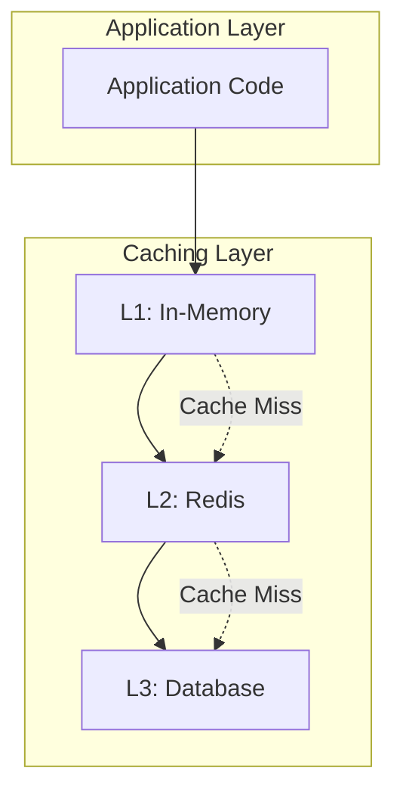

#### Caching Implementation
```python
@runtime_checkable
class ProtocolCacheService(Protocol):
    """Multi-level caching protocol."""

    async def get(
        self,
        key: str,
        cache_level: Literal["L1", "L2", "L3"] = "L1"
    ) -> Optional[Any]:
        """Get value from specified cache level."""
        ...

    async def set(
        self,
        key: str,
        value: Any,
        ttl_seconds: int = 3600,
        cache_levels: list[str] = ["L1", "L2"]
    ) -> bool:
        """Set value in multiple cache levels."""
        ...

    async def get_statistics(self) -> ProtocolCacheStatistics:
        """Get comprehensive cache performance metrics."""
        ...

# Cache-aware service wrapper
class CachedServiceWrapper:
    def __init__(
        self,
        service: ProtocolUserService,
        cache: ProtocolCacheService
    ):
        self.service = service
        self.cache = cache

    async def get_user(self, user_id: UUID) -> Optional[User]:
        # Try L1 cache first (in-memory)
        cached = await self.cache.get(f"user:{user_id}", cache_level="L1")
        if cached:
            return cached

        # Try L2 cache (Redis)
        cached = await self.cache.get(f"user:{user_id}", cache_level="L2")
        if cached:
            # Populate L1 cache
            await self.cache.set(f"user:{user_id}", cached, cache_levels=["L1"])
            return cached

        # Get from service and populate caches
        user = await self.service.get_user(user_id)
        if user:
            await self.cache.set(
                f"user:{user_id}",
                user,
                cache_levels=["L1", "L2"]
            )

        return user
```

## Security Architecture

### Type Safety as Security

```python
# Constrained types prevent injection attacks
ContextValue = str | int | float | bool | list[str] | dict[str, str]

# No arbitrary object types that could contain malicious code
class ProtocolWorkflowContext(Protocol):
    data: dict[str, ContextValue]    # Safe, constrained values
    secrets: dict[str, str]          # Encrypted string values only

    # Avoid: arbitrary objects that could execute code
    # dangerous_data: dict[str, Any]  # Could contain anything

# Input validation at protocol boundaries
@runtime_checkable
class ProtocolInputValidator(Protocol):
    """Validate inputs at system boundaries."""

    async def validate_workflow_data(
        self,
        data: dict[str, Any]  # Unvalidated input
    ) -> dict[str, ContextValue]:  # Validated output
        """Convert and validate arbitrary input to safe types."""
        ...

    async def sanitize_user_input(
        self,
        user_input: str
    ) -> str:
        """Sanitize user input for safe processing."""
        ...
```

### Secrets Management

```python
# Secure secrets handling protocol
@runtime_checkable
class ProtocolSecretsManager(Protocol):
    """Secure secrets management."""

    async def store_secret(
        self,
        key: str,
        value: str,
        encryption_key_id: str
    ) -> bool:
        """Store encrypted secret."""
        ...

    async def retrieve_secret(
        self,
        key: str,
        requester_context: dict[str, str]
    ) -> Optional[str]:
        """Retrieve decrypted secret with access control."""
        ...

    async def rotate_secret(
        self,
        key: str,
        new_value: str
    ) -> bool:
        """Rotate secret with zero-downtime."""
        ...

# Workflow context with secure secrets
class ProtocolWorkflowContext(Protocol):
    secrets: dict[str, str]  # Encrypted values

    async def get_secret(
        self,
        key: str,
        secrets_manager: ProtocolSecretsManager
    ) -> Optional[str]:
        """Get decrypted secret value."""
        encrypted_value = self.secrets.get(key)
        if not encrypted_value:
            return None

        return await secrets_manager.retrieve_secret(
            key=encrypted_value,
            requester_context={
                "workflow_type": self.workflow_type,
                "instance_id": str(self.instance_id)
            }
        )
```

## Testing Architecture

### Protocol Compliance Testing

```python
# Abstract compliance test suite
class WorkflowEventBusComplianceTests(ABC):
    """Abstract test suite for event bus compliance."""

    @pytest.fixture
    def event_bus(self) -> ProtocolWorkflowEventBus:
        """Override in subclasses."""
        raise NotImplementedError

    @pytest.mark.asyncio
    async def test_publish_event_success(
        self,
        event_bus: ProtocolWorkflowEventBus
    ):
        """Test successful event publishing."""
        event = create_test_workflow_event()
        await event_bus.publish_workflow_event(event)
        # Verify event was published

    @pytest.mark.asyncio  
    async def test_replay_events(
        self,
        event_bus: ProtocolWorkflowEventBus
    ):
        """Test event replay functionality."""
        # Publish test events
        events = await event_bus.replay_events(
            workflow_type="test_workflow",
            instance_id=test_instance_id,
            from_sequence=1
        )
        assert len(events) > 0

# Concrete implementation tests
class TestKafkaEventBus(WorkflowEventBusComplianceTests):
    @pytest.fixture
    def event_bus(self):
        return KafkaWorkflowEventBus(kafka_config)

class TestInMemoryEventBus(WorkflowEventBusComplianceTests):
    @pytest.fixture
    def event_bus(self):
        return InMemoryWorkflowEventBus()
```

### Integration Testing Architecture

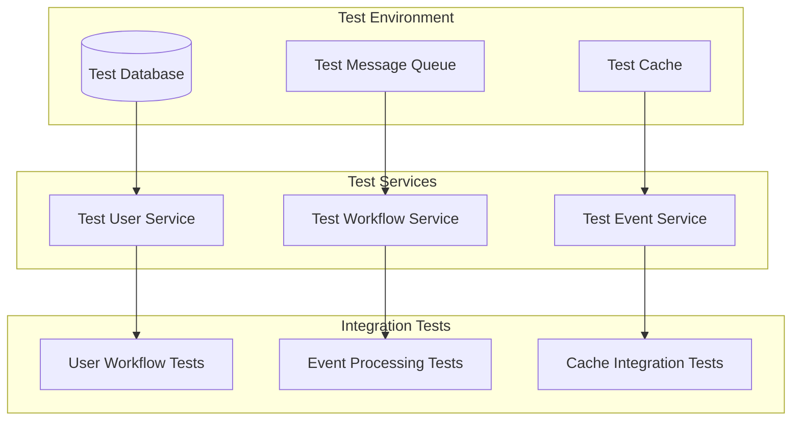

## Evolution and Migration

### Protocol Versioning

```python
# Version-aware protocol evolution
class ProtocolUserServiceV1(Protocol):
    """Version 1 of user service protocol."""
    async def get_user(self, user_id: UUID) -> Optional[User]: ...

class ProtocolUserServiceV2(ProtocolUserServiceV1, Protocol):
    """Version 2 adds new methods while maintaining compatibility."""
    async def get_users_batch(
        self, user_ids: list[UUID]
    ) -> dict[UUID, Optional[User]]: ...

# Backward compatibility adapter
class UserServiceV1Adapter(ProtocolUserServiceV2):
    """Adapt V1 service to V2 interface."""

    def __init__(self, v1_service: ProtocolUserServiceV1):
        self.v1_service = v1_service

    async def get_user(self, user_id: UUID) -> Optional[User]:
        return await self.v1_service.get_user(user_id)

    async def get_users_batch(
        self, user_ids: list[UUID]
    ) -> dict[UUID, Optional[User]]:
        # Implement batch operation using V1 interface
        results = {}
        for user_id in user_ids:
            results[user_id] = await self.v1_service.get_user(user_id)
        return results
```

### Migration Strategies

```python
# Feature flags for gradual migration
@runtime_checkable
class ProtocolFeatureFlags(Protocol):
    """Feature flag management for migrations."""

    async def is_enabled(
        self,
        flag_name: str,
        context: dict[str, str]
    ) -> bool:
        """Check if feature is enabled for context."""
        ...

# Migration-aware service implementation
class MigrationAwareUserService(ProtocolUserServiceV2):
    """Service that supports gradual migration."""

    def __init__(
        self,
        v1_service: ProtocolUserServiceV1,
        v2_service: ProtocolUserServiceV2,
        feature_flags: ProtocolFeatureFlags
    ):
        self.v1_service = v1_service
        self.v2_service = v2_service
        self.feature_flags = feature_flags

    async def get_user(self, user_id: UUID) -> Optional[User]:
        use_v2 = await self.feature_flags.is_enabled(
            "user_service_v2",
            {"user_id": str(user_id)}
        )

        if use_v2:
            return await self.v2_service.get_user(user_id)
        else:
            return await self.v1_service.get_user(user_id)
```

## Summary

The omnibase-spi architecture provides a robust, type-safe foundation for distributed service coordination with:

### Key Architectural Strengths

1. **Protocol-First Design**: Clean separation between contracts and implementations
2. **Type Safety**: Strong typing prevents runtime errors and improves maintainability  
3. **Event Sourcing**: Complete audit trails and state reconstruction capabilities
4. **Distributed Coordination**: Scalable node and subsystem coordination patterns
5. **Quality Assurance**: Comprehensive validation and testing frameworks
6. **Performance**: Async-first design with multi-level caching strategies
7. **Security**: Type constraints and secure secrets management
8. **Evolution**: Versioning and migration strategies for long-term maintenance

### Scalability Characteristics

- **Horizontal Scaling**: Add nodes and subsystems dynamically
- **Workflow Isolation**: Independent scaling per workflow type
- **Event Streaming**: Distributed event processing with partitioning
- **Caching Layers**: Multi-level caching for performance optimization
- **Load Balancing**: Distribute load across multiple implementations

### Reliability Features

- **Event Sourcing**: Complete state reconstruction from events
- **Idempotency**: Duplicate prevention with idempotency keys
- **Health Monitoring**: Continuous health checking with automatic failover
- **Fault Isolation**: Failures contained within workflow instances
- **Recovery**: Event replay for failure recovery

This architecture enables the ONEX ecosystem to handle complex, distributed workflows with strong consistency guarantees, comprehensive observability, and robust failure handling capabilities.

---

*For implementation details, see the [Developer Guide](../developer-guide/). For specific protocol documentation, see the [API Reference](../api-reference/).*
