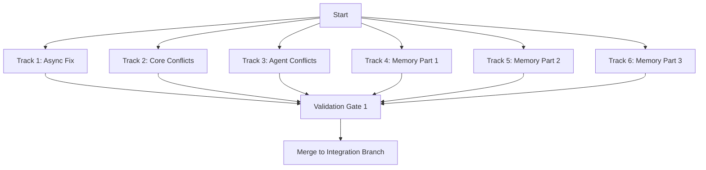
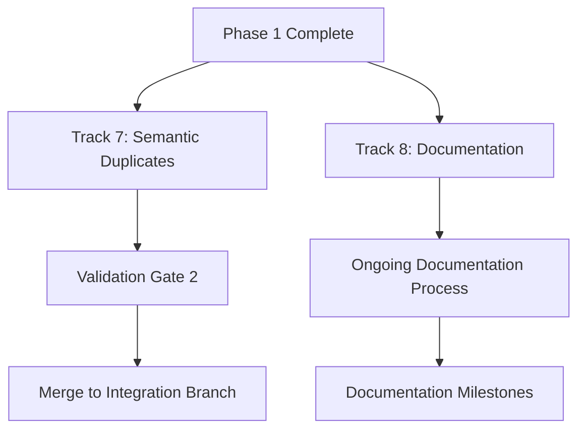

# SPI Validation Remediation Plan - 8 Parallel Tracks

**Generated**: 2025-10-06
**Total Violations**: 380 (34 errors, 346 warnings)
**Execution Model**: 8 parallel agent-workflow-coordinators
**Estimated Total Time**: 4-6 hours (parallel), 20-30 hours (sequential)

---

## Executive Summary

### Violation Breakdown

| Rule | Type | Count | Severity | Strategy |
|------|------|-------|----------|----------|
| SPI005 | Async I/O Operations | 1 | Error | Quick fix - add async |
| SPI011 | Protocol Name Conflicts | 33 | Error | Rename with domain prefixes |
| SPI010 | Semantic Duplicates | 25 | Warning | Consolidate to canonical locations |
| SPI014 | Protocol Documentation | 321 | Warning | Architectural decision + sampling |

### Track Distribution Strategy

```
Track 1: Critical Async Fix           [1 error]   - 15 min
Track 2: Core Domain Conflicts        [3 errors]  - 45 min
Track 3: Agent Protocol Conflicts     [9 errors]  - 90 min
Track 4: Memory Conflicts Part 1      [8 errors]  - 90 min
Track 5: Memory Conflicts Part 2      [8 errors]  - 90 min
Track 6: Memory Conflicts Part 3      [4 errors]  - 60 min
Track 7: Semantic Duplicates          [25 warns]  - 120 min
Track 8: Documentation Strategy       [321 warns] - 180 min (decision) + ongoing
```

**Critical Path**: Tracks 1-6 must complete before merging (all errors)
**Optional Path**: Tracks 7-8 improve code quality (warnings only)

---

## Track 1: Critical Async Fix

**Agent**: `agent-quick-fix`
**Complexity**: Low
**Duration**: 15 minutes
**Dependencies**: None

### Scope

Fix 1 SPI005 error - method with I/O operations needs async.

### Files to Modify

1. **File**: `src/omnibase_spi/protocols/types/protocol_core_types.py`
   **Line**: 1549
   **Issue**: Method `get_errors` contains I/O operations but is not async
   **Fix**: Change signature to `async def get_errors(...) -> ...`

### Implementation Steps

1. Read `protocol_core_types.py`
2. Locate line 1549: `def get_errors(...)`
3. Change to: `async def get_errors(...)`
4. Update all callers if within SPI (unlikely for protocol definition)
5. Run validation

### Validation Command

```bash
# Validate specific file
python scripts/validation/comprehensive_spi_validator.py \
  src/omnibase_spi/protocols/types/protocol_core_types.py \
  --json-report

# Check for SPI005 violations
grep -A 2 "SPI005" comprehensive_spi_validation_*.json
```

### Success Criteria

- ✅ SPI005 error count: 0
- ✅ No new violations introduced
- ✅ Method signature updated to async

### Implementation Notes

```python
# BEFORE (Line 1549)
def get_errors(self) -> list[str]:
    """Get validation errors."""
    ...

# AFTER
async def get_errors(self) -> list[str]:
    """Get validation errors."""
    ...
```

---

## Track 2: Core Domain Conflicts

**Agent**: `agent-core-domain-fix`
**Complexity**: Medium
**Duration**: 45 minutes
**Dependencies**: None

### Scope

Resolve 3 protocol name conflicts in core/discovery domains.

### Files to Modify

#### 1. ProtocolDiscoveredTool Conflict

**Conflict Files**:
- `src/omnibase_spi/protocols/discovery/protocol_discovery_client.py:11`
- `src/omnibase_spi/protocols/cli/protocol_cli_tool_discovery.py`

**Resolution Strategy**:
```python
# Discovery domain keeps ProtocolDiscoveredTool
# CLI domain renames to ProtocolCliDiscoveredTool

# File: protocol_cli_tool_discovery.py
# BEFORE: class ProtocolDiscoveredTool(Protocol)
# AFTER:  class ProtocolCliDiscoveredTool(Protocol)
```

#### 2. ProtocolRegistryWithBus Conflict

**Conflict Files**:
- `src/omnibase_spi/protocols/types/protocol_core_types.py:1415`
- `src/omnibase_spi/protocols/event_bus/protocol_event_bus_mixin.py`

**Resolution Strategy**:
```python
# Core types keeps ProtocolRegistryWithBus (more generic)
# Event bus renames to ProtocolEventBusRegistry

# File: protocol_event_bus_mixin.py
# BEFORE: class ProtocolRegistryWithBus(Protocol)
# AFTER:  class ProtocolEventBusRegistry(Protocol)
```

#### 3. ProtocolLogEmitter Conflict

**Conflict Files**:
- `src/omnibase_spi/protocols/types/protocol_core_types.py:1439`
- `src/omnibase_spi/protocols/event_bus/protocol_event_bus_mixin.py`

**Resolution Strategy**:
```python
# Core types keeps ProtocolLogEmitter
# Event bus renames to ProtocolEventBusLogEmitter

# File: protocol_event_bus_mixin.py
# BEFORE: class ProtocolLogEmitter(Protocol)
# AFTER:  class ProtocolEventBusLogEmitter(Protocol)
```

### Implementation Steps

1. Read all 5 files to understand protocol definitions
2. Implement renaming strategy (CLI and EventBus domains add prefixes)
3. Update imports in affected files (search for usage)
4. Update `__all__` exports
5. Run validation

### Validation Command

```bash
# Validate specific files
python scripts/validation/comprehensive_spi_validator.py \
  src/omnibase_spi/protocols/discovery/ \
  src/omnibase_spi/protocols/cli/ \
  src/omnibase_spi/protocols/event_bus/ \
  src/omnibase_spi/protocols/types/protocol_core_types.py \
  --json-report

# Check for remaining conflicts on these protocols
grep -E "ProtocolDiscoveredTool|ProtocolRegistryWithBus|ProtocolLogEmitter" \
  comprehensive_spi_validation_*.json
```

### Success Criteria

- ✅ SPI011 conflicts reduced by 3
- ✅ All renamed protocols follow domain prefix pattern
- ✅ Exports updated in `__init__.py` files
- ✅ No import errors

---

## Track 3: Agent Protocol Conflicts

**Agent**: `agent-memory-domain-fix-1`
**Complexity**: High
**Duration**: 90 minutes
**Dependencies**: None

### Scope

Resolve 9 agent-related protocol conflicts in memory domain.

### Protocol Conflict Groups

#### Group A: ProtocolAgentConfig (3 conflicts)

**Canonical Location**: `protocol_agent_config_interfaces.py`
**Duplicates to Remove**:
1. `protocol_agent_manager.py:12`
2. `protocol_agent_pool.py:12`
3. `protocol_distributed_agent_orchestrator.py:12`

**Strategy**: Import from canonical, remove local definitions

#### Group B: ProtocolAgentInstance (3 conflicts)

**Conflict Files**:
1. `memory/protocol_agent_manager.py:37` vs `mcp/protocol_llm_agent_provider.py`
2. `memory/protocol_agent_pool.py:37` vs `mcp/protocol_llm_agent_provider.py`
3. `memory/protocol_distributed_agent_orchestrator.py:37` vs `mcp/protocol_llm_agent_provider.py`

**Resolution Strategy**:
```python
# Memory domain: ProtocolMemoryAgentInstance
# MCP domain: ProtocolMcpAgentInstance

# Files to rename:
# - protocol_agent_manager.py: ProtocolMemoryAgentInstance
# - protocol_agent_pool.py: ProtocolMemoryAgentInstance
# - protocol_distributed_agent_orchestrator.py: ProtocolMemoryAgentInstance
# - protocol_llm_agent_provider.py: ProtocolMcpAgentInstance
```

#### Group C: ProtocolAgentHealthStatus (2 conflicts)

**Canonical Location**: `protocol_agent_manager.py`
**Duplicates to Remove**:
1. `protocol_agent_pool.py:67`
2. `protocol_distributed_agent_orchestrator.py:67`

**Strategy**: Import from canonical (agent_manager), remove local definitions

#### Group D: ProtocolAgentStatus (1 conflict)

**Additional Conflict**: `types/protocol_event_bus_types.py:216` has different definition

**Resolution Strategy**:
```python
# Memory domain: ProtocolMemoryAgentStatus (in protocol_agent_manager.py)
# Event bus domain: ProtocolEventBusAgentStatus (in protocol_event_bus_types.py)
# Duplicates in pool/orchestrator: Import from agent_manager
```

### Implementation Steps

1. **Phase 1**: Analyze all 7 files to map protocol definitions
2. **Phase 2**: Implement Group A (remove duplicates, add imports)
3. **Phase 3**: Implement Group B (rename with domain prefixes)
4. **Phase 4**: Implement Group C (remove duplicates, add imports)
5. **Phase 5**: Implement Group D (rename + consolidate)
6. **Phase 6**: Update all `__all__` exports
7. **Phase 7**: Search for usage and update imports
8. **Phase 8**: Run validation

### Files to Modify

1. `src/omnibase_spi/protocols/memory/protocol_agent_manager.py` (canonical source)
2. `src/omnibase_spi/protocols/memory/protocol_agent_pool.py` (remove duplicates, add imports)
3. `src/omnibase_spi/protocols/memory/protocol_distributed_agent_orchestrator.py` (remove duplicates, add imports)
4. `src/omnibase_spi/protocols/memory/protocol_agent_config_interfaces.py` (canonical for configs)
5. `src/omnibase_spi/protocols/mcp/protocol_llm_agent_provider.py` (rename to ProtocolMcpAgentInstance)
6. `src/omnibase_spi/protocols/types/protocol_event_bus_types.py` (rename to ProtocolEventBusAgentStatus)
7. `src/omnibase_spi/protocols/memory/__init__.py` (update exports)

### Validation Command

```bash
# Validate memory and MCP domains
python scripts/validation/comprehensive_spi_validator.py \
  src/omnibase_spi/protocols/memory/ \
  src/omnibase_spi/protocols/mcp/ \
  src/omnibase_spi/protocols/types/protocol_event_bus_types.py \
  --json-report

# Check for agent-related conflicts
grep -E "ProtocolAgent(Config|Instance|HealthStatus|Status)" \
  comprehensive_spi_validation_*.json | grep SPI011
```

### Success Criteria

- ✅ SPI011 conflicts reduced by 9
- ✅ All agent protocols follow domain prefix pattern
- ✅ Canonical protocols identified and documented
- ✅ Imports correctly reference canonical locations
- ✅ No circular import issues

---

## Track 4: Memory Conflicts Part 1

**Agent**: `agent-memory-domain-fix-2`
**Complexity**: High
**Duration**: 90 minutes
**Dependencies**: Track 3 (for ProtocolAgentStatus context)

### Scope

Resolve 8 memory protocol conflicts (ProtocolValidationResult, ProtocolMemoryOperation, ProtocolMemoryResponse, ProtocolMemoryMetadata).

### Protocol Conflict Groups

#### Group A: ProtocolValidationResult (2 conflicts)

**Conflict Files**:
1. `memory/protocol_distributed_agent_orchestrator.py:107` vs `memory/protocol_agent_pool.py`
2. `validation/protocol_validation.py:30` vs `memory/protocol_agent_pool.py`

**Resolution Strategy**:
```python
# Validation domain: ProtocolValidationResult (canonical)
# Memory domain: ProtocolMemoryValidationResult

# Rename in:
# - protocol_agent_pool.py: ProtocolMemoryValidationResult
# - protocol_distributed_agent_orchestrator.py: ProtocolMemoryValidationResult
# Keep canonical in validation/protocol_validation.py
```

#### Group B: ProtocolMemoryOperation (1 conflict)

**Conflict Files**:
- `protocol_distributed_agent_orchestrator.py:127` vs `protocol_agent_pool.py`

**Resolution Strategy**:
```python
# Check if one is canonical, consolidate to single definition
# Likely: Keep in protocol_agent_pool.py (more specialized)
# Remove from: protocol_distributed_agent_orchestrator.py
```

#### Group C: ProtocolMemoryResponse (2 conflicts)

**Conflict Files**:
1. `memory/protocol_distributed_agent_orchestrator.py:147` vs `memory/protocol_agent_pool.py`
2. `memory/protocol_memory_responses.py:45` vs `memory/protocol_agent_pool.py`

**Resolution Strategy**:
```python
# Canonical: protocol_memory_responses.py (dedicated responses module)
# Remove duplicates from:
# - protocol_agent_pool.py
# - protocol_distributed_agent_orchestrator.py
# Add import: from omnibase_spi.protocols.memory.protocol_memory_responses import ProtocolMemoryResponse
```

#### Group D: ProtocolMemoryMetadata (2 conflicts)

**Conflict Files**:
1. `memory/protocol_distributed_agent_orchestrator.py:167` vs `memory/protocol_agent_pool.py`
2. `memory/protocol_memory_base.py:54` vs `memory/protocol_agent_pool.py`

**Resolution Strategy**:
```python
# Canonical: protocol_memory_base.py (base module for core types)
# Remove duplicates from:
# - protocol_agent_pool.py
# - protocol_distributed_agent_orchestrator.py
# Add import: from omnibase_spi.protocols.memory.protocol_memory_base import ProtocolMemoryMetadata
```

### Implementation Steps

1. **Phase 1**: Read all 6 files to understand protocol signatures
2. **Phase 2**: Implement Group A (rename in memory domain)
3. **Phase 3**: Implement Group B (consolidate MemoryOperation)
4. **Phase 4**: Implement Group C (remove duplicates, import from responses module)
5. **Phase 5**: Implement Group D (remove duplicates, import from base module)
6. **Phase 6**: Update `__all__` exports
7. **Phase 7**: Run validation

### Files to Modify

1. `src/omnibase_spi/protocols/memory/protocol_agent_pool.py` (remove duplicates, add imports, rename ValidationResult)
2. `src/omnibase_spi/protocols/memory/protocol_distributed_agent_orchestrator.py` (remove duplicates, add imports, rename ValidationResult)
3. `src/omnibase_spi/protocols/validation/protocol_validation.py` (canonical ValidationResult)
4. `src/omnibase_spi/protocols/memory/protocol_memory_responses.py` (canonical MemoryResponse)
5. `src/omnibase_spi/protocols/memory/protocol_memory_base.py` (canonical MemoryMetadata)
6. `src/omnibase_spi/protocols/memory/__init__.py` (update exports)

### Validation Command

```bash
# Validate memory and validation domains
python scripts/validation/comprehensive_spi_validator.py \
  src/omnibase_spi/protocols/memory/ \
  src/omnibase_spi/protocols/validation/ \
  --json-report

# Check for specific conflicts
grep -E "Protocol(ValidationResult|MemoryOperation|MemoryResponse|MemoryMetadata)" \
  comprehensive_spi_validation_*.json | grep SPI011
```

### Success Criteria

- ✅ SPI011 conflicts reduced by 8
- ✅ Canonical modules clearly identified
- ✅ Memory-specific protocols use ProtocolMemory* prefix
- ✅ Imports correctly reference canonical locations
- ✅ No import cycles

---

## Track 5: Memory Conflicts Part 2

**Agent**: `agent-memory-domain-fix-3`
**Complexity**: High
**Duration**: 90 minutes
**Dependencies**: None (parallel with Track 4)

### Scope

Resolve 8 memory protocol conflicts (ProtocolMemoryError, ProtocolMemoryRequest, ProtocolMemoryResponseV2, ProtocolMemorySecurityContext).

### Protocol Conflict Groups

#### Group A: ProtocolMemoryError (2 conflicts)

**Conflict Files**:
1. `memory/protocol_distributed_agent_orchestrator.py:192` vs `memory/protocol_agent_pool.py`
2. `memory/protocol_memory_errors.py:35` vs `memory/protocol_agent_pool.py`

**Resolution Strategy**:
```python
# Canonical: protocol_memory_errors.py (dedicated errors module)
# Remove duplicates from:
# - protocol_agent_pool.py
# - protocol_distributed_agent_orchestrator.py
# Add import: from omnibase_spi.protocols.memory.protocol_memory_errors import ProtocolMemoryError
```

#### Group B: ProtocolMemoryRequest (2 conflicts)

**Conflict Files**:
1. `memory/protocol_distributed_agent_orchestrator.py:212` vs `memory/protocol_agent_pool.py`
2. `memory/protocol_memory_requests.py:40` vs `memory/protocol_agent_pool.py`

**Resolution Strategy**:
```python
# Canonical: protocol_memory_requests.py (dedicated requests module)
# Remove duplicates from:
# - protocol_agent_pool.py
# - protocol_distributed_agent_orchestrator.py
# Add import: from omnibase_spi.protocols.memory.protocol_memory_requests import ProtocolMemoryRequest
```

#### Group C: ProtocolMemoryResponseV2 (1 conflict)

**Conflict Files**:
- `protocol_distributed_agent_orchestrator.py:237` vs `protocol_agent_pool.py`

**Resolution Strategy**:
```python
# Check canonical location or consolidate
# Likely: Keep in protocol_agent_pool.py or move to protocol_memory_responses.py
# Remove from: protocol_distributed_agent_orchestrator.py
```

#### Group D: ProtocolMemorySecurityContext (2 conflicts)

**Conflict Files**:
1. `memory/protocol_distributed_agent_orchestrator.py:257` vs `memory/protocol_agent_pool.py`
2. `memory/protocol_memory_security.py:22` vs `memory/protocol_agent_pool.py`

**Resolution Strategy**:
```python
# Canonical: protocol_memory_security.py (dedicated security module)
# Remove duplicates from:
# - protocol_agent_pool.py
# - protocol_distributed_agent_orchestrator.py
# Add import: from omnibase_spi.protocols.memory.protocol_memory_security import ProtocolMemorySecurityContext
```

### Implementation Steps

1. **Phase 1**: Read all 5 files to understand protocol signatures
2. **Phase 2**: Implement Group A (remove duplicates, import from errors module)
3. **Phase 3**: Implement Group B (remove duplicates, import from requests module)
4. **Phase 4**: Implement Group C (consolidate ResponseV2)
5. **Phase 5**: Implement Group D (remove duplicates, import from security module)
6. **Phase 6**: Update `__all__` exports
7. **Phase 7**: Run validation

### Files to Modify

1. `src/omnibase_spi/protocols/memory/protocol_agent_pool.py` (remove duplicates, add imports)
2. `src/omnibase_spi/protocols/memory/protocol_distributed_agent_orchestrator.py` (remove duplicates, add imports)
3. `src/omnibase_spi/protocols/memory/protocol_memory_errors.py` (canonical MemoryError)
4. `src/omnibase_spi/protocols/memory/protocol_memory_requests.py` (canonical MemoryRequest)
5. `src/omnibase_spi/protocols/memory/protocol_memory_responses.py` (possibly canonical for ResponseV2)
6. `src/omnibase_spi/protocols/memory/protocol_memory_security.py` (canonical SecurityContext)
7. `src/omnibase_spi/protocols/memory/__init__.py` (update exports)

### Validation Command

```bash
# Validate memory domain
python scripts/validation/comprehensive_spi_validator.py \
  src/omnibase_spi/protocols/memory/ \
  --json-report

# Check for specific conflicts
grep -E "ProtocolMemory(Error|Request|ResponseV2|SecurityContext)" \
  comprehensive_spi_validation_*.json | grep SPI011
```

### Success Criteria

- ✅ SPI011 conflicts reduced by 8
- ✅ Canonical modules clearly identified (errors, requests, responses, security)
- ✅ Imports correctly reference canonical locations
- ✅ No duplicate protocol definitions

---

## Track 6: Memory Conflicts Part 3

**Agent**: `agent-memory-domain-fix-4`
**Complexity**: Medium
**Duration**: 60 minutes
**Dependencies**: None (parallel with Tracks 4-5)

### Scope

Resolve 4 remaining memory protocol conflicts (ProtocolMemoryStreaming*, ProtocolMemorySecurityPolicy, ProtocolMemoryComposable, ProtocolMemoryErrorHandling).

### Protocol Conflict Groups

#### Group A: ProtocolMemoryStreamingResponse (1 conflict)

**Conflict Files**:
- `protocol_distributed_agent_orchestrator.py:277` vs `protocol_agent_pool.py`

**Resolution Strategy**:
```python
# Consolidate to canonical location
# Likely: Keep in protocol_agent_pool.py or move to protocol_memory_responses.py
# Remove from: protocol_distributed_agent_orchestrator.py
```

#### Group B: ProtocolMemoryStreamingRequest (1 conflict)

**Conflict Files**:
- `protocol_distributed_agent_orchestrator.py:297` vs `protocol_agent_pool.py`

**Resolution Strategy**:
```python
# Consolidate to canonical location
# Likely: Keep in protocol_agent_pool.py or move to protocol_memory_requests.py
# Remove from: protocol_distributed_agent_orchestrator.py
```

#### Group C: ProtocolMemorySecurityPolicy (1 conflict)

**Conflict Files**:
- `protocol_distributed_agent_orchestrator.py:317` vs `protocol_agent_pool.py`

**Resolution Strategy**:
```python
# Consolidate to canonical location
# Likely: Keep in protocol_memory_security.py (if exists) or protocol_agent_pool.py
# Remove from: protocol_distributed_agent_orchestrator.py
```

#### Group D: Miscellaneous Protocols (2 conflicts)

**Protocols**:
1. `ProtocolMemoryComposable` - `orchestrator:337` vs `agent_pool`
2. `ProtocolMemoryErrorHandling` - `orchestrator:357` vs `agent_pool`

**Resolution Strategy**:
```python
# Consolidate both to canonical locations
# ProtocolMemoryComposable: Keep in protocol_agent_pool.py (composability feature)
# ProtocolMemoryErrorHandling: Move to protocol_memory_errors.py (error handling)
# Remove both from: protocol_distributed_agent_orchestrator.py
```

### Implementation Steps

1. **Phase 1**: Read both files to understand protocol signatures
2. **Phase 2**: Determine canonical locations for each protocol
3. **Phase 3**: Implement Groups A-B (consolidate streaming protocols)
4. **Phase 4**: Implement Group C (consolidate security policy)
5. **Phase 5**: Implement Group D (consolidate composable + error handling)
6. **Phase 6**: Update `__all__` exports
7. **Phase 7**: Run validation

### Files to Modify

1. `src/omnibase_spi/protocols/memory/protocol_agent_pool.py` (canonical for some, remove others)
2. `src/omnibase_spi/protocols/memory/protocol_distributed_agent_orchestrator.py` (remove duplicates, add imports)
3. `src/omnibase_spi/protocols/memory/protocol_memory_requests.py` (possibly canonical for StreamingRequest)
4. `src/omnibase_spi/protocols/memory/protocol_memory_responses.py` (possibly canonical for StreamingResponse)
5. `src/omnibase_spi/protocols/memory/protocol_memory_security.py` (possibly canonical for SecurityPolicy)
6. `src/omnibase_spi/protocols/memory/protocol_memory_errors.py` (canonical for ErrorHandling)
7. `src/omnibase_spi/protocols/memory/__init__.py` (update exports)

### Validation Command

```bash
# Validate memory domain
python scripts/validation/comprehensive_spi_validator.py \
  src/omnibase_spi/protocols/memory/ \
  --json-report

# Check for remaining memory conflicts
grep -E "ProtocolMemory(Streaming|SecurityPolicy|Composable|ErrorHandling)" \
  comprehensive_spi_validation_*.json | grep SPI011
```

### Success Criteria

- ✅ SPI011 conflicts reduced by 4
- ✅ All memory protocols consolidated to canonical locations
- ✅ No remaining conflicts in memory domain
- ✅ Clean module organization with clear responsibilities

---

## Track 7: Semantic Duplicates

**Agent**: `agent-semantic-consolidation`
**Complexity**: High
**Duration**: 120 minutes
**Dependencies**: Tracks 3-6 (protocol conflicts must be resolved first)

### Scope

Consolidate 25 semantically duplicate protocols (100% similarity).

### Duplicate Protocol Groups

#### Group A: Agent Duplicates (Already addressed in Track 3)

These will be resolved by Track 3 and should be verified:
1. ProtocolAgentConfig (3 duplicates)
2. ProtocolAgentInstance (3 duplicates)
3. ProtocolAgentHealthStatus (2 duplicates)
4. ProtocolAgentStatus (3 duplicates)

**Action**: Verify Track 3 completion resolves these

#### Group B: Memory Protocol Duplicates (Already addressed in Tracks 4-6)

These will be resolved by Tracks 4-6 and should be verified:
1. ProtocolMemoryOperation (1 duplicate)
2. ProtocolMemoryResponse (2 duplicates)
3. ProtocolMemoryMetadata (2 duplicates)
4. ProtocolMemoryError (2 duplicates)
5. ProtocolMemoryRequest (2 duplicates)
6. ProtocolMemoryResponseV2 (1 duplicate)
7. ProtocolMemorySecurityContext (2 duplicates)
8. ProtocolMemoryStreamingResponse (1 duplicate)
9. ProtocolMemoryStreamingRequest (1 duplicate)
10. ProtocolMemorySecurityPolicy (1 duplicate)
11. ProtocolMemoryComposable (1 duplicate)
12. ProtocolMemoryErrorHandling (1 duplicate)

**Action**: Verify Tracks 4-6 completion resolves these

#### Group C: Validation Result Duplicates

**File**: `protocol_agent_pool.py:107`, `protocol_distributed_agent_orchestrator.py:107`
**Duplicate**: `ProtocolValidationResult` similar to `ProtocolLegacyConfigValidationResult`

**Resolution Strategy**:
```python
# Analyze both protocols to determine relationship
# If ProtocolLegacyConfigValidationResult is deprecated:
#   - Mark as @deprecated
#   - Document migration path to ProtocolValidationResult
# If different use cases:
#   - Rename to clarify purposes
#   - Document distinctions
```

#### Group D: Batch Memory Request Duplicate

**File**: `protocol_memory_requests.py:104`
**Duplicate**: `ProtocolBatchMemoryRetrieveRequest` vs `ProtocolMemoryRetrieveRequest`

**Resolution Strategy**:
```python
# These should be distinct (batch vs single)
# If 100% similar, batch should extend/wrap single:
#   - ProtocolBatchMemoryRetrieveRequest should contain list[ProtocolMemoryRetrieveRequest]
# If truly identical:
#   - Remove batch variant, use single with optional batching
```

#### Group E: Workflow Input State Duplicate

**File**: `protocol_workflow_orchestration_types.py:519`
**Duplicate**: `ProtocolWorkflowInputState` vs `ProtocolOnexInputState`

**Resolution Strategy**:
```python
# Analyze semantic difference between Workflow and Onex contexts
# If identical:
#   - Keep ProtocolWorkflowInputState (more generic)
#   - Alias: ProtocolOnexInputState = ProtocolWorkflowInputState
#   - Document in comments
# If different scopes:
#   - Rename to clarify: ProtocolOnexWorkflowInputState
```

### Implementation Steps

1. **Phase 1**: Verify Tracks 3-6 completion (Groups A-B already resolved)
2. **Phase 2**: Analyze Group C (ValidationResult vs LegacyConfigValidationResult)
3. **Phase 3**: Analyze Group D (Batch vs Single memory requests)
4. **Phase 4**: Analyze Group E (Workflow vs Onex input states)
5. **Phase 5**: Implement consolidation or renaming for Groups C-E
6. **Phase 6**: Update documentation and `__all__` exports
7. **Phase 7**: Run validation

### Files to Modify

1. `src/omnibase_spi/protocols/memory/protocol_agent_pool.py` (verify Track 3 fixes)
2. `src/omnibase_spi/protocols/memory/protocol_distributed_agent_orchestrator.py` (verify Tracks 3-6 fixes)
3. `src/omnibase_spi/protocols/memory/protocol_memory_requests.py` (analyze batch request)
4. `src/omnibase_spi/protocols/types/protocol_workflow_orchestration_types.py` (analyze input states)
5. `src/omnibase_spi/protocols/memory/__init__.py` (update exports)

### Validation Command

```bash
# Validate all affected domains
python scripts/validation/comprehensive_spi_validator.py \
  src/omnibase_spi/protocols/memory/ \
  src/omnibase_spi/protocols/types/ \
  --json-report

# Check for SPI010 warnings
grep "SPI010" comprehensive_spi_validation_*.json | wc -l
```

### Success Criteria

- ✅ SPI010 warnings reduced to 0 or near-0
- ✅ All semantically identical protocols consolidated
- ✅ Remaining similar protocols have clear distinctions documented
- ✅ No functional regressions

---

## Track 8: Documentation Strategy

**Agent**: `agent-documentation-framework`
**Complexity**: High (strategic decision) + Medium (implementation)
**Duration**: 180 minutes (decision phase) + ongoing (implementation)
**Dependencies**: None (can run in parallel)

### Scope

Address 321 SPI014 protocol documentation warnings through architectural decision and systematic implementation.

### Phase 1: Architectural Decision (3 hours)

#### Decision Points

1. **Documentation Standard**:
   - What level of documentation is required for SPI protocols?
   - Should examples be mandatory or recommended?
   - What documentation format (NumPy, Google, custom)?

2. **Priority Tiers**:
   ```
   Tier 1 (High Priority): Public-facing protocols (50-75 protocols)
   Tier 2 (Medium Priority): Internal cross-module protocols (100-150 protocols)
   Tier 3 (Low Priority): Helper/utility protocols (remaining)
   ```

3. **Automation Strategy**:
   - Can documentation be auto-generated from protocol signatures?
   - Should we create templates for common protocol patterns?
   - What tooling can assist (e.g., docstring generators)?

4. **Quality Threshold**:
   - Set severity level for SPI014 (error vs warning vs info)
   - Define minimum documentation requirements
   - Establish review process

#### Recommended Strategy

```yaml
documentation_policy:
  severity: warning  # Don't block on docs, but track quality

  tiers:
    tier_1_public:
      - requirements:
          - Comprehensive docstring (3+ sentences)
          - Purpose statement
          - Usage example
          - Args/Returns documentation
      - examples:
          - ProtocolWorkflowEventBus
          - ProtocolMCPRegistry
          - ProtocolWorkflowReducer

    tier_2_internal:
      - requirements:
          - Clear docstring (1-2 sentences)
          - Purpose statement
          - Args/Returns documentation
      - examples:
          - ProtocolWorkflowContext
          - ProtocolEventStore

    tier_3_utility:
      - requirements:
          - Basic docstring (1 sentence)
          - Purpose statement
      - examples:
          - ProtocolLogEmitter
          - ProtocolHealthMonitor

  templates:
    standard_protocol: |
      \"\"\"
      Protocol for {purpose}.

      This protocol defines the contract for {domain} operations,
      providing {key_capability} functionality.

      Example:
          ```python
          {usage_example}
          ```

      Key Features:
          - {feature_1}
          - {feature_2}
      \"\"\"

    simple_protocol: |
      \"\"\"Protocol for {purpose} in {domain}.\"\"\"
```

### Phase 2: Systematic Documentation (Ongoing)

#### Implementation Strategy

1. **Categorize Protocols**:
   ```bash
   # Generate protocol catalog by domain
   python scripts/validation/comprehensive_spi_validator.py \
     src/ --json-report

   # Extract undocumented protocols by tier
   python scripts/analysis/categorize_protocols.py \
     --input comprehensive_spi_validation_*.json \
     --output protocol_documentation_plan.yaml
   ```

2. **Create Documentation Templates**:
   ```python
   # scripts/templates/protocol_docstring_generator.py

   TEMPLATE_PUBLIC = '''"""
   Protocol for {purpose}.

   This protocol defines the contract for {domain} operations,
   providing {key_capability} functionality.

   Example:
       ```python
       # Import protocol
       from omnibase_spi.protocols.{module} import {protocol_name}

       # Usage example
       async def example_usage(service: {protocol_name}) -> None:
           result = await service.{primary_method}(...)
       ```

   Key Features:
       - {feature_1}
       - {feature_2}
       - {feature_3}
   """'''
   ```

3. **Batch Processing**:
   - Process 10-20 protocols per batch
   - Focus on Tier 1 protocols first
   - Use AI assistance for documentation generation
   - Manual review for accuracy

4. **Quality Assurance**:
   ```bash
   # Validate documentation improvements
   python scripts/validation/comprehensive_spi_validator.py \
     src/ --json-report

   # Track progress
   grep "SPI014" comprehensive_spi_validation_*.json | wc -l
   ```

### Implementation Steps

1. **Phase 1 (Decision - 3 hours)**:
   - Review current documentation patterns
   - Define documentation policy
   - Create templates
   - Get stakeholder approval

2. **Phase 2 (Implementation - Ongoing)**:
   - Generate protocol catalog
   - Categorize by tier
   - Create batched documentation tasks
   - Process Tier 1 protocols (high priority)
   - Process Tier 2 protocols (medium priority)
   - Process Tier 3 protocols (low priority)

### Files to Create

1. `docs/SPI_DOCUMENTATION_POLICY.md` (documentation standards)
2. `scripts/templates/protocol_docstring_generator.py` (generation tool)
3. `scripts/analysis/categorize_protocols.py` (protocol categorization)
4. `protocol_documentation_plan.yaml` (implementation roadmap)

### Files to Modify

- All 149 protocol files with SPI014 warnings (in batches)

### Validation Command

```bash
# Track documentation coverage
python scripts/validation/comprehensive_spi_validator.py \
  src/ --json-report

# Calculate documentation percentage
python -c "
import json
with open('comprehensive_spi_validation_*.json', 'r') as f:
    data = json.load(f)
    violations = data['violations']
    spi014 = [v for v in violations if v['rule_id'] == 'SPI014']
    total_protocols = data['protocols']['total_protocols']
    documented = total_protocols - len(spi014)
    coverage = (documented / total_protocols) * 100
    print(f'Documentation coverage: {coverage:.1f}%')
"
```

### Success Criteria

- ✅ Documentation policy defined and approved
- ✅ Templates created for common protocol patterns
- ✅ Tier 1 protocols: 100% comprehensive documentation
- ✅ Tier 2 protocols: 80%+ clear documentation
- ✅ Tier 3 protocols: 60%+ basic documentation
- ✅ Overall SPI014 warnings reduced by 50%+ (160 warnings remaining acceptable)

### Metrics Tracking

```yaml
documentation_metrics:
  baseline:
    total_protocols: 668
    spi014_warnings: 321
    coverage: 52.0%

  targets:
    tier_1_target: 100%  # All public protocols
    tier_2_target: 80%   # Most internal protocols
    tier_3_target: 60%   # Basic utility protocols
    overall_target: 75%  # Overall coverage

  milestones:
    week_1: "Policy approved, templates created"
    week_2: "Tier 1 protocols 50% complete"
    week_3: "Tier 1 protocols 100% complete"
    week_4: "Tier 2 protocols 50% complete"
    month_2: "Overall target 75% reached"
```

---

## Parallel Execution Workflow

### Pre-Execution Checklist

1. ✅ All agents have access to latest codebase
2. ✅ Validation script is functional: `scripts/validation/comprehensive_spi_validator.py`
3. ✅ JSON report format is understood
4. ✅ Git branch strategy is defined (8 feature branches)

### Branch Strategy

```bash
# Create 8 feature branches from main
git checkout -b feature/spi-track-1-async-fix
git checkout -b feature/spi-track-2-core-conflicts
git checkout -b feature/spi-track-3-agent-conflicts
git checkout -b feature/spi-track-4-memory-conflicts-1
git checkout -b feature/spi-track-5-memory-conflicts-2
git checkout -b feature/spi-track-6-memory-conflicts-3
git checkout -b feature/spi-track-7-semantic-duplicates
git checkout -b feature/spi-track-8-documentation
```

### Execution Phases

#### Phase 1: Critical Errors (Tracks 1-6) - PARALLEL

**Duration**: 90-120 minutes
**Goal**: Eliminate all 34 SPI errors



**Success Criteria for Phase 1**:
- All 34 SPI011 errors resolved
- 1 SPI005 error resolved
- No new errors introduced
- All tracks validated independently

#### Phase 2: Quality Improvements (Tracks 7-8) - PARALLEL

**Duration**: 2-4 hours (Track 7), ongoing (Track 8)
**Goal**: Reduce warnings, improve code quality



**Success Criteria for Phase 2**:
- Track 7: SPI010 warnings reduced to 0
- Track 8: Documentation policy established, Tier 1 coverage >80%

### Integration Strategy

```bash
# After all tracks complete Phase 1
git checkout feature/spi-integration
git merge feature/spi-track-1-async-fix
git merge feature/spi-track-2-core-conflicts
git merge feature/spi-track-3-agent-conflicts
git merge feature/spi-track-4-memory-conflicts-1
git merge feature/spi-track-5-memory-conflicts-2
git merge feature/spi-track-6-memory-conflicts-3

# Run comprehensive validation
python scripts/validation/comprehensive_spi_validator.py src/ --json-report

# Expected results:
# - Error count: 0
# - Warning count: <346 (reduced from semantic duplicate consolidation)

# Merge quality tracks
git merge feature/spi-track-7-semantic-duplicates

# Run final validation
python scripts/validation/comprehensive_spi_validator.py src/ --json-report

# Expected results:
# - Error count: 0
# - Warning count: <100 (SPI014 documentation warnings acceptable)
```

### Final Validation

```bash
# Comprehensive SPI validation
python scripts/validation/comprehensive_spi_validator.py src/ --json-report

# Type checking
poetry run mypy src/omnibase_spi --strict

# Import validation
poetry run pytest tests/test_protocol_imports.py -v

# Build validation
poetry build

# All tests
poetry run pytest
```

---

## Coordination Points

### Track Dependencies

| Track | Depends On | Blocks |
|-------|------------|--------|
| 1 | None | None |
| 2 | None | None |
| 3 | None | Track 7 (verify agent consolidation) |
| 4 | Track 3 (for context) | Track 7 (verify memory consolidation) |
| 5 | None | Track 7 (verify memory consolidation) |
| 6 | None | Track 7 (verify memory consolidation) |
| 7 | Tracks 3-6 (protocol consolidation) | Final merge |
| 8 | None | None (ongoing) |

### Communication Protocol

1. **Track Start**: Post to coordination channel with branch name
2. **Completion**: Post validation results to coordination channel
3. **Issues**: Immediately report conflicts or blockers
4. **Integration**: Tracks 1-6 must complete before Track 7 starts verification

### Risk Mitigation

#### Risk 1: Import Cycles

**Mitigation**:
- Use forward references with TYPE_CHECKING
- Keep imports in alphabetical order
- Validate imports after each change

#### Risk 2: Merge Conflicts

**Mitigation**:
- Tracks work on different files where possible
- Tracks 3-6 coordinate on memory domain (most overlap)
- Use integration branch for incremental merges

#### Risk 3: Protocol Signature Changes

**Mitigation**:
- Rename protocols, don't change signatures
- Add imports, don't modify existing protocols
- Validate each change immediately

---

## Appendix A: Quick Reference Commands

### Validation Commands

```bash
# Full validation
python scripts/validation/comprehensive_spi_validator.py src/ --json-report

# Single file validation
python scripts/validation/comprehensive_spi_validator.py \
  src/omnibase_spi/protocols/memory/protocol_agent_pool.py \
  --json-report

# Domain validation
python scripts/validation/comprehensive_spi_validator.py \
  src/omnibase_spi/protocols/memory/ \
  --json-report

# Check specific rule
grep "SPI011" comprehensive_spi_validation_*.json

# Count errors
python -c "
import json
with open('comprehensive_spi_validation_*.json', 'r') as f:
    data = json.load(f)
    print(f\"Errors: {data['summary']['error_count']}\")
    print(f\"Warnings: {data['summary']['warning_count']}\")
"
```

### Search Commands

```bash
# Find protocol definition
grep -rn "class ProtocolAgentInstance" src/omnibase_spi/protocols/

# Find protocol imports
grep -rn "from.*ProtocolAgentInstance" src/omnibase_spi/

# Find protocol usage
grep -rn "ProtocolAgentInstance" src/omnibase_spi/ | grep -v "class Protocol"
```

### Git Commands

```bash
# Create feature branch
git checkout -b feature/spi-track-{N}-{description}

# Commit changes
git add .
git commit -m "fix(spi): Track {N} - {description}"

# Push for review
git push origin feature/spi-track-{N}-{description}

# Create PR
gh pr create --title "SPI Track {N}: {description}" \
  --body "Resolves {X} violations. Part of 8-track SPI remediation plan."
```

---

## Appendix B: Success Metrics

### Target Metrics

| Metric | Baseline | Target | Track Responsible |
|--------|----------|--------|-------------------|
| SPI005 Errors | 1 | 0 | Track 1 |
| SPI011 Errors | 33 | 0 | Tracks 2-6 |
| SPI010 Warnings | 25 | 0 | Track 7 |
| SPI014 Warnings | 321 | <160 | Track 8 |
| Total Violations | 380 | <200 | All |
| Code Quality Score | 30% | >85% | All |

### Quality Gates

**Gate 1: Error Elimination** (Tracks 1-6)
- ✅ Zero SPI005 errors
- ✅ Zero SPI011 errors
- ✅ No new errors introduced
- ✅ All tests passing

**Gate 2: Warning Reduction** (Tracks 7-8)
- ✅ Zero SPI010 warnings
- ✅ SPI014 warnings <160 (50% reduction)
- ✅ Documentation policy approved
- ✅ Quality score >85%

**Gate 3: Final Validation**
- ✅ Comprehensive SPI validation passing
- ✅ Type checking (mypy --strict) passing
- ✅ Import validation passing
- ✅ Build successful
- ✅ All tests passing

---

## Appendix C: Agent Assignments

### Recommended Agent-Workflow-Coordinator Mapping

```yaml
agents:
  agent-quick-fix:
    track: 1
    skills: [python, async, protocols]
    estimated_time: 15min

  agent-core-domain-fix:
    track: 2
    skills: [python, protocols, imports, refactoring]
    estimated_time: 45min

  agent-memory-domain-fix-1:
    track: 3
    skills: [python, protocols, domain-modeling, refactoring]
    estimated_time: 90min

  agent-memory-domain-fix-2:
    track: 4
    skills: [python, protocols, consolidation]
    estimated_time: 90min

  agent-memory-domain-fix-3:
    track: 5
    skills: [python, protocols, consolidation]
    estimated_time: 90min

  agent-memory-domain-fix-4:
    track: 6
    skills: [python, protocols, consolidation]
    estimated_time: 60min

  agent-semantic-consolidation:
    track: 7
    skills: [python, protocols, analysis, consolidation]
    estimated_time: 120min
    dependencies: [3, 4, 5, 6]

  agent-documentation-framework:
    track: 8
    skills: [documentation, strategic-planning, automation]
    estimated_time: 180min + ongoing
```

---

## Appendix D: Troubleshooting

### Common Issues

#### Issue 1: Import Cycle Detected

**Symptoms**:
```python
ImportError: cannot import name 'ProtocolX' from partially initialized module
```

**Solution**:
```python
# Use TYPE_CHECKING guard
from typing import TYPE_CHECKING

if TYPE_CHECKING:
    from omnibase_spi.protocols.module import ProtocolX

def method(self, param: "ProtocolX") -> None:
    ...
```

#### Issue 2: Protocol Not Found After Rename

**Symptoms**:
```python
AttributeError: module 'omnibase_spi.protocols.memory' has no attribute 'ProtocolAgentInstance'
```

**Solution**:
```python
# Update __init__.py exports
# src/omnibase_spi/protocols/memory/__init__.py

from .protocol_agent_manager import ProtocolMemoryAgentInstance

__all__ = ["ProtocolMemoryAgentInstance"]
```

#### Issue 3: Validation Still Shows Conflict

**Symptoms**:
```
SPI011: Protocol 'ProtocolX' conflicts with different protocol in file Y
```

**Solution**:
1. Ensure both files are updated
2. Check for cached Python bytecode: `find . -name "*.pyc" -delete`
3. Re-run validation
4. Check `__all__` exports

---

**End of Remediation Plan**

For questions or issues during execution, refer to:
- Main coordination document: `SPI_REMEDIATION_PLAN.md` (this file)
- Validation framework: `scripts/validation/comprehensive_spi_validator.py`
- CLAUDE.md: Project-level SPI documentation
